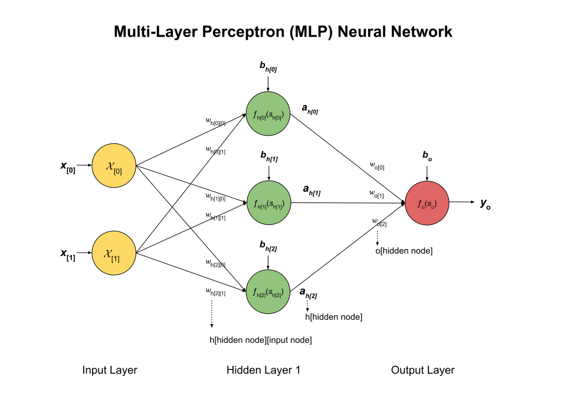
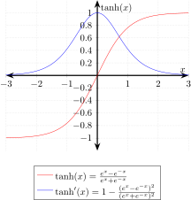

# THE MATH BEHIND TRAINING MLP NEURAL NETWORKS

_The math behind training a multi-layer perceptron (MLP) neural network._

Table of Contents

* [OVERVIEW]()

Documentation and Reference

* [artificial intelligence](https://github.com/JeffDeCola/my-cheat-sheets/tree/master/software/development/software-architectures/artificial-intelligence/artificial-intelligence-cheat-sheet)
cheat sheet
* [neural networks](https://github.com/JeffDeCola/my-cheat-sheets/tree/master/software/development/software-architectures/artificial-intelligence/artificial-intelligence-cheat-sheet/neural-networks.md)
cheat sheet
* [my-neural-networks](https://github.com/JeffDeCola/my-neural-networks/tree/main)
  * [perceptron-simple-example](https://github.com/JeffDeCola/my-neural-networks/tree/main/perceptron-simple-example)
  * [mlp-classification-example](https://github.com/JeffDeCola/my-neural-networks/tree/main/mlp-classification-example)
  * [mlp-image-recognition-example](https://github.com/JeffDeCola/my-neural-networks/tree/main/mlp-regression-example)
  * [mlp-regression-example](https://github.com/JeffDeCola/my-neural-networks/tree/main/mlp-image-recognition-example)

## OVERVIEW

A neural networks is trained using a dataset. The dataset is split into two parts,

* Training data
  * Used to train the neural network
  * Adjusts the weights and biases of the neural network
  * Minimizes the error between the predicted output and the actual output
* Testing data
  * Used to test the neural network
  * See how well the neural network performs

## OUR EXAMPLE

We will use the following multi-layer perceptron (MLP) neural network as our example.

where

* **Input Layer**
  * Two input values
    * $x[0], x[1]$
* **Hidden Layer**
  * Each node has two weights
    * $wh[0][0][0], wh[0][0][1], wh[0][1][0], wh[0][1][1], wh[0][2][0], wh[0][2][1]$
    * \[hidden layer]\[hidden node]\[input node]
  * One bias term
    * $bh[0][0], bh[0][1], bh[0][2]$
    * \[hidden layer]\[hidden node]
  * Three activation functions
    * $fh[0][0](s), fh[0][1](s), fh[0][2](s)$
    * \[hidden layer]\[hidden node]
  * Three outputs
    * $yh[0][0], yh[0][1], yh[0][2]$
    * \[hidden layer]\[hidden node]
* **Output Layer**
  * The node has three weights
    * $wo[0][0], wo[0][1] wo[1][2]$
    * \[output node]\[hidden node]
  * One bias term
    * $bo[0]$
  * Two output values
    * $yo[0], yo[1]$

## MATHEMATICAL MODEL OF NEURAL NETWORK

Since we are dealing with neural networks, let's quicky review our model of a neuron.
Check out a more detailed view in my cheat sheets
[mathematical model of a neuron](https://github.com/JeffDeCola/my-cheat-sheets/blob/master/software/development/software-architectures/artificial-intelligence/artificial-intelligence-cheat-sheet/neural-networks.md#mathematical-model-of-a-neuron).

An artificial neuron consists of the following components,

* Inputs $x_{[i]}$
* Applies a weight to that input $w_{[i]}$
* **Summation Function**
  * Weighted sum of inputs
  * Adds a bias term to the weighted sums $b$
  * $s = f(x,w) = \sum_{i=1}^{n} x_i w_i + b$
* **Activation Function**
  * The activation function determines if the neuron will fire or not
  * Applies a non-linear activation function to the sum
  * $y = f(s)$
* Outputs the result $y$

### THE SUMMATION FUNCTION

The summation function takes the weighted inputs and sums them up and
then adds a bias term.

$$
\begin{aligned}
s = f(x,w,b) &= x_1 w_1 + x_2 w_2 + \cdots + x_n w_n + b \\
&= \sum_{i=1}^{n} x_i w_i + b
\end{aligned}
$$

Where,

* $x_1, x_2, \ldots, x_n$ are the input values
* $w_1, w_2, \ldots, w_n$ are the weights
* $b$ is the bias
* $n$ is the number of inputs

### THE ACTIVATION FUNCTION

The activation function $f(s)$ is a nonlinear function.
Two common activation functions are,
the sigmoid function and the tanh function.

#### The Sigmoid Function

$$
\begin{aligned}
\sigma(s) &= \frac{1}{1 + e^{-s}} \\
\sigma'(s) &= \sigma(s)(1 - \sigma(s))
\end{aligned}
$$

    

#### The Tanh Function

$$
\begin{aligned}
\tanh(s) &= \frac{e^s - e^{-s}}{e^s + e^{-s}} \\
\tanh'(s) &= 1 - \tanh^2(s)
\end{aligned}
$$

    

### THE OUTPUT FUNCTION

And the output of the neuron is simply the output of the activation function,

$$
y = f(s)
$$

## STEP 1 - NORMALIZATION