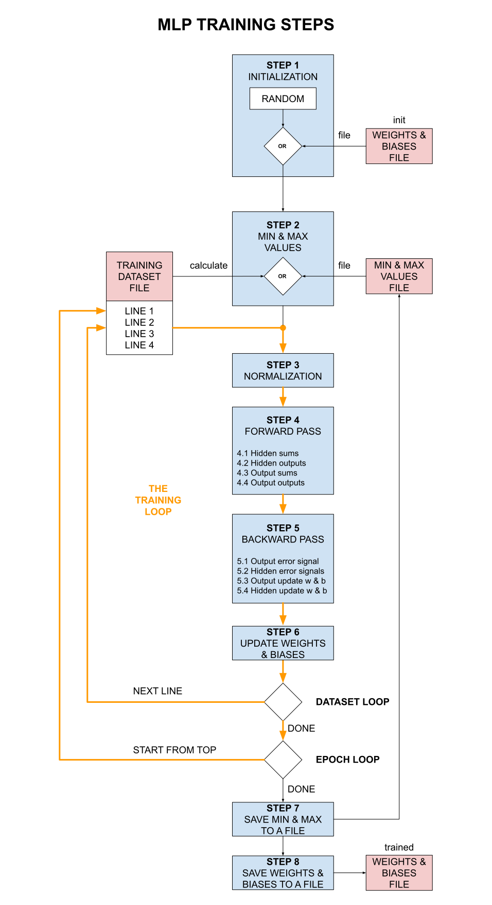

# THE MATH BEHIND TRAINING MLP NEURAL NETWORKS

_The math behind training a multi-layer perceptron (MLP) neural network._

Table of Contents

* [OVERVIEW](https://github.com/JeffDeCola/my-cheat-sheets/blob/master/software/development/software-architectures/artificial-intelligence/artificial-intelligence-cheat-sheet/the-math-behind-training-mlp-neural-networks.md#overview)
* [MATHEMATICAL MODEL OF NEURAL NETWORK](https://github.com/JeffDeCola/my-cheat-sheets/blob/master/software/development/software-architectures/artificial-intelligence/artificial-intelligence-cheat-sheet/the-math-behind-training-mlp-neural-networks.md#mathematical-model-of-neural-network)
* [MLP ARCHITECTURE USED FOR THIS EXAMPLE](https://github.com/JeffDeCola/my-cheat-sheets/blob/master/software/development/software-architectures/artificial-intelligence/artificial-intelligence-cheat-sheet/the-math-behind-training-mlp-neural-networks.md#mlp-architecture-used-for-this-example)
* [THE TRAINING DATASET](https://github.com/JeffDeCola/my-cheat-sheets/blob/master/software/development/software-architectures/artificial-intelligence/artificial-intelligence-cheat-sheet/the-math-behind-training-mlp-neural-networks.md#the-training-dataset)
* [STEP 1 - INITIALIZATION](https://github.com/JeffDeCola/my-cheat-sheets/blob/master/software/development/software-architectures/artificial-intelligence/artificial-intelligence-cheat-sheet/the-math-behind-training-mlp-neural-networks.md#step-1---initialization)
* [THE TRAINING LOOP](https://github.com/JeffDeCola/my-cheat-sheets/blob/master/software/development/software-architectures/artificial-intelligence/artificial-intelligence-cheat-sheet/the-math-behind-training-mlp-neural-networks.md#the-training-loop)
  * [STEP 2 - NORMALIZATION](https://github.com/JeffDeCola/my-cheat-sheets/blob/master/software/development/software-architectures/artificial-intelligence/artificial-intelligence-cheat-sheet/the-math-behind-training-mlp-neural-networks.md#step-2---normalization)
  * [STEP 3 - FORWARD PASS](https://github.com/JeffDeCola/my-cheat-sheets/blob/master/software/development/software-architectures/artificial-intelligence/artificial-intelligence-cheat-sheet/the-math-behind-training-mlp-neural-networks.md#step-3---forward-pass)
  * [STEP 4 - BACKWARD PASS](https://github.com/JeffDeCola/my-cheat-sheets/blob/master/software/development/software-architectures/artificial-intelligence/artificial-intelligence-cheat-sheet/the-math-behind-training-mlp-neural-networks.md#step-4---backward-pass)
  * [STEP 5 - UPDATE WEIGHTS & BIASES](https://github.com/JeffDeCola/my-cheat-sheets/blob/master/software/development/software-architectures/artificial-intelligence/artificial-intelligence-cheat-sheet/the-math-behind-training-mlp-neural-networks.md#step-5---update-weights--biases)
* [STEP 6 - SAVE WEIGHTS & BIASES](https://github.com/JeffDeCola/my-cheat-sheets/blob/master/software/development/software-architectures/artificial-intelligence/artificial-intelligence-cheat-sheet/the-math-behind-training-mlp-neural-networks.md#step-6---save-weights--biases)

Documentation and Reference

* [artificial intelligence](https://github.com/JeffDeCola/my-cheat-sheets/tree/master/software/development/software-architectures/artificial-intelligence/artificial-intelligence-cheat-sheet)
cheat sheet
* [neural networks](https://github.com/JeffDeCola/my-cheat-sheets/tree/master/software/development/software-architectures/artificial-intelligence/artificial-intelligence-cheat-sheet/neural-networks.md)
cheat sheet
* [my-neural-networks](https://github.com/JeffDeCola/my-neural-networks/tree/main)
  * [perceptron-simple-example](https://github.com/JeffDeCola/my-neural-networks/tree/main/perceptron-simple-example)
  * [mlp-classification-example](https://github.com/JeffDeCola/my-neural-networks/tree/main/mlp-classification-example)
  * [mlp-image-recognition-example](https://github.com/JeffDeCola/my-neural-networks/tree/main/mlp-regression-example)
  * [mlp-regression-example](https://github.com/JeffDeCola/my-neural-networks/tree/main/mlp-image-recognition-example)

## OVERVIEW

The goal of training a neural network is to adjust the weights and biases
of the neural network so that the predicted output is as close as possible
to the actual output.

A neural networks is trained using a training dataset.
The entire process of training a neural network is shown below,



## MATHEMATICAL MODEL OF NEURAL NETWORK

Since we are dealing with neural networks, let's quicky review our model of a neuron.
Check out a more detailed view in my cheat sheets
[mathematical model of a neuron](https://github.com/JeffDeCola/my-cheat-sheets/blob/master/software/development/software-architectures/artificial-intelligence/artificial-intelligence-cheat-sheet/neural-networks.md#mathematical-model-of-a-neuron).


An artificial neuron consists of the following components,

* **Inputs**
  * $x_{[i]}$
* **Summation Function**
  * Weighted sum of inputs
  * Adds a bias term to the weighted sums $b$
  * $s = f(x,w) = \sum_{i=1}^{n} x_i w_i + b$
* **Activation Function**
  * The activation function determines if the neuron will fire or not
  * Applies a nonlinear activation function $f(s)$ to the sum such
    as sigmoid or tanh
* **Output**
  * The result $y = f(s)$

## MLP ARCHITECTURE USED FOR THIS EXAMPLE

As we go through this cheat sheet,
we will use the following multi-layer perceptron (MLP) neural network as our example.


where

* **Input Layer**
  * Two input values
    * $x[0], x[1]$
* **Hidden Layer**
  * Each node has two inputs, hence two weights
    * $wh[0][0][0], wh[0][0][1], wh[0][1][0], wh[0][1][1], wh[0][2][0], wh[0][2][1]$
    * \[hidden layer]\[hidden node]\[input node]
  * One bias term
    * $bh[0][0], bh[0][1], bh[0][2]$
    * \[hidden layer]\[hidden node]
  * Three activation functions
    * $fh[0][0](s), fh[0][1](s), fh[0][2](s)$
    * \[hidden layer]\[hidden node]
  * Three outputs
    * $yh[0][0], yh[0][1], yh[0][2]$
    * \[hidden layer]\[hidden node]
* **Output Layer**
  * The node has three inputs, hence three weights
    * $wo[0][0], wo[0][1] wo[0][2]$
    * \[output node]\[hidden node]
  * One bias term
    * $bo[0]$
  * Two output values
    * $yo[0], yo[1]$

## THE TRAINING DATASET

The training dataset is the data used to train the neural network.
The dataset consists of input values and the corresponding output values.

In our example, we will use the following training dataset,

```csv
I0,  I1,  Z0
70,  100, 90
50,  85,  80
65,  70,  80
30,  95,  70
```

## STEP 1 - INITIALIZATION

The first step is to initialize the weights and biases of the neural network.
This is usually done randomly. Random numbers between $[-1, 1]$ are usually used.

For our example, we will initialize the weights and biases as follows,

* **HIDDEN LAYER 0**
  * NODE 0
    * hiddenWeight {-0.5 -1.0}
    * hiddenBias {0.5}
  * NODE 1
    * hiddenWeight {-0.5. .5}
    * hiddenBias {0.5}
  * NODE 2
    * hiddenWeight {1.0 0.0}
    * hiddenBias {0.5}
* **OUTPUT LAYER**
  * NODE 0
    * outputWeight {0.5 -1.0 0.0}
    * outputBias {0.5}


## THE TRAINING LOOP

The goal of training is to adjust the weights and biases
to minimize the difference between the actual output $y$
and the actual targets $z$.
The training loop is the process of training the neural network.
There are two loops,

* **Epochs**
  * The number of times the entire dataset is passed forward and backward
* **One Full Dataset**
  * The entire dataset is passed forward and backward to adjust the weights and biases

### STEP 2 - NORMALIZATION

Normalization, also called min-max scaling, changes the values of
input dataset $i$ to occupy a range of $[0, 1]$ or $[-1, 1]$,
reducing the influence of unusual values of out model.


#### MIN-MAX SCALING FUNCTION [0, 1]

The formula to normalize a training dataset using min-max $[0, 1]$ scaling is,

$$
normalized \; data = \frac{data - min(dataset)}{max(dataset) - min(dataset)}
$$

where

* $data$ is the input data
* $min(dataset)$ is the minimum value of the dataset
* $max(dataset)$ is the maximum value of the dataset
* $normalized \; data$ is the output

For example, from our dataset,

```csv
I0,  I1,  Z0
70,  98,  91
50,  85,  82
65,  67,  80
25,  95,  68
```

For $I[0]$, 25 is the minimum value and 70 is the maximum value.
For $I[1]$, 67 is the minimum value and 98 is the maximum value.

Hence, for data input for $I[0]$ of 65 would be normalized to,

$$
\frac{65 - 25}{70 - 25} = 0.8888
$$

Doing all the calculations for [0,1], the input dataset would look like,

```csv
I[0] -> Normalized   I[1] -> Normalized
70   -> 1.0          98   -> 1.0
50   -> 0.5555       85   -> 0.5806
65   -> 0.8888       67   -> 0.0
25   -> 0.0          95   -> 0.9032
```

#### MIN-MAX SCALING FUNCTION [-1, 1]

The formula to normalize a training dataset using min-max $[-1, 1]$ scaling is,
$$

normalized \; data = \frac{data - min(dataset)}{max(dataset) - min(dataset)}
\times 2 - 1
$$

This will normalize the dataset to the range of [-1, 1].

Doing all the calculations, the input dataset would look like,

```csv
I[0] -> Normalized   I[1] -> Normalized
70   -> 1.0          98   -> 1.0
50   -> -0.1111      85   -> 0.1613
65   -> 0.7777       67   -> -1.0
25   -> -1.0         95   -> 0.8064
```

### STEP 3 - FORWARD PASS

Forward propagation is the process of moving the input data through the
neural network to get an output. Each Hidden out output node will
calculate a Summation Function and apply an Activation Function.


#### THE SUMMATION FUNCTION

The summation function takes the weighted inputs and sums them up and
then adds a bias term.

$$
\begin{aligned}
s = f(w,b) &= x_1 w_1 + x_2 w_2 + \cdots + x_n w_n + b \\
&= \sum_{i=1}^{n} x_i w_i + b
\end{aligned}
$$

Where,

* $x_1, x_2, \ldots, x_n$ are the input values
* $w_1, w_2, \ldots, w_n$ are the weights
* $b$ is the bias
* $n$ is the number of inputs

#### THE ACTIVATION FUNCTION

The activation function $f(s)$ is a nonlinear function.
Two common activation functions are,
the sigmoid function and the tanh function.

##### The Sigmoid Function

$$
\begin{aligned}
\sigma(s) &= \frac{1}{1 + e^{-s}} \\
\sigma'(s) &= \sigma(s)(1 - \sigma(s))
\end{aligned}
$$

<p align="center">
    

##### The Tanh Function

$$
\begin{aligned}
\tanh(s) &= \frac{e^s - e^{-s}}{e^s + e^{-s}} \\
\tanh'(s) &= 1 - \tanh^2(s)
\end{aligned}
$$

<p align="center">
    

#### THE OUTPUT FUNCTION

And the output of the neuron is simply the output of the activation function,

$$
y = f(s)
$$

#### OUR EXAMPLE

The output functions for the hidden layer nodes in our example would be,

$$
\begin{aligned}
y_{h[0][0]} &= f_{h[0][0]}(s) \\
&= f_{h[0][0]}\left(x_{[0]} w_{h[0][0][0]} +
   x_{[1]} w_{h[0][0][1]} + b_{h[0][0]}\right) \\
&= f_{h[0][0]}\left((1.0 \cdot -0.5) + (1.0 \cdot -1.0) + 0.5\right) \\
&= f_{h[0][0]}\left(-0.5 - 1.0 + 0.5\right) \\
&= f_{h[0][0]}\left(-1.0\right) \\
&= \sigma(-1.0) \\
&= 0.2689
\end{aligned}
$$

$$
\begin{aligned}
y_{h[0][1]} &= f_{h[0][1]}(s) \\
&= f_{h[0][1]}\left(x_{[0]} w_{h[0][1][0]} +
   x_{[1]} w_{h[0][1][1]} + b_{h[0][1]}\right) \\
&= f_{h[0][1]}\left((1.0 \cdot -0.5) + (1.0 \cdot 0.5) + 0.5\right) \\
&= f_{h[0][1]}\left(-0.5 + 0.5 + 0.5\right) \\
&= f_{h[0][1]}\left(0.5\right) \\
&= \sigma(0.5) \\
&= 0.6225
\end{aligned}
$$

$$
\begin{aligned}
y_{h[0][2]} &= f_{h[0][2]}(s) \\
&= f_{h[0][2]}\left(x_{[0]} w_{h[0][2][0]} +
   x_{[1]} w_{h[0][2][1]} + b_{h[0][2]}\right) \\
&= f_{h[0][2]}\left((1.0 \cdot 1.0) + (1.0 \cdot 0.0) + 0.5\right) \\
&= f_{h[0][2]}\left(1.0 + 0.0 + 0.5\right) \\
&= f_{h[0][2]}\left(1.5\right) \\
&= \sigma(1.5) \\
&= 0.8176
\end{aligned}
$$

The output function for the output layer node would be,

$$
\begin{aligned}
y_{o[0]} &= f_{o[0]}(s) \\
&= f_{o[0]}\left(y_{h[0][0]} w_{o[0][0]} + y_{h[0][1]} w_{o[0][1]} +
   y_{h[0][2]} w_{o[0][2]} + b_{o[0]}\right) \\
&= f_{o[0]}\left((0.2689 \cdot 0.5) + (0.6225 \cdot -1.0) +
   (0.8176 \cdot 0.0) + 0.5\right) \\
&= f_{o[0]}\left(0.1345 - 0.6225 + 0.0 + 0.5\right) \\
&= f_{o[0]}\left(0.0120\right) \\
&= \sigma(0.0120) \\
&= 0.5030
\end{aligned}
$$

### STEP 4 - LOSS FUNCTION

The loss function is the difference between the
predicted output $y$
and the target output $z$.


#### MEAN SQUARED ERROR (MSE)

Mean Squared Error (mse) is a common loss function used in regression problems.
It is the average of the squared differences between the
predicted output and target output.

$$
\begin{aligned}
Loss &= \frac{1}{2} \left(predicted - target\right)^2 \\
L&= \frac{1}{2} \left(y-z\right)^2
\end{aligned}
$$

We use mse over a simple linear loss because,

* It is differentiable (which is important for gradient descent below)
* It penalizes errors more due to squaring

**The goal is to minimize the loss function**. Ideally we want it to be zero.

### STEP 5 - BACKWARD PASS

We will use stochastic gradient descent (SGD) to adjust the weights and biases.
What does this mean?

1. We will calculate the gradient of the loss function with respect
   to the weights and biases.
2. Then we will adjust the weights and biases in the opposite direction of the gradient

#### AN EXPLANATION OF THE GRADIENT DESCENT ALGORITHM

So how do we do minimize the loss function when we have so many weights and biases?
We will use a technique called gradient descent.
Gradient descent is an optimization algorithm used to minimize some function
by iteratively moving in the direction of steepest descent as defined by the
negative of the gradient.

The formula for gradient descent is,

$$
\theta_{new} = \theta_{old} - \alpha \nabla f(\theta_{old})
$$

Where,

* $\theta_{new}$ is the new value of the parameter
* $\theta_{old}$ is the old value of the parameter
* $\alpha$ is the learning rate (a small number)
* $\nabla f(\theta)$ is the gradient of the function with respect to the parameter


As an example, lets say we have a function $f(x,y)$ and we want to
find the minimum value of $f(x,y)$.

$$
\begin{aligned}
f(x,y) &= x^2 + y^2 \\
z &= x^2 + y^2
\end{aligned}
$$

This represents a paraboloid (a bowl-shaped surface).
The graph would look like,

<p align="center">
    

The gradient of $f(x,y)$ is just the partial derivatives of $f(x,y)$ with
respect to $x$ and $y$.

Partial derivative with respect to $x$,

$$
\begin{aligned}
\nabla f(x) &= \frac{\partial f}{\partial x} \\
&= \frac{\partial}{\partial x} (x^2 + y^2) \\
&= 2x
\end{aligned}
$$

Partial derivative with respect to $y$,

$$
\begin{aligned}
\nabla f(y) &= \frac{\partial f}{\partial y} \\
&= \frac{\partial}{\partial y} (x^2 + y^2) \\
&= 2y
\end{aligned}
$$

Using the gradient descent formula for $x$ and $y$,

$$
\begin{aligned}
x_{new} &= x_{old} - \alpha \nabla f(x_{old}) \\
&= x_{old} - \alpha \frac{\partial f}{\partial x} \\
&= x_{old} - \alpha (2x)
\end{aligned}
$$

$$
\begin{aligned}
y_{new} & = y_{old} - \alpha \nabla f(y_{old}) \\
&= y_{old} - \alpha \frac{\partial f}{\partial y} \\
&= y_{old} - \alpha (2y) \\
\end{aligned}
$$

We can write the gradient descent formula for $x$ and $y$ as,

$$
\mathbf{\nabla f(x,y)} = \left[ \mathbf{2x}, \mathbf{2y} \right] \tag{1}
$$

This will move us closer to the minimum of the function.

As an example, let's start at a random point (3, 4) and try
to find the minimum of the function $f(x,y) = x^2 + y^2$.

$$
\begin{aligned}
\nabla f(3,4) &= \left[2 \cdot 3, 2 \cdot 4\right] \\
&= \left[6, 8\right]
\end{aligned}
$$

If we want to move to the minimum, we would subtract the gradient,

$$
\begin{aligned}
x_{new} &= 3 - \alpha \cdot 6 \\
&= 3 - 0.1 \cdot 6 \\
&= 3 - 0.6 \\
&= 2.4
\end{aligned}
$$

$$
\begin{aligned}
y_{new} &= 4 - \alpha \cdot 8 \\
&= 4 - 0.1 \cdot 8 \\
&= 4 - 0.8 \\
&= 3.2
\end{aligned}
$$

Now the new points would be (2.4, 3.2). If we continue this process,

$$
\begin{aligned}
\nabla f(2.4, 3.2) &= \left[2 \cdot 2.4, 2 \cdot 3.2\right] \\
&= \left[4.8, 6.4\right]
\end{aligned}
$$

$$
\begin{aligned}
x_{new} &= 2.4 - 0.1 \cdot 4.8 \\
&= 2.4 - 0.48 \\
&= 1.92
\end{aligned}
$$

$$
\begin{aligned}
y_{new} &= 3.2 - 0.1 \cdot 6.4 \\
&= 3.2 - 0.64 \\
&= 2.56
\end{aligned}
$$

Hence, the new point would be (2.4, 3.2). If we continue this process,
we will eventually reach the minimum of the function which is (0, 0).

Lets show a table of these calculations,

| x   | y   | $\nabla f(x,y)$ | $x_{new}$ | $y_{new}$ |
|-----|-----|-----------------|-----------|-----------|
| 3   | 4   | [6, 8]          | 2.4       | 3.2       |
| 2.4 | 3.2 | [4.8, 6.4]      | 1.92      | 2.56      |
| 1.92| 2.56| [3.84, 5.12]    | 1.536     | 2.048     |
| 1.536| 2.048| [3.072, 4.096] | 1.2288    | 1.6384    |
| 1.2288| 1.6384| [2.4576, 3.2768] | 0.98304 | 1.31072 |
| 0.98304| 1.31072| [1.96608, 2.62144] | 0.786432 | 1.048576 |
| 0.786432| 1.048576| [1.572864, 2.097152] | 0.6291456 | 0.8388608 |
| 0.6291456| 0.8388608| [1.2582912, 1.6777216] | 0.50331648 | 0.67108864 |
| 0.50331648| 0.67108864| [1.00663296, 1.34217728] | 0.402653184 | 0.536870912 |

You can see we are getting closer to the minimum of the function (0, 0).


