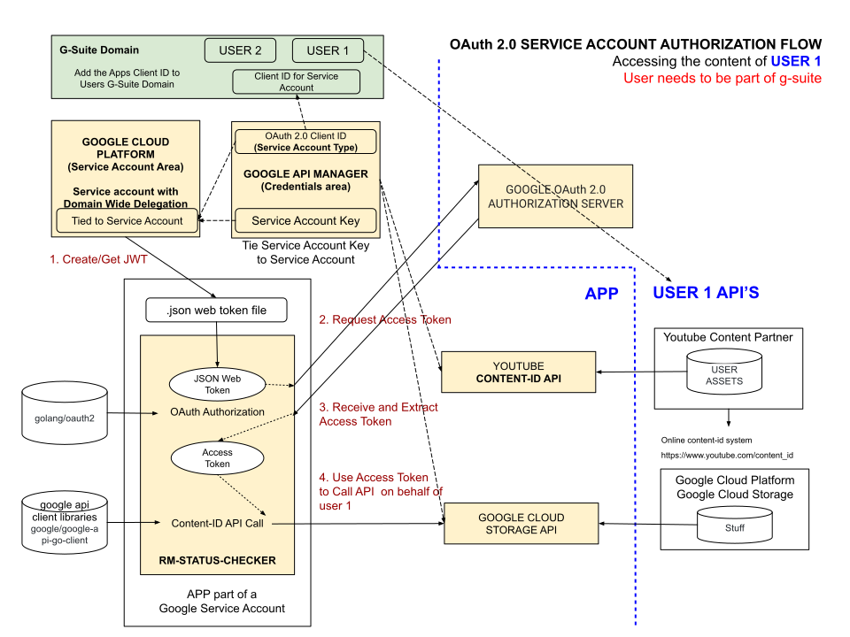

# OAuth 2.0 SERVICE ACCOUNT AUTHORIZATION CHEAT SHEET

_OAuth 2.0 Service Account Authorization Flow is using your
service account to access your data or one of your teams data via g-suite._

Table of Contents

* [OAuth 2.0 SERVICE ACCOUNT FLOW - TO AUTHORIZE API CALLS](https://github.com/JeffDeCola/my-cheat-sheets/blob/master/software/development/software-architectures/authorization/OAuth-2.0-authorization-cheat-sheet/OAuth-2.0-authorization-service-account-flow.md#oauth-20-service-account-flow---to-authorise-api-calls)
* [CREATE OAuth 2.0 CLIENT ID & SECRET](https://github.com/JeffDeCola/my-cheat-sheets/blob/master/software/development/software-architectures/authorization/OAuth-2.0-authorization-cheat-sheet/OAuth-2.0-authorization-service-account-flow.md#create-oauth-20-client-id--secret)
* [HIGH-LEVEL VIEW](https://github.com/JeffDeCola/my-cheat-sheets/blob/master/software/development/software-architectures/authorization/OAuth-2.0-authorization-cheat-sheet/OAuth-2.0-authorization-service-account-flow.md#high-level-view)

Documentation and Reference

* [Web Server-Side Flow](https://github.com/JeffDeCola/my-cheat-sheets/tree/master/software/development/software-architectures/authorization/OAuth-2.0-authorization-cheat-sheet/OAuth-2.0-authorization-web-server-app-flow.md)
* Client-Side Flow
* Installed App Flow
* Device Flow
* [Service Account Flow](https://github.com/JeffDeCola/my-cheat-sheets/tree/master/software/development/software-architectures/authorization/OAuth-2.0-authorization-cheat-sheet/OAuth-2.0-authorization-service-account-flow.md)
  **<- YOU ARE HERE**

## OAuth 2.0 SERVICE ACCOUNT FLOW - TO AUTHORIZE API CALLS

A Service Account is a Google Account that can be used to
authorize API calls without ANY user interaction. It's Server-to-Server.

For the OAuth 2.0 flow for Service Accounts, the steps for authenticating
and authorizing access to API resources do not take place in a web browser

Your application can use the OAuth 2.0 flow for Service Accounts
such as the YouTube Content ID API or google Cloud Storage API.

## CREATE OAuth 2.0 CLIENT ID & SECRET

To create an `OAuth 2.0 Client ID` goto credentials page
[here](https://console.developers.google.com/projectselector/apis/credentials)
and select create credentials.

Create a OAuth 2.0 client IDs for a `web application`.

You will now have a Client ID and a Secret.  Obviously, keep this in a safe place.

## HIGH-LEVEL VIEW

The following diagram illustrates how everything fits together. To
access a users info they must be in your g-suite domain.

