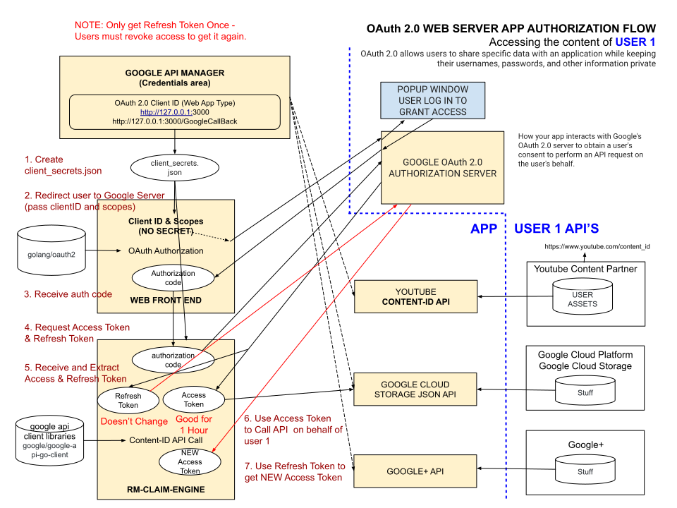

# OAuth 2.0 WEB SERVER APP AUTHORIZATION CHEAT SHEET

_OAuth 2.0 Web Server Side Authorization Flow allows users to authenticate
themselves in order for an APP to gain access to their information via an API._

Table of Contents

* [HIGH-LEVEL VIEW](https://github.com/JeffDeCola/my-cheat-sheets/blob/master/software/development/software-architectures/authorization/OAuth-2.0-authorization-cheat-sheet/OAuth-2.0-authorization-web-server-app-flow.md#high-level-view)
* [THE STEPS TO LOG IN](https://github.com/JeffDeCola/my-cheat-sheets/blob/master/software/development/software-architectures/authorization/OAuth-2.0-authorization-cheat-sheet/OAuth-2.0-authorization-web-server-app-flow.md#the-steps-to-log-in)
  * [STEP 1 - CREATE OAuth 2.0 CLIENT ID & SECRET](https://github.com/JeffDeCola/my-cheat-sheets/blob/master/software/development/software-architectures/authorization/OAuth-2.0-authorization-cheat-sheet/OAuth-2.0-authorization-web-server-app-flow.md#step-1---create-oauth-20-client-id--secret)
  * [STEP 2 - USER GETS REDIRECTED TO LOGIN TO ACCOUNT](https://github.com/JeffDeCola/my-cheat-sheets/blob/master/software/development/software-architectures/authorization/OAuth-2.0-authorization-cheat-sheet/OAuth-2.0-authorization-web-server-app-flow.md#step-2---user-gets-redirected-to-login-to-account)
  * [STEP 3 - GET AUTHORIZATION CODE](https://github.com/JeffDeCola/my-cheat-sheets/blob/master/software/development/software-architectures/authorization/OAuth-2.0-authorization-cheat-sheet/OAuth-2.0-authorization-web-server-app-flow.md#step-3---get-authorization-code)
  * [STEP 4 - USER AUTH CODE TO GET TOKEN (ACCESS AND REFRESH)](https://github.com/JeffDeCola/my-cheat-sheets/blob/master/software/development/software-architectures/authorization/OAuth-2.0-authorization-cheat-sheet/OAuth-2.0-authorization-web-server-app-flow.md#step-4---user-auth-code-to-get-token-access-and-refresh)
  * [STEP 5 - USE ACCESS TOKEN TO CALL API](https://github.com/JeffDeCola/my-cheat-sheets/blob/master/software/development/software-architectures/authorization/OAuth-2.0-authorization-cheat-sheet/OAuth-2.0-authorization-web-server-app-flow.md#step-5---use-access-token-to-call-api)

Documentation and Reference

* [Web Server-Side Flow](https://github.com/JeffDeCola/my-cheat-sheets/tree/master/software/development/software-architectures/authorization/OAuth-2.0-authorization-cheat-sheet/OAuth-2.0-authorization-web-server-app-flow.md)
  **<- YOU ARE HERE**
* Client-Side Flow
* Installed App Flow
* Device Flow
* [Service Account Flow](https://github.com/JeffDeCola/my-cheat-sheets/tree/master/software/development/software-architectures/authorization/OAuth-2.0-authorization-cheat-sheet/OAuth-2.0-authorization-service-account-flow.md)

## HIGH-LEVEL VIEW

The following diagram illustrates how everything fits for
Web Server-Side Flow,

## THE STEPS TO LOG IN

### STEP 1 - CREATE OAuth 2.0 CLIENT ID & SECRET

To create Create a `OAuth 2.0 Client ID` goto credentials page
[here](https://console.developers.google.com/projectselector/apis/credentials)
and select create credentials.

Create a OAuth 2.0 client IDs for a Web Application.

You will now have a Client ID and a Secret.

### STEP 2 - USER GETS REDIRECTED TO LOGIN TO ACCOUNT

The user opens the website and clicks the login button.

### STEP 3 - GET AUTHORIZATION CODE

If you use go, you can use the `golang/oauth2` client libraries
[here](https://github.com/golang/oauth2)
to implement OAuth 2.0 in your application.

### STEP 4 - USER AUTH CODE TO GET TOKEN (ACCESS AND REFRESH)

Use the code you get to obtain a,

* Access Token: Good for one hour.
* Refresh Token : Only get once. Save this. Good forever until user revokes.

You only get a `refresh token` if you specified
access_type as offline when getting `auth code`.  Meaning
the user can be offline but you may use the `refresh token` to
get a new `access token`.

### STEP 5 - USE ACCESS TOKEN TO CALL API

You can use the `google/google-api-go-client` client libraries
[here](https://github.com/google/google-api-go-client)
to use APIs in your application.
