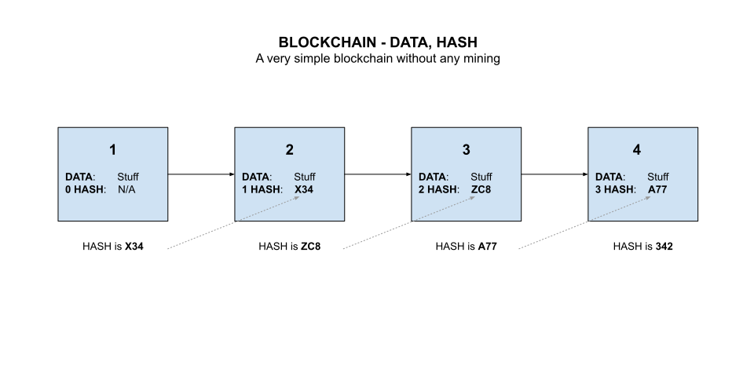
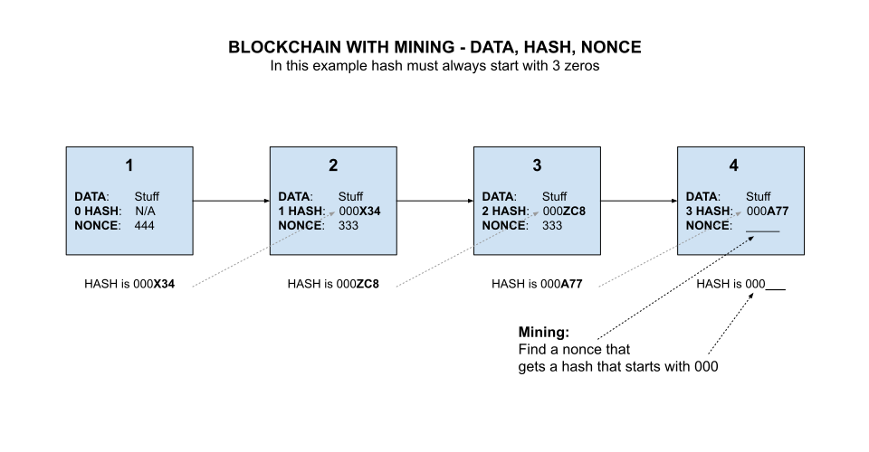

# BLOCKCHAIN CHEAT SHEET

_A blockchain is a digital way to save data and make it immutable._

Table of Contents

* [OVERVIEW](https://github.com/JeffDeCola/my-cheat-sheets/tree/master/software/development/software-architectures/blockchain/blockchain-cheat-sheet#overview)
* [HOW DOES IT WORK](https://github.com/JeffDeCola/my-cheat-sheets/tree/master/software/development/software-architectures/blockchain/blockchain-cheat-sheet#how-does-it-work)
* [WHY IS THIS IMMUTABLE - WHY DO WE ADD BLOCKS](https://github.com/JeffDeCola/my-cheat-sheets/tree/master/software/development/software-architectures/blockchain/blockchain-cheat-sheet#why-is-this-immutable---why-do-we-add-blocks)

Documentation and Reference

* Check out a
  [single-node-blockchain-with-REST](https://github.com/JeffDeCola/my-go-examples/tree/master/architectures/blockchain/single-node-blockchain-with-REST)
  I wrote in go

## OVERVIEW

A blockchain is a structure for storing data in which groups of
valid transactions, called blocks, form a chronological chain,
with each block cryptographically linked to the previous one.

* The data comes in blocks
* Blocks are chained together and this makes their data immutable
* When a block of data is chained to the other blocks,
  its data can never be changed again
* It is publicly available to anyone who wants to
  see it

## HOW DOES IT WORK

### STEP 1 - A BLOCK OF DATA

* A block mainly has immutable data in it.

### STEP 2 - BLOCK HASH

* Every block gets a unique digital signature (a hash)
  that corresponds to exactly the data in that block
* The hash has a few characters at the beginning
  that are unique (e.g. 000).

### STEP 3 - CHAIN BLOCKS TOGETHER

* Chain blocks together with the previous blocks hash
* Hence block 2 has the has of block 1 and using it for its hash
* Once data has been added to the blockchain, it can never be changed

Here is an illustration of a chain of blocks,

Now imagine if the data in block 1 is altered, even by 1 bit.
That would create a new hash.
That would obviously break the chain and would be rejected.

### STEP 4 - MINING - FINDING THE NONCE

When adding a block we have three things,

* The data
* The previous blocks hash
* A nonce (a random info to mine)

The goal is to find a nonce that will result in the
hash to have that unique number (e.g. 000) at
the start of the hash.

## WHY IS THIS IMMUTABLE - WHY DO WE ADD BLOCKS

It is almost impossible to go back in the chain and change anything.
The amount of computation power is virtually infinite.

By adding new blocks you keep the chain going, hence
bad people can't start changing the data because they have to
recalculate all the blocks.
