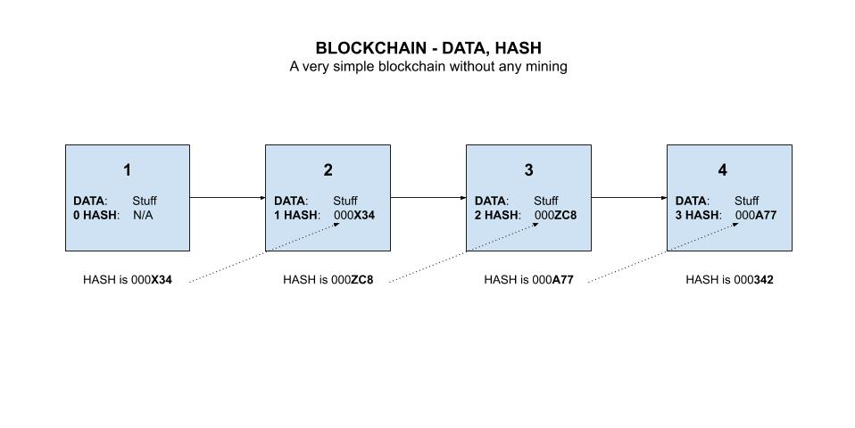
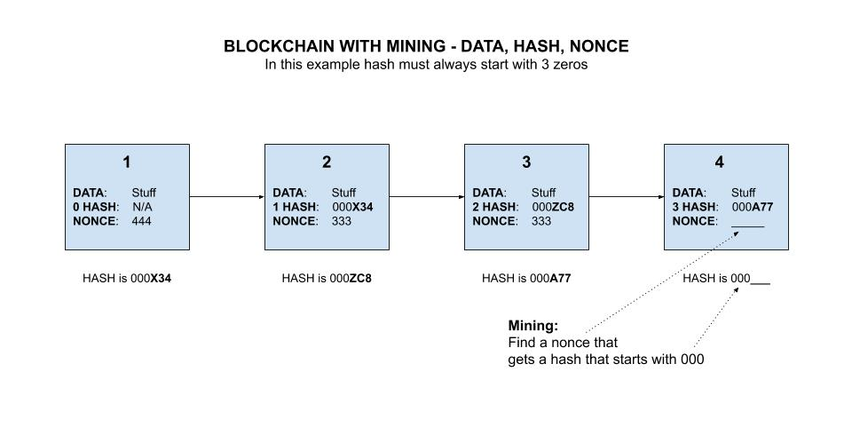

# BLOCKCHAIN CHEAT SHEET

```txt
*** THIS CHEAT SHEET IS UNDER CONSTRUCTION - CHECK BACK SOON ***
```

`blockchain` _is a digital way to save data and make it immutable._

tl;dr,

```bash
tbd
```

Table of Contents,

* tbd

Documentation and reference,

* A
  [simple-blockchain](https://github.com/JeffDeCola/my-go-examples/tree/master/blockchain/simple-blockchain)
  I wrote in go in `my-go-examples` repo.

View my entire list of cheat sheets on
[my GitHub Webpage](https://jeffdecola.github.io/my-cheat-sheets/).

## OVERVIEW

* Digital concept to store data
* This data comes in blocks
* Blocks are chained together, and this makes their data immutable.
* When a block of data is chained to the other blocks,
  its data can never be changed again.
* It is publicly available to anyone who wants to
  see it

Nobody can change that piece of information once it is on a blockchain

## STEP 1 - A BLOCK OF DATA

* A Block mainly has immutable data in it

## STEP 2 - BLOCK HASH

* Every block gets a unique digital signature (a hash)
  that corresponds to exactly the data in that block.
* The hash has a few characters at the beginning
  that are unique (e.g. 000).  More on this in a bit.

## STEP 3 - CHAIN BLOCKS TOGETHER

* Chain blocks together with the previous blocks hash.
* Hence block 2 has the has of block 1 and using it for its hash.
* Once data has been added to the blockchain, it can never be changed.

Here is an illustration of a chain of blocks,



Now imagine if the data in block 1 is altered, even by 1 bit.
That would create a new hash.

That would obviously break the chain, and it is rejected.

## STEP 4 - MINING - FINDING THE NONCE

When adding a block we have three things,

* The data
* The previous blocks hash
* A nonce (a random info to mine)

The goal is to find a nonce that will result in the
hash to have that unique number (e.g. 000) at
the start of the hash.



## WHY IS THIS IMMUTABLE

It is almost impossible to go back in the chain and change anything.
The amount of computation power is virtually infinite.
