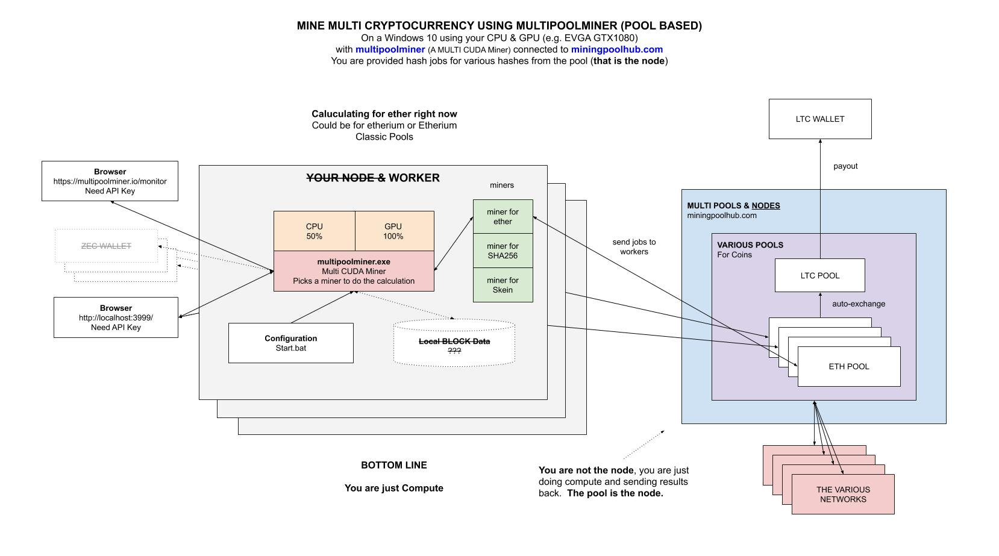

# MINE MULTI USING MULTIPOOLMINER CHEAT SHEET

`mine-multi-cryptocurrency-windows-multipoolminer` _will show you how to mine for
multi currencies on your Windows 10 using your GPU (e.g. NVIDIA EVGA GTX1080).
I will be using `multipoolminer` connected to `miningpoolhub.com`._

This is **pool based**, meaning the software will not work independently
since you would need a full node.  **The pool keeps the node**.

Table of Contents,

* [MININGPOOLHUB.COM](https://github.com/JeffDeCola/my-cheat-sheets/tree/master/software/development/software-architectures/blockchain/mine-multi-cryptocurrency-windows-multipoolminer#miningpoolhubcom)
  * [CONFIGURE AUTOEXCHANGE](https://github.com/JeffDeCola/my-cheat-sheets/tree/master/software/development/software-architectures/blockchain/mine-multi-cryptocurrency-windows-multipoolminer#configure-autoexchange)
  * [ADD A HUB WORKER](https://github.com/JeffDeCola/my-cheat-sheets/tree/master/software/development/software-architectures/blockchain/mine-multi-cryptocurrency-windows-multipoolminer#add-a-hub-worker)
* [MULTIPOOLMINER.EXE](https://github.com/JeffDeCola/my-cheat-sheets/tree/master/software/development/software-architectures/blockchain/mine-multi-cryptocurrency-windows-multipoolminer#multipoolminerexe)
  * [DOWNLOAD & INSTALL](https://github.com/JeffDeCola/my-cheat-sheets/tree/master/software/development/software-architectures/blockchain/mine-multi-cryptocurrency-windows-multipoolminer#download--install)
  * [CONFIGURE](https://github.com/JeffDeCola/my-cheat-sheets/tree/master/software/development/software-architectures/blockchain/mine-multi-cryptocurrency-windows-multipoolminer#configure)
  
## MININGPOOLHUB.COM

First, lets pick you pool. I registered at
[miningpoolhub.com](https://miningpoolhub.com).

There are other pools, but I choose this one.

### CONFIGURE AUTOEXCHANGE

This is a fancy way to say your base wallet.
I choose want LTC to be my base currency.

Add your LTC Address and a threshold of when to send.

### ADD A HUB WORKER

Add a Worker name and a password.
I used `WORKER1` as my worker.

## MULTIPOOLMINER.EXE

This is just compute software that does all the hash computations
it is told to do from the various multi pools.  It will determine which is
best for your machine.

This software Supports multiple platforms,

* AMD
* NVIDIA
* CPU

And Supports the following pools:

* MiningPoolHub (I'm using this one)
* Zpool
* HashRefinery
* Nicehash
* Ahashpool
* BlockMunch
* ItalYiiMP
* YiiMP.eu

It makes it money by taking out a little bit of coin per day.

There are other programs like `awesome miner` and `minerstat`,
but I choose this one.

Here is an illustration of what we're going to do,



### DOWNLOAD & INSTALL

Now lets get multipoolminer.exe for your rig.
Grab the latest Windows binary from
[https://github.com/MultiPoolMiner/MultiPoolMiner/releases](https://github.com/MultiPoolMiner/MultiPoolMiner/releases)

Place the folder anywhere on your rig.

### CONFIGURE

Its actually very simple. Open `Start-MiningPoolHub.bat` and simply edit
the following line to something like,

```bash
set "command=& .\multipoolminer.ps1
-API_Key <YOUR_API_KEY>
-APIPort 3999
-UserName <YOUR_USERNAME>
-WorkerName <YOUR_WORKER_NAME>
-Region US
-Currency usd
-DeviceName nvidia
-PoolName miningpoolhub-Algo
-Donate 10
-Watchdog
-MinerStatusURL https://multipoolminer.io/monitor/miner.php
-MinerStatusKey <YOUR KEY>
-SwitchingPrevention 2"
```

If you want to only use a particular miner (algorithm) use,

```txt
-Algorithm Ethash
```

If you want to mine for a particular coin like `Feathercoin` use,

```txt
-CoinName Feathercoin
```

I wanted to get Ethereum coin to work but can't seem to figure it out.

The API key allowed you to use this,

 [http://localhost:3999]( http://localhost:3999)

Thats it, you are mining and now wasting electricity.
