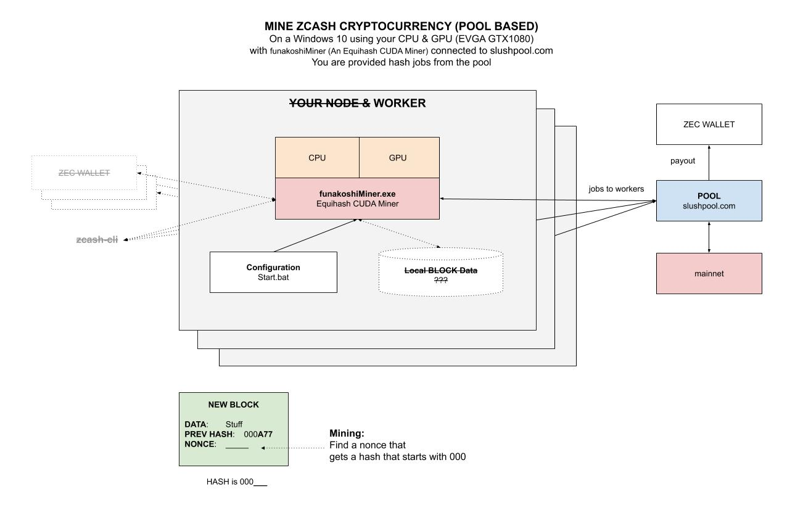

# MINE ZCASH CRYPTOCURRENCY WINDOWS EVGA GTX1080 CHEAT SHEET

`mine-zcash-cryptocurrency-windows-evga-gtx1080` _will show you how to mine for zcash(ZEC) on the
Zcash mainnet on your maWindows 10 using your GPU (EVGA GTX1080)._

tl;dr,

```bash

```

Table of Contents,

* tbd

## OVERVIEW OF ZCASH

* Launch: 2016
* Official website:
  [z.cash](https://z.cash/)
* Can you mine: YES
* Hash: Equihash based
* Max Supply: 21,000,000
* Proof Type: Proof of Work
* Example of a Wallet:
  [explorer.zcha.in](https://explorer.zcha.in/accounts/t1h1xStMimJTxAo9DvLY7koDj9UkKDACtxb)

The Block Rewards will issue a total of 50 Zcash (ZEC) every 10 mins.
The block spacing is 2.5 mins, so each block produces 12.5 ZEC.
10% of all coins mined will go to the Founders Reward.

## WINDOWS 10 EVGA GTX1080

There are many different hardware options but I am going to use
my gtx1080 on my windows rig. I will be using

* Run a full Node???
* Mine with your CPU???
* Built in Wallet for sending and receiving Zcash???

Here is an illustration of what we are going to do,



## INSTALL FROM SOURCE ON YOUR MACOS

Lets start the installation,
