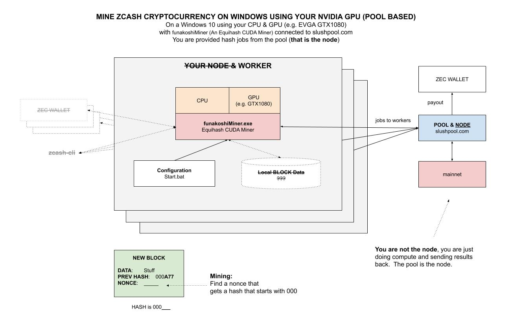

# MINE ZCASH CRYPTOCURRENCY WINDOWS NVIDIA GPU POOL CHEAT SHEET

`mine-zcash-cryptocurrency-windows-nvidia-gpu-pool` _will show you how to mine for
zcash(ZEC) on the Zcash on your Windows 10 using your Nvidia GPU
(e.g. EVGA GTX1080). I will be using open source software `funakoshiMiner`
connected to `SlushPool`._

This is **pool based**, meaning the software will not work independently
since you would need a full node.  **The pool keeps the node**.

Table of Contents,

* [OVERVIEW OF ZCASH](https://github.com/JeffDeCola/my-cheat-sheets/tree/master/software/development/software-architectures/blockchain/mine-zcash-cryptocurrency-windows-evga-gtx1080#overview-of-zcash)
* [WINDOWS 10 EVGA GTX1080](https://github.com/JeffDeCola/my-cheat-sheets/tree/master/software/development/software-architectures/blockchain/mine-zcash-cryptocurrency-windows-evga-gtx1080#windows-10-evga-gtx1080)
* [INSTALL funakoshiMiner](https://github.com/JeffDeCola/my-cheat-sheets/tree/master/software/development/software-architectures/blockchain/mine-zcash-cryptocurrency-windows-evga-gtx1080#install-funakoshiminer)
* [GET A SLUSH POOL ACCOUNT](https://github.com/JeffDeCola/my-cheat-sheets/tree/master/software/development/software-architectures/blockchain/mine-zcash-cryptocurrency-windows-evga-gtx1080#get-a-slush-pool-account)
* [CONFIGURE](https://github.com/JeffDeCola/my-cheat-sheets/tree/master/software/development/software-architectures/blockchain/mine-zcash-cryptocurrency-windows-evga-gtx1080#configure)

## OVERVIEW OF ZCASH

* Launch: 2016
* Official website:
  [z.cash](https://z.cash/)
* Can you mine: YES
* Hash: Equihash based
* Max Supply: 21,000,000
* Proof Type: Proof of Work
* Example of a Wallet:
  [explorer.zcha.in](https://explorer.zcha.in/accounts/t1h1xStMimJTxAo9DvLY7koDj9UkKDACtxb)

The Block Rewards will issue a total of 50 Zcash (ZEC) every 10 mins.
The block spacing is 2.5 mins, so each block produces 12.5 ZEC.
10% of all coins mined will go to the Founders Reward.

## WINDOWS 10 EVGA GTX1080

There are many different hardware and software options but
I am going to use my gtx1080 on my windows rig.
I will be using the open source funakoshiMiner with slush pool.

`Funakoshi` is a Equihash CUDA Miner.  So it works with ZEC and ETH
but not bitcoin.

Here is an illustration of what we're going to do,



## INSTALL funakoshiMiner

Grab the latest Windows binary from
[github.com/funakoshi2718/funakoshi-miner](https://github.com/funakoshi2718/funakoshi-miner)

Place the folder anywhere on your rig.

## GET A SLUSH POOL ACCOUNT

You really can use any pool, but I choose
[slushpool.com](https://slushpool.com).

Provide them a wallet to put your mined coins.
And then created a worker for ZEC coins in your dashboard.

## CONFIGURE

Its actually very simple. Open Start.bat and simply edit,

```bash
funakoshiMiner.exe --server us-east.zec.slushpool.com --port 4444 --user <USER>.<WORKER>
```

Thats it, you are mining and now wasting electricity.
