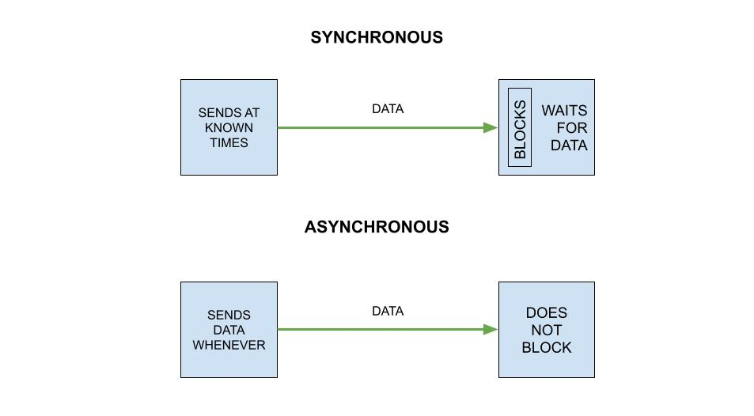
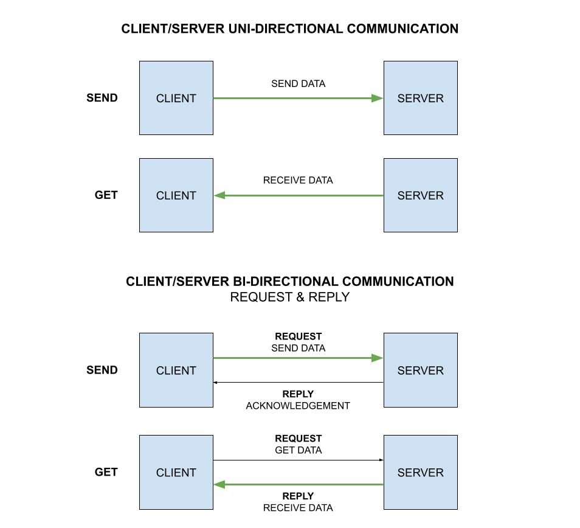

# IN-PROCESS AND INTER-PROCESS (IPC) COMMUNICATIONS OVERVIEW

_In-process and ipc overview._

Table of Contents,

* [SYNCHRONOUS AND ASYNCHRONOUS COMMUNICATION](https://github.com/JeffDeCola/my-cheat-sheets/tree/master/software/development/software-architectures/communication/in-process-and-inter-process-communications-ipc-overview-cheat-sheet#synchronous-and-asynchronous-communication)
* [CLIENT SERVER COMMUNICATION](https://github.com/JeffDeCola/my-cheat-sheets/tree/master/software/development/software-architectures/communication/in-process-and-inter-process-communications-ipc-overview-cheat-sheet#client-server-communication)
* [IN-PROCESS AND INTER-PROCESS COMMUNICATION](https://github.com/JeffDeCola/my-cheat-sheets/tree/master/software/development/software-architectures/communication/in-process-and-inter-process-communications-ipc-overview-cheat-sheet#in-process-and-inter-process-communication)

Documentation and reference,

* [my-go-example](https://github.com/JeffDeCola/my-go-examples)
  has a lot of examples

View my entire list of cheat sheets on
[my GitHub Webpage](https://jeffdecola.github.io/my-cheat-sheets/).

## SYNCHRONOUS AND ASYNCHRONOUS COMMUNICATION

Synchronous and asynchronous communication really depends on
what you're referring too. For example, if you have a uni-directional
communication and you are referring to the data transfer. Or if it
a bi-directional communication and you're referring to
the reply.

Here is a high-level view,

* Synchronous – The client expects a timely response and might
  even block while it waits
* Asynchronous – The client doesn’t block while waiting for a response,
  and the response, if any, may not be immediate

## CLIENT SERVER COMMUNICATION

## IN-PROCESS AND INTER-PROCESS COMMUNICATION

