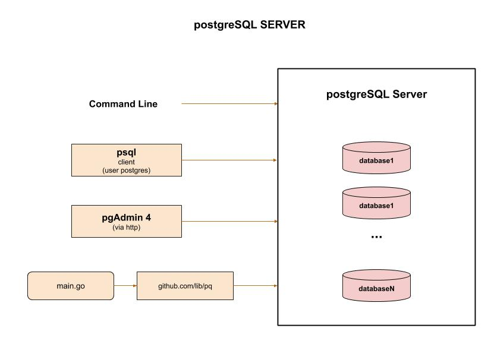

# postgreSQL CHEAT SHEET

`postgreSQL` _is a open source object-relational database system._

tl;dr,

```bash
sudo /etc/init.d/postgresql start
ps aux | grep -i postgres
sudo -u postgres psql
CREATE USER jeffd;
CREATE USER jeffd WITH ENCRYPTED PASSWORD 'mypass';
CREATE DATABASE jeff_db_example OWNER jeffd;
DROP DATABASE jeff_db_example3;
\l
\c jeff_db_example
CREATE TABLE people (id int primary key not null, first_name text, last_name text);
\d
```

Documentation and reference,

* [postgreSQL website](https://www.postgresql.org/)
* To use with go, refer to my repo
  [my-go-examples](https://github.com/JeffDeCola/my-go-examples/tree/master/database/postgreSQL)

View my entire list of cheat sheets on
[my GitHub Webpage](https://jeffdecola.github.io/my-cheat-sheets/).

## HISTORY

PostgreSQL is an object-relational database management system
(ORDBMS) based on POSTGRES, Version 4.2, developed at the
University of California at Berkeley Computer Science Department.

The origins of PostgreSQL date back to 1986 as part of the POSTGRES
project at the University of California at Berkeley and has more than
30 years of active development on the core platform.

## OVERVIEW

There are a few ways to interact with your database (server),

* Command Line
* psql (client)
* go library
* pgAdmin4

Here is an illustration,



## INSTALL POSTGRES (SERVER), PSQL (CLIENT) & PGADMIN4

Install from
[here](https://www.postgresql.org/download).

### UBUNTU/DEBIAN

Install postgreSQL Server,

```bash
sudo apt-get update
sudo apt-get -y install postgresql postgresql-client postgresql-contrib
sudo apt-get -y install pgadmin3
```

Add command line tools path ~/.bashrc

```bash
export PATH=/usr/lib/postgresql/9.5/bin:$PATH
export PATH=/usr/lib/postgresql/10/bin:$PATH
```

### MAC OS

I downloaded the interactive 
[installer](https://www.enterprisedb.com/downloads/postgres-postgresql-downloads)
by EnterpriseDB which includes,

* PostgreSQL Server
* pgAdmin - graphical tool for managing database
* Stackbuilder - package manager
* Command Line Tools (e.g. createdb)

Add command line tools path ~/.bashrc

```bash
export PATH=/Library/PostgreSQL/11/bin:$PATH
```

You could also use brew,

```bash
brew update
brew install postgresql
```

### INSTALL pgAdmin4

`pgAdmin` is a graphical tool for managing and
developing your databases.

Install from [here](https://www.pgadmin.org/download/)

It will run in your browser such as
[http://127.0.0.1:50088/browser/](http://127.0.0.1:50088/browser/)

To connect, just use the username `postgres` and the password you
will create below.

### CHECK VERSIONS

Server,

```bash
postgres -V
```

Client,

```bash
psql -V
```

pgadmin,

```bash
pgadmin3 -v
```

## CONFIGURE

The configuration files are,

* pg_hba.conf - Where Authentication is handled
* postgresql.conf - Server config.

Edit pg_hba.conf (macOS path is second one),

```bash
sudo su - postgres
nano /etc/postgresql/10/main/pg_hba.conf
nano /Library/PostgreSQL/11/data/pg_hba.conf
```
Make it look like,

```txt
# Local networks
host    all     all     xx.xx.xx.xx/xx  md5
# Example
host    all     all     192.168.0.0/24  md5
host    all     all     127.0.0.0/32    md5
```

Edit postgresql.conf (macOS path is second one),

```bash
sudo su - postgres
sudo nano /etc/postgresql/10/main/postgresql.conf
nano /Library/PostgreSQL/11/data/postgresql.conf
```

Replace `listen_addresses = 'localhost'` with `listen_addresses = '*'`

Restart server and confirm postgres listening on port 5432,

```txt
netstat -ant | grep 5432
tcp        0      0 0.0.0.0:5432            0.0.0.0:*               LISTEN
tcp6       0      0 :::5432                 :::*                    LISTEN
```

Change both passwords for user postgres and the username postgres
in psql,

Change user password,

```bash
sudo passwd postgres
```

Then change username in psql password,

```bash
sudo -u postgres psql
ALTER USER postgres PASSWORD 'Password';
```

## START/STOP POSTGRESQL SERVER

Check the postgreSQL server is running,

```bash
ps aux | grep -i postgres
```

### LINUX

Uses init.d,

Start,

```bash
sudo /etc/init.d/postgresql start
```

Stop,

```bash
sudo /etc/init.d/postgresql stop
``` 

### MACOS

Must be postgres user.

Status,

```bash
sudo su - postgres
/Library/PostgreSQL/11/bin/pg_ctl status -D /Library/PostgreSQL/11/data
```

Start,

```bash
sudo su - postgres
/Library/PostgreSQL/11/bin/pg_ctl -D /Library/PostgreSQL/11/data start
```

Stop,

```bash
sudo su - postgres
/Library/PostgreSQL/11/bin/pg_ctl -D /Library/PostgreSQL/11/data stop -s -m fast
``` 

## USING PSQL (CLIENT)

Become user `postgres`,

```bash
sudo su - postgres
./psql
```

But I like to use,

```bash
sudo -u postgres psql
```

Quit,

```bash
\q
```

## CREATE A USER

Create a user `jeffd`,

Method 1 - Create user using command line as user postgres,

```bash
sudo su - postgres
./createuser jeffd
```

Method 2 - Create user using command line without becoming user postgres,

```bash
sudo -u postgres createuser jeffd
```

Method 3 (USER THIS ONE) - Create user using
psql (REMEMBER TO END WITH `;`),

```bash
sudo -u postgres psql
CREATE USER jeffd WITH ENCRYPTED PASSWORD 'mypass';
CREATE USER jeffd;
```

Check user was created,

```bash
sudo -u postgres psql
\du
```

## CREATE A DATABASE

Create database `jeff_db_example`,

Method 1 - Create database using command line as user postgres,

```bash
sudo su - postgres
./creatdb --owner=jeffd jeff_db_example
```

Method 2 - Create database using command line without becoming user postgres,

```bash
sudo -u postgres createdb --owner=jeffd jeff_db_example
```

Method 3 (USER THIS ONE) - Create database using
psql (REMEMBER TO END WITH `;`),

```bash
sudo -u postgres psql
CREATE DATABASE jeff_db_example3 OWNER jeffd;
```

To drop a database,

```bash
DROP DATABASE jeff_db_example3;
```

Add a user to a database,

```bash
???
```

List all databases from psql,

```bash
sudo -u postgres psql
\l
```

## CONNECT TO A DATABASE

Connect to a `database` using psql,

```bash
sudo -u postgres psql
\c jeff_db_example
```

Then you can do things like create a table,

## CREATE A TABLE (YOUR SCHEMA)

Create table,

```bash
CREATE TABLE people (id int primary key not null, first_name text, last_name text);
GRANT ALL PRIVILEGES ON TABLE people TO jeffd;
```

## LIST TABLES

List all tables in a database your connected to,

```bash
\d
```

List a table in database,

```bash
\d people
\d+ people
```

## LIST ROWS OF TABLE

```bash
select * from people;
select last_name from people;
```
