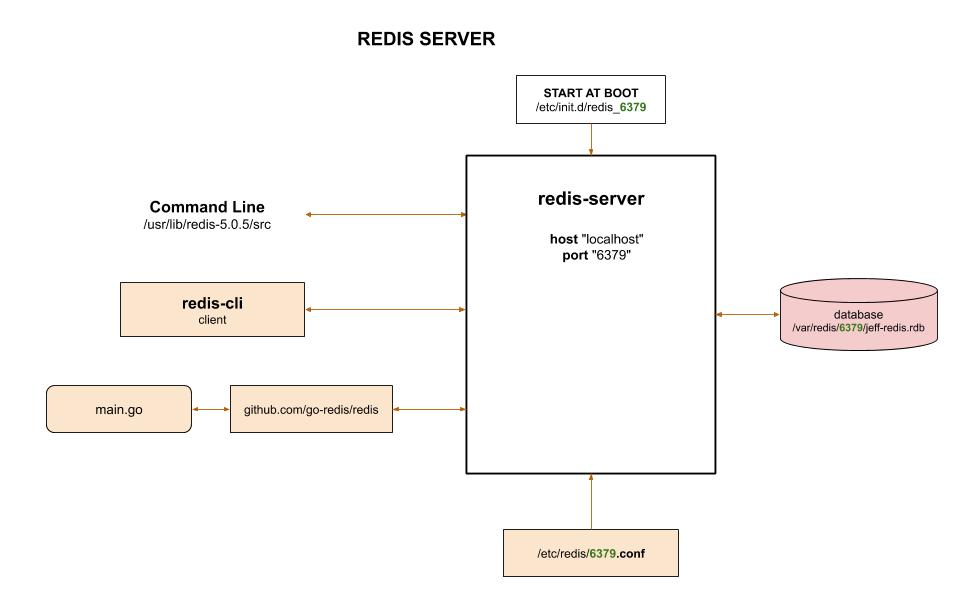

# REDIS CHEAT SHEET

`redis` _is an open source non-relational (NoSQL) database system
using key:value storage._

tl;dr,

```bash
# VERSIONS
redis-server --version
redis-cli --version
# START/STOP - INIT AT BOOT
sudo /etc/init.d/redis_6379 start
sudo /etc/init.d/redis_6379 stop
ps aux | grep -i redis
# REDIS_CLI
redis-cli ping
# SET/GET
redis-cli
set jeff "whats up"
get jeff
exit
```

Documentation and reference,

* [redis website](https://redis.io/)
* Full list of
  [redis-cli commands](https://redis.io/commands#hash).
* To use with go, refer to my repo
  [my-go-examples](https://github.com/JeffDeCola/my-go-examples/tree/master/database/redis)
* A great list of using
  [go with databases](https://github.com/gostor/awesome-go-storage)

View my entire list of cheat sheets on
[my GitHub Webpage](https://jeffdecola.github.io/my-cheat-sheets/).

## OVERVIEW

Redis is an open source key-value store,
often referred to as a NoSQL database.
The essence of a key-value store is the ability
to store some data, called a value, inside a key.
This data can later be retrieved only if we know the
exact key used to store it.

There are a few ways to interact with your database (server),

* Command Line
  * `redis-server` - The server itself
  * `redis-sentinel`
  * `redis-benchmark` 
  * `redis-check-aof`
  * `redis-check-dump`
* redis-cli (client)
* [github.com/go-redis/redis go library](https://github.com/go-redis/redis)

Here is an illustration,



## INSTALL REDIS (SERVER) & REDIS-CLI (CLIENT)

Install from
[here](https://redis.io/download).

Or install source,

```bash
wget http://download.redis.io/releases/redis-5.0.5.tar.gz
tar xzf redis-5.0.5.tar.gz
cd redis-5.0.5
make
cd ..
sudo mv redis-5.0.5 /usr/lib
```

Add command line tools path ~/.bashrc

```bash
export PATH=/usr/lib/redis-5.0.5/src:$PATH
```

### CHECK VERSIONS

Server,

```bash
redis-server --version
```

Client,

```bash
redis-cli --version
```

## CONFIGURE

There are a few simples steps to properly configure redis
on your machine.  We will be using port 6379.

### CONFIGURATION FILE

The configuration template file is `redis.conf`, located in
`/usr/lib/redis-5.0.5`.

Place in `/etc/redis`,

```bash
sudo mkdir /etc/redis
sudo cp /usr/lib/redis-5.0.5/redis.conf /etc/redis/6379.conf
```

Edit,

```bash
sudo nano /etc/redis/6379.conf
```

* Set daemonize to yes (default set to no).
* Set the pidfile to `/var/run/redis_6379.pid`.
* Change the port accordingly.
* Set your preferred loglevel.
* Set the logfile to `/var/log/redis_6379.log`.
* Set the dir to `/var/redis/6379` and dbfilename to jeff-redis.rdb.

## START ON BOOT USING THE OLD SysV INIT SCRIPT

SysV init script are old and really should be updated with systemd
.service scripts but since redis still use them,
we will do it.  Note the systemd actually runs these scripts,
not the old init system.

For more information on systemd and init refer to my cheat sheet
[here](https://github.com/JeffDeCola/my-cheat-sheets/tree/master/software/development/operating-systems/linux/systemd-systemctl-cheat-sheet)

Create an init.d script,

```bash
sudo cp /usr/lib/redis-5.0.5/utils/redis_init_script /etc/init.d/redis_6379
```

Edit,

```bash
sudo nano /etc/init.d/redis_6379
```

change to look like,

```bash
EXEC=/usr/lib/redis-5.0.5/src/redis-server
CLIEXEC=/usr/lib/redis-5.0.5/src/redis-cli
```

Add to init,

```bash
sudo update-rc.d redis_6379 defaults
```

### DATABASE STORAGE AREA

Create the database storage area,

```bash
sudo mkdir /var/redis
sudo mkdir /var/redis/6379
```

## START/STOP REDIS-SERVER

Check if the redis-server server is running,

```bash
ps aux | grep -i redis
redis-cli ping
```

Start/stop (As mentioned above systemd is actually running the service manager),

```bash
sudo /etc/init.d/redis_6379 start
sudo /etc/init.d/redis_6379 stop
```
## REDIS-CLI COMMANDS

Start,

```bash
redis-cli
```

Set/get/delete,

```bash
set jeff "whats up"
get jeff
del jeff
exit
```

But it probably makes more sense to be more organized,

Set/get more organized,

```bash
set people:jeff "whats up"
set people:larry "yo yo"
get people:jeff
exit

Expire data,

```bash
set bye "this will expire in 20 seconds"
expire bye 20
get bye
```

Lists,

* RPUSH puts the new value at the end of the list
* LPUSH puts the new value at the start of the list
* LRANGE gets a subset of the list
* LLEN returns the current length of the list.
* LPOP removes the first element from the list and returns it.
* RPOP removes the last element from the list and returns it.

```bash
rpush friends "Alice"
rpush friends "Bob"
lpush friends "Sam"
lrange friends 0 -1
llen friends
```

Set is like a list, but no order,

```bash
sadd superpowers "flight"
sadd superpowers "x-ray vision"
sadd superpowers "reflexes"
smembers superpowers
```

Full list of redis-cli commands
[here](https://redis.io/commands#hash).
