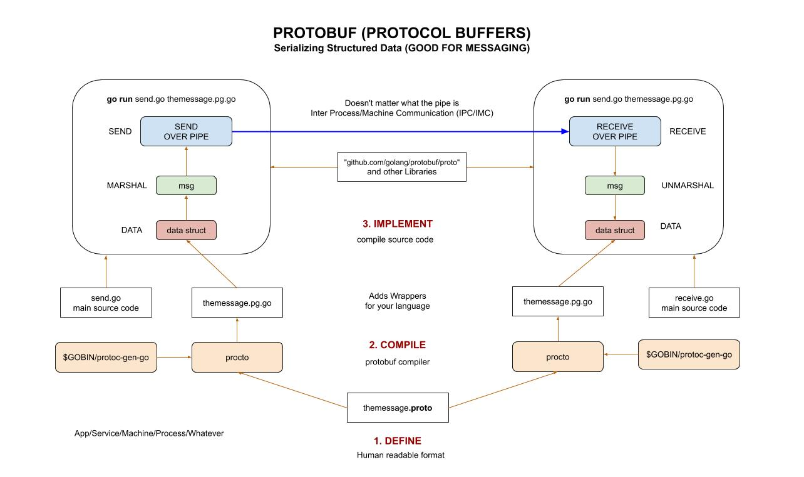

# PROTOBUF CHEAT SHEET

`protobuf` _short for protocol buffers is a method of
serializing structured data (useful for messaging)._

tl;dr,

```bash
protoc --version
protoc --go_out=. messages.proto
```

Table of Contents,

* [OVERVIEW](https://github.com/JeffDeCola/my-cheat-sheets/tree/master/software/development/software-architectures/messaging/protobuf-cheat-sheet#overview)
* [INSTALL PROTOC FROM SOURCE](https://github.com/JeffDeCola/my-cheat-sheets/tree/master/software/development/software-architectures/messaging/protobuf-cheat-sheet#install-protoc-from-source)
* [INSTALL LIBRARIES FOR GO](https://github.com/JeffDeCola/my-cheat-sheets/tree/master/software/development/software-architectures/messaging/protobuf-cheat-sheet#install-libraries-for-go)
* [1. DEFINE - .proto FILE](https://github.com/JeffDeCola/my-cheat-sheets/tree/master/software/development/software-architectures/messaging/protobuf-cheat-sheet#1-define---proto-file)
* [2. COMPILE - RUN PROTOC](https://github.com/JeffDeCola/my-cheat-sheets/tree/master/software/development/software-architectures/messaging/protobuf-cheat-sheet#2-compile---run-protoc)
* [3. IMPLEMENT - IN YOUR CODE](https://github.com/JeffDeCola/my-cheat-sheets/tree/master/software/development/software-architectures/messaging/protobuf-cheat-sheet#3-implement---in-your-code)
* [USEFUL FOR RPC](https://github.com/JeffDeCola/my-cheat-sheets/tree/master/software/development/software-architectures/messaging/protobuf-cheat-sheet#useful-for-rpc)

Documentation and reference,

* For some examples with go, refer to my repo
  [my-go-examples](https://github.com/JeffDeCola/my-go-examples#messaging)

View my entire list of cheat sheets on
[my GitHub Webpage](https://jeffdecola.github.io/my-cheat-sheets/).

## OVERVIEW

The concept is to have a human readable file representing your data you
want to transfer.  This file is a `.proto` file.

Then your process/machine/microservice/whatever can take that .proto
file and compile it (using protoc) to their language of
choice and use it in their microservice/app/service.

Or to state again, the whole purpose of using
protocol buffers is to serialize
your data so that it can be parsed elsewhere.

The flow is,

1. `DEFINE` - The message format (using .proto file)
1. `COMPILE` - the .proto file to your language
1. `IMPLEMENT` - Use proto file in your code

Here is an illustration on how protobuf works,



## INSTALL PROTOC FROM SOURCE

For macOS,

```bash
PROTOC_ZIP=protoc-3.7.1-osx-x86_64.zip
curl -OL https://github.com/google/protobuf/releases/download/v3.7.1/$PROTOC_ZIP
sudo unzip -o $PROTOC_ZIP -d /usr/local bin/protoc
rm -f $PROTOC_ZIP
```

For linux,

```bash
PROTOC_ZIP=protoc-3.7.1-linux-x86_64.zip
curl -OL https://github.com/google/protobuf/releases/download/v3.7.1/$PROTOC_ZIP
sudo unzip -o $PROTOC_ZIP -d /usr/local bin/protoc
rm -f $PROTOC_ZIP
```

For Raspberry pi,

```bash
apt list *protobuf*
sudo apt install protobuf-compiler
```

Check version,

```bash
protoc --version
```

Almost done, now we need the libraries and the protobuf compile
for your language.

## INSTALL LIBRARIES FOR GO

```bash
go get -v -u github.com/golang/protobuf/protoc-gen-go
```

This will,

* Get the libraries and place in `/src/github.com/golang/protobuf`
* Place `protoc-gen-go` binary (used for protoc) in `$GOPATH/bin/protoc-gen-go`

## 1. DEFINE - .proto FILE

The .proto file defines the message format
in readable form.  We are using version 3 or
`proto3` of this file format.

Here is an example of a .proto file I use in my repo
[my-go-examples](https://github.com/JeffDeCola/my-go-examples/tree/master/messaging/protobuf)

```txt
syntax = "proto3";

package main;

message Person {
    string name = 1;
    int32 age = 2;
    string email = 3;
    string phone = 4;
}

message AddressBook {
  repeated Person people = 1;
}
```

## 2. COMPILE - RUN PROTOC

`protoc` is the protocol buffer compiler that will
compile the `messages.proto` file to a readable form
for your particular language.

```bash
protoc --go_out=. messages.proto
```

## 3. IMPLEMENT - IN YOUR CODE

Refer to my repo with go examples using protobuf
[my-go-examples](https://github.com/JeffDeCola/my-go-examples#messaging).

## USEFUL FOR RPC

Protobuf serves as a basis for a custom Remote Procedure
Call (RPC) system that can be used for inter-machine communication.
