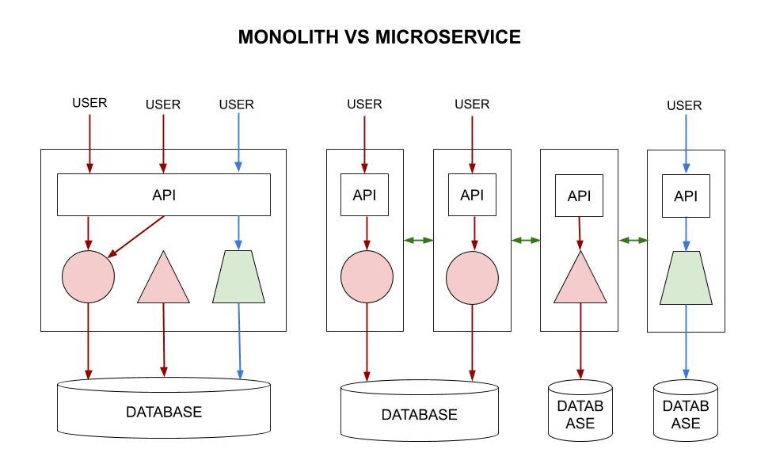

# MICROSERVICES CHEAT SHEET

`microservices` _runs in its own little world where
each service can be scaled independently._

Visit my
[data-crunch-engine](https://github.com/JeffDeCola/data-crunch-engine)
repo as an example of a microservice.

View my entire list of cheat sheets on
[my GitHub Webpage](https://jeffdecola.github.io/my-cheat-sheets/).

## OVERVIEW

Benefits,

* Designed for failure
* Small lightweight
* Great to use with Kubernetes or docker containers
* Scales independently
* Minimum centralized management
* APPs are suites of smaller independently deployable services

As an illustration,

## COMMUNICATION

Popular ways are,

* RPC - Procedural calls
* HTTP - Web service
