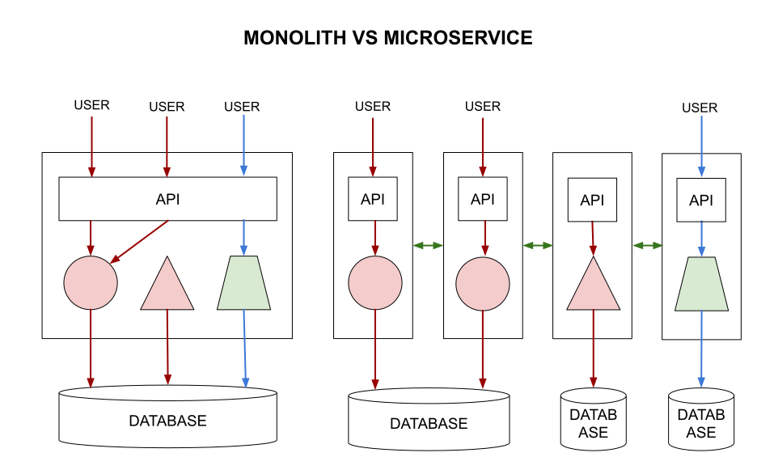

# MICROSERVICES CHEAT SHEET

_Microservices run in its own little world where
each service can be scaled independently._

Table of Contents

* [OVERVIEW](https://github.com/JeffDeCola/my-cheat-sheets/tree/master/software/development/software-architectures/microservices/microservices-cheat-sheet#overview)
* [COMMUNICATION](https://github.com/JeffDeCola/my-cheat-sheets/tree/master/software/development/software-architectures/microservices/microservices-cheat-sheet#communication)

Documentation and Reference

* Visit my
  [data-crunch-engine](https://github.com/JeffDeCola/data-crunch-engine)
  repo as an example of a microservice

## OVERVIEW

Benefits,

* Designed for failure
* Small lightweight
* Great to use with Kubernetes or docker containers
* Scales independently
* Minimum centralized management
* APPs are suites of smaller independently deployable services

As an illustration,

## COMMUNICATION

Popular ways are,

* RPC - Procedural calls
* HTTP - Web service
