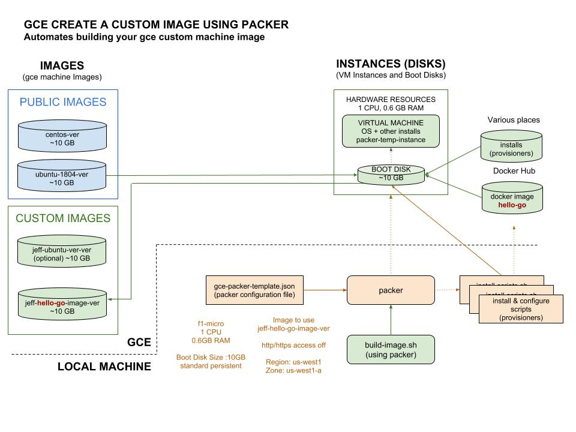

# CREATE A CUSTOM IMAGE USING PACKER CHEAT SHEET

`create a custom image using packer` _is a way
to create a custom image on `gce`._

My Repo example is [hello-go-deploy-gce](https://github.com/JeffDeCola/hello-go-deploy-gce).

Documentation and reference,
* [gce template file reference](https://www.packer.io/docs/builders/googlecompute.html)
* My cheat sheet on
  [packer](https://github.com/JeffDeCola/my-cheat-sheets/tree/master/software/operations-tools/orchestration/builds-deployment-containers/packer-cheat-sheet).

View my entire list of cheat sheets on
[my GitHub Webpage](https://jeffdecola.github.io/my-cheat-sheets/).

## OVERVIEW

Packer's entire deal is to create custom machine `images`. 
This is exactly what we want to do.

The following illustration shows how `packer` controls the automation of building an `image`.
As you can see, it all stems from one configuration file `gce-packer-template.json`.



## AUTHENTICATION

Packer needs to be authorized to use your `gce` account.
This is done using a google service account file. We already setup an env
variable `$GOOGLE_APPLICATION_CREDENTIALS` that points to the
location of the service account file.

For information how to set this up checkout my cheat sheet 
[here](https://github.com/JeffDeCola/my-cheat-sheets/tree/master/software/infrastructure-as-a-service/cloud-services-compute/google-cloud-platform-cheat-sheet/google-compute-engine.md#gce-service-account-key)

## BASIC GCE PACKER TEMPLATE FILE
 
A bare bones template file to build a custom image from an image would look like this,

```json
{
    "variables": {
        "zone": "us-central1-a",
    },

    "builders": [
        {   
            "type": "googlecompute",
            "account_file": "account.json",
            "project_id": "my project",
            "source_image": "debian-7-wheezy-v20150127",
            "ssh_username": "packer",
            "zone": "{{user `zone`}}"
        }
    ],

    "provisioners": [
        {
            "type": "file",
            "source": "./welcome.txt",
            "destination": "/home/ubuntu/"
        },
        {
            "type": "shell",
            "script": "./example.sh"
        }
    ]
}
```

To see a real working example, go to my repo
[hello-go-deploy-gce](https://github.com/JeffDeCola/hello-go-deploy-gce).
