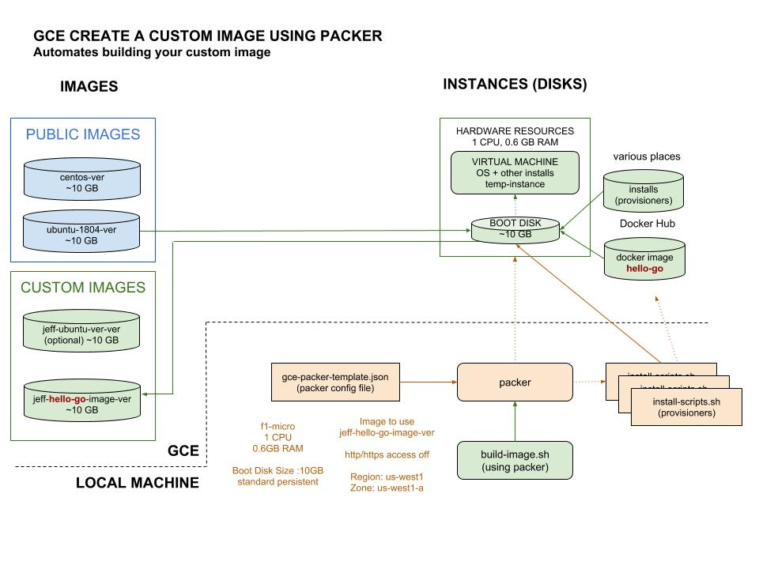

# CREATE A CUSTOM IMAGE USING PACKER CHEAT SHEET

`create a custom image using packer` _is a way
to create a custom image on `gce`._

My Repo example is [hello-go-deploy-gce](https://github.com/JeffDeCola/hello-go-deploy-gce).

My cheat sheet on
[packer](https://github.com/JeffDeCola/my-cheat-sheets/tree/master/software/operations-tools/orchestration/builds-deployment-containers/packer-cheat-sheet).

View my entire list of cheat sheets on
[my GitHub Webpage](https://jeffdecola.github.io/my-cheat-sheets/).

## OVERVIEW

Packer's entire deal is to create custom machine `images`. 
This is exactly what we want to do.

The following illustration shows how `packer` controls the automation of building an `image`.
As you can see, it all stems from one configuration file `gce-packer-template.json`.

## GCE PACKER TEMPLATE FILE

## VARIABLES

Got `gce` we use the env variable `$GOOGLE_APPLICATION_CREDENTIALS` that you already setup.
This will allow `packer` running on your local machine authorization to access your `gce` account.
For information how to set this up checkout my cheat sheet 
[here](https://github.com/JeffDeCola/my-cheat-sheets/tree/master/software/infrastructure-as-a-service/cloud-services-compute/google-cloud-platform-cheat-sheet/google-compute-engine.md#gce-service-account-key)

### BUILDRS

### PROVISIONERS