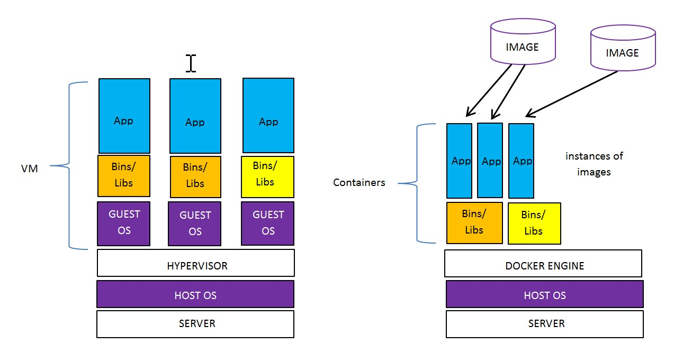

# DOCKER CHEAT SHEET

`docker` _is a Virtual Linux Container. DockerHub is an online
resource to place docker containers._

[Jeff's Docker Hub Images](https://hub.docker.com/u/jeffdecola/)

View my entire list of cheat sheets on
[my GitHub Webpage](https://jeffdecola.github.io/my-cheat-sheets/).

## A VIRTUAL MACHINE VS DOCKER CONTAINER

The following diagram shows the difference betwenn a Virtual Machine
and a Docker Container.



Virtual Machine:

* Must use a Hypervisor emulated Virtual Hardware.
* Needs a guest OS.
* Takes a lot of system resources.

Container:

* Uses a shared host OS.
* You must use that OS.
* Less Resources and lightweight.

## INSTALL

Goto [docs.docker.com/install](https://docs.docker.com/install)
to install.  Must be 64-bit machine.

When you're done, check version,

```bash
docker version
```

To mange docker as non-root, add yourself to the docker group,

```bash
sudo usermod -aG docker $USER
```

## DOCKER RUN (RUN A SINGLE CONTAINER)

To run a simple docker container just use `docker run`,

```bash
docker run jeffdecola/hello-go
```

## DOCKER-COMPOSE (RUN MULTIPLE CONTAINERS)

Compose is a tool for defining and running
multi-container Docker applications.

With compose, you use a .yml file to configure your application’s
services. Then, with a single command, you create and
start all the services from your configuration.

Here is an example of using docker-compose to
[start up concourse services using two docker containers](https://github.com/JeffDeCola/my-cheat-sheets/tree/master/software/operations-tools/continuous-integration-continuous-deployment/concourse-cheat-sheet/install-concourse-using-docker-compose/README.md).

## IMAGES

An image is ready to run.

List images,

```bash
docker images
```

Delete an image,

```bash
docker rmi IMAGE-ID
```

Delete all images (-f is force),

```bash
docker rmi $(docker images -q)
docker rmi -f $(docker images -q)
```

Get an image from [hub.docker.com](https://hub.docker.com/explore/),

```bash
docker pull concourse/concourse
```

Check you got it,

```bash
docker images
```

## CONTAINERS - A RUNNING IMAGE

A container is a running image.

List of Running Containers

```bash
docker ps
```

### START/STOP A CONTAINER

Run an image from Docker Hub,

```bash
docker run jeffdecola/hello-go
docker run --name hello-go jeffdecola/hello-go
docker run docker/whalesay cowsay boo
docker run ubuntu /bin/echo 'Hello World'
```

I like to use,

```bash
docker run --name hello-go -dit jeffdecola/hello-go
```

The docker command looks for it on your local system.
If the image isn’t there, docker gets it.

Stop a running container,

```bash
docker stop IMAGE-ID
```

Find the switches you can use with a container,

```bash
docker run IMAGENAME --help
```

List old containers you have lying around (cached),

```bash
docker ps -a
```

### DELETE A CONTAINER

Delete a container,

```bash
docker rm IMAGE-ID
```

Delete all containers,

```bash
docker rm $(docker ps -a -q)
```

### RUN INTERACTIVE CONTAINER

Run an interactive container, This is cool, it gives you a tty terminal,

* -t tty
* -i interactive

```bash
docker run -t -i ubuntu /bin/bash
docker run -t -i jeffdecola/hello-go
```

Run a container as a daemon,

```bash
docker run -d ubuntu /bin/sh -c "while true; do echo hello world; sleep 1; done"
```

Now see what the docker container daemon is doing,

```bash
docker logs NAME
```

## GET A SHELL PROMPT INSIDE A RUNNING CONTAINER

To get inside a running container,

```bash
docker exec -t -i <container ID> /bin/bash
```

Use `docker ps` to get the container ID.

## CHECK THE STDOUT OF A RUNNING CONTAINER

```bash
docker logs -f <container_name>
```

`-f` switch is check forever.

## CHECK THE HISTORY OF AN IMAGE

```bash
docker history jeffdecola/hello-go-deploy-gce
```

### METHOD 1 - Modify an Existing image

Get an existing docker image and add to it,

```bash
docker run -t -i training/sinatra /bin/bash
```

Now add something to it,

```bash
root@ IMAGE-ID:/# apt-get install -y ruby2.0-dev
```

Exit,

```bash
docker commit -m "Added ruby" -a "Jeff DeCola" IMAGE-ID
jeffdecola/sinatra:jeffver
```

### METHOD 2 - Create a Dockerfile

Create a Dockerfile,

```bash
## Test
FROM ubuntu:14.04
MAINTAINER Jeff DeCola
CMD echo "Hi Jeff"
```

Another example,

```bash
FROM docker/whalesay:latest
RUN apt-get -y update && apt-get install -y fortunes
CMD /usr/games/fortune -a | cowsay
```

And another one,

```bash
#Test
FROM ubuntu:14.04
LABEL Jeff DeCola
COPY whatever /
CMD echo "Hi Jeff"
```

Build the image,

```bash
docker build -t jeffdecola/NAME .
```

`-t` is tag name.

Check your build,

```bash
docker images
```

## PUSH TO DOKERHUB

To push an image to dockerhub,

```bash
docker push jeffdecola/hello-go
```