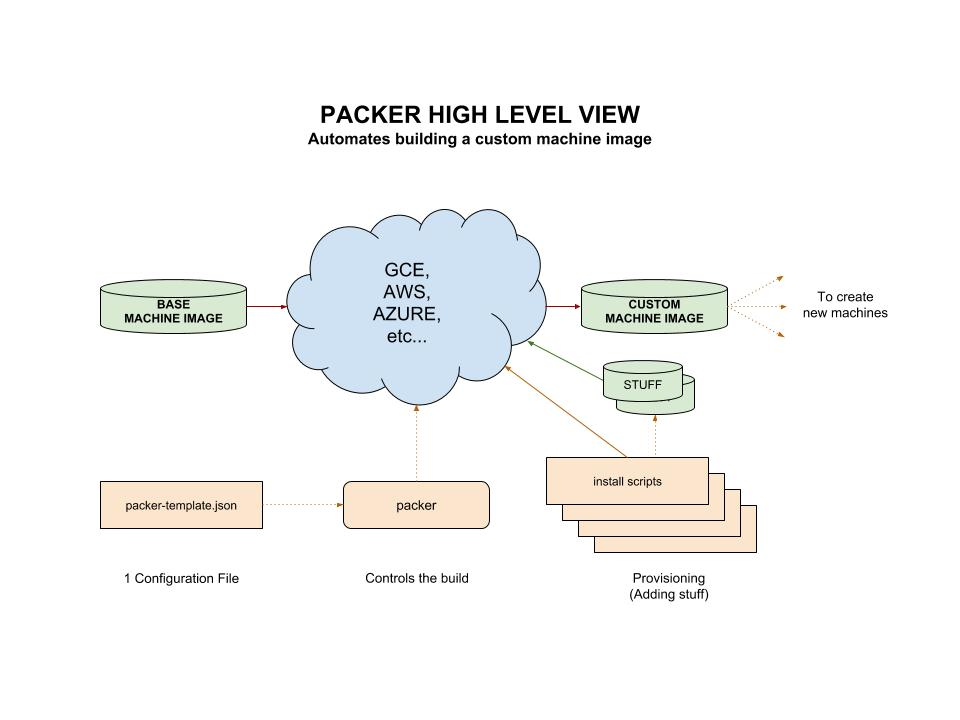

# PACKER CHEAT SHEET

`packer` _is a tool from HashiCorp that automates the building
of custom machine `images` (for multiple platforms) from a single
configuration file._

Documentation and reference,

* My cheat sheet,
  [create a custom image using packer on gce](https://github.com/JeffDeCola/my-cheat-sheets/blob/master/software/service-architectures/infrastructure-as-a-service/google-compute-engine-cheat-sheet/google-compute-engine-create-image-packer.md)
* [Packer Documentation](https://www.packer.io/)

My Repo example using packer is
[hello-go-deploy-gce](https://github.com/JeffDeCola/hello-go-deploy-gce).

View my entire list of cheat sheets on
[my GitHub Webpage](https://jeffdecola.github.io/my-cheat-sheets/).

## AUTOMATES MACHINE IMAGE BUILDS

A machine `image` is a single static unit that contains a
pre-configured operating system and installed software
which is used to quickly create new running machines.

Once you set up a configuration file, you run `packer` and it
does the rest. It fits perfectly in a `continuous deployment` pipeline.

The beauty is, it automates the building of your custom machine `image`
(you can also say provisioned image, but I like custom image).
And once set up, you can generate different machine `images` for
different platforms.

Packer supports building `images` for,

* Amazon EC2
* CloudStack
* DigitalOcean
* Docker
* Google Compute Engine
* Microsoft Azure
* QEMU
* VirtualBox
* VMware
* and more

Here is a high level view of packer,



## INSTALL PACKER

Go [here](https://www.packer.io/downloads.html)
to install.  Must use a 64-bit machine.

For Linux, its actually really simple to install
the binary, just download, unzip and place in `/usr/bin`.

For macOS, place the binary in `/usr/local/bin`. This is due to
System Integrity Protection (SIP).  SIP makes `/usr/bin` read-only.

After install check the version,

```bash
packer version
```

## HOW PACKER CREATES YOUR CUSTOM IMAGE

Its actually pretty straight forward,

* Authorize Packer with `gce`.
* Starts up a temporary VM `instance`  and temporary `boot disk`
  from a source `image`.
* Provisions (Configures and Installs) whatever you want on
  this VM `instance`.
* Deletes the temporary VM `instance`.
* Creates the custom `image` based on `boot disk`.
* Deletes the temporary `boot disk`.

## TEMPLATE FILE (CONFIGURATION)

The above steps to create a custom machine image are
orchestrated by one configuration file.
It is called a template in packer terminology.

A packer template has three main sections,

* `variables` - Just variables to make your life easier.
* `builders` - Define and configure your builders (e.g. `gce`, `aws`, `azure` etc...)
* `provisioners` - This is the magic, where you install and configure stuff.

### BASIC FORMAT OF A TEMPLATE FILE

Here is a very simple template file used
to build a simple image at using `gce` as a platform,

```json
{
    "variables": {
        "account_file": "",
        "project_id": "",
        "source_image": "ubuntu-1604-xenial-v20190306",
        "image_name": "hello-go-{{isotime \"20060102\"}}",
        "ssh_username": "packer",
        "zone": "us-west1-a"
    },

    "builders": [
        {
            "type": "googlecompute",
            "ssh_timeout": "10m",
            "account_file":"{{user `account_file`}}",
            "project_id": "{{user `project_id`}}",
            "source_image": "{{user `source_image`}}",
            "image_name": "{{user `image_name`}}",
            "ssh_username": "{{user `ssh_username`}}",
            "zone": "{{user `zone`}}"
        }
    ],

    "provisioners": [
        {
            "type": "file",
            "source": "./install-scripts/welcome.txt",
            "destination": "/tmp/welcome.txt"
        },
        {
            "type": "shell",
            "pause_before": "10s",
            "execute_command": "chmod +x {{ .Path }}; {{ .Vars }} sudo -E {{ .Path }}",
            "scripts": [
                "./install-scripts/add-user-jeff.sh",
                "./install-scripts/move-welcome-file.sh"
            ]
        }
    ]
}
```

### VARIABLES

Variables are just that, variables. It makes life easier.
they are used in the builder section.

You can also pass in variables to packer via
the packer command line interface.

### BUILDERS

Quite simply, what platform are you going to use?
`gce`, `aws`, etc..

In the template example above, the platform `gce` platform is
our builder. `"type": "googlecompute"`.

For each builder type there are specific switches to set.

The packer website has an entire list of
[builder types](https://www.packer.io/docs/builders/index.html)
and the switches for each.

### PROVISIONERS (ADD YOUR STUFF)

Install and configure software.  This stage is also known
as the provision step.

Things like,

* Installing packages
* Patching the kernel
* Creating users
* Adding files
* Downloading application code

In the template file above,

* Using `"type": "file"` a welcome.txt file was added to the `/tmp/` directory.
* Using `"type": "shell"` a script added user jeff.
* Using `"type": "shell"` a script moved welcome.txt from /tmp to /home/jeff/.

The packer website has an entire list of
[provisioner types](https://www.packer.io/docs/provisioners/index.html)

During this stage packer would need to ssh into your temporary instance.

## VALIDATE THE TEMPLATE FILE

Before you kick off a build, validate the template file,

```bash
packer validate packer-template-file.json
```

## RUN THE TEMPLATE FILE (BUILD THE IMAGE)

Lets build our custom machine image,

```bash
packer build -force packer-template-file.json
```

`-force` removes artifacts from previous build.

You can pass in variables with the `packer` cli
if you don't want to keep them in your
template file.

For example,

```bash
packer build -force \
    -var "account_file=$GOOGLE_APPLICATION_CREDENTIALS" \
    -var "project_id=$GOOGLE_JEFFS_PROJECT_ID" \
    gce-packer-template.json
```

There are also lots of command line switches,
but I like to keep everything but authentication in my
template file.

Again, to see a working example, go to my repo
[hello-go-deploy-gce](https://github.com/JeffDeCola/hello-go-deploy-gce).
