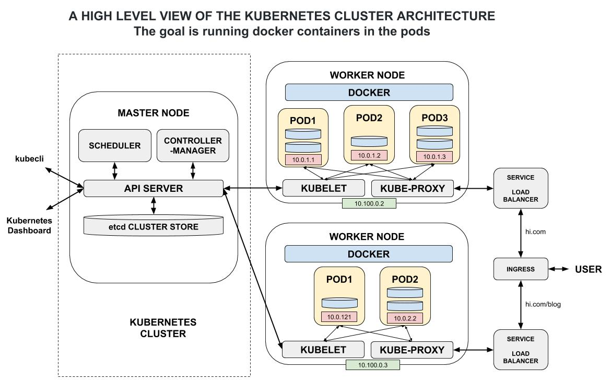

# KUBERNETES CHEAT SHEET

`kubernetes` _(aka k8s) is a container orchestration platform.
Automating the deployment, scaling and management of containers._

Documentation and reference,

* [Kubernetes Documentation](https://dcos.io/)
* [kubectl (Kubernetes cli)](https://kubernetes.io/docs/reference/kubectl/overview/)

My CaaS cheat sheets and repos are,

  * [Amazon - elastic container service for kubernetes (eks)](https://github.com/JeffDeCola/my-cheat-sheets/tree/master/software/service-architectures/containers-as-a-service/amazon-elastic-container-service-for-kubernetes-cheat-sheet),
    [hello-go-deploy-amazon-eks](https://github.com/JeffDeCola/hello-go-deploy-amazon-eks)
  * [Google - kubernetes engine (gke)](https://github.com/JeffDeCola/my-cheat-sheets/tree/master/software/service-architectures/containers-as-a-service/google-kubernetes-engine-cheat-sheet),
    [hello-go-deploy-gke](https://github.com/JeffDeCola/hello-go-deploy-gke)
  * [Microsoft - azure kubernetes service (aks)](https://github.com/JeffDeCola/my-cheat-sheets/tree/master/software/service-architectures/containers-as-a-service/microsoft-azure-kubernetes-service-cheat-sheet),
    [hello-go-deploy-aks](https://github.com/JeffDeCola/hello-go-deploy-aks)

View my entire list of cheat sheets on
[my GitHub Webpage](https://jeffdecola.github.io/my-cheat-sheets/).

## OVERVIEW

Kubernetes is a container orchestration platform. It
automates the following on your containers,

* Deployment
* Scaling
* Management

Its a perfect solution for microservices.

Here is a high level view of a Kubernetes Cluster,



Solve the problems of,

* Monitoring your services
* Scaling base on load
* Managing containers on multiple servers
* Manual intervention

## FEATURES

* Managing multiple containers
* Health checks (Redeploy)
* Load balancing
* Networking (Could be 100s of nodes but communication as if on one machine)
* Rolling updates
* Resource Usage Monitoring (Scaling)

## INSTALL KUBERNETES CLUSTER

I use CaaS to create my Kubernetes Clusters,

* [Amazon eks](https://github.com/JeffDeCola/my-cheat-sheets/tree/master/software/service-architectures/containers-as-a-service/amazon-elastic-container-service-for-kubernetes-cheat-sheet)
* [Google gke](https://github.com/JeffDeCola/my-cheat-sheets/tree/master/software/service-architectures/containers-as-a-service/google-kubernetes-engine-cheat-sheet)
* [Microsoft aks](https://github.com/JeffDeCola/my-cheat-sheets/tree/master/software/service-architectures/containers-as-a-service/microsoft-azure-kubernetes-service-cheat-sheet)

## DEPLOYMENT

To deploy you can use a kubectl command (see below) or a yaml file.

```bash
kubectl create -f deploy.yaml
```

This is your yaml file,

```yaml
apiVersion: apps/v1
kind: Deployment
metadata:
  name: jeffs-web-counter-deployment
spec:
  selector:
    matchLabels:
      app: jeffs-web-counter
  replicas: 2 # How many pods I want to create (Default 1 container per pod)
  template:
    metadata:
      labels:
        app: jeffs-web-counter
    spec:
      containers:
      - name: jeffs-web-counter
        image: jeffdecola/hello-go-deploy-gke:latest
        ports:
        - containerPort: 8080
```

## SERVICES

Services are endpoints that export ports to the outside world.

To create a service you can use a kubectl command (see below)
or a yaml file.

```bash
kubectl create -f service.yaml
```

This is your yaml file,

```yaml
apiVersion: v1
kind: Service
metadata:
  name: jeffs-web-counter-service
spec:
  selector:
    app: jeffs-web-counter
  ports:
    - protocol: TCP
      port: 80
      targetPort: 8080
      nodePort: 31000
  type: LoadBalancer
```

## KUBECTL

`kubectl` is a cli for running kubernetes commands.

Install from [here](https://kubernetes.io/docs/tasks/tools/install-kubectl/).

## BASIC KUBECTL COMMANDS

Some basic commands I like and use.

### NODES

List nodes in a cluster,

```bash
kubectl get nodes
```

### PODS

How many pods you have,

```bash
kubectl get pod
```

What pods are on what nodes,

```bash
kubectl get pods -o wide
```

### DEPLOY A CONTAINER

Run/deploy a docker image from Dockerhub to gke (A `workload`),

```bash
kubectl run jeffs-web-counter-deployment \
    --replicas 2 \
    --image "jeffdecola/hello-go-deploy-gke:latest" \
    --port "8080"
```

This will make one container in a pod.
I like to use yaml files to deploy rather than this command.

Inspect your deployment,

```bash
kubectl get deployments
kubectl get deployment jeffs-web-counter-deployment
```

Delete your deployment,

```bash
kubectl delete deployment jeffs-web-counter-deployment
```

### SERVICE (A LOAD BALANCER)

How a user accesses a container.

Create a `service` - Expose a port with a load balancer,

```bash
kubectl expose deployment jeffs-web-counter-deployment \
    --name jeffs-web-counter-service \
    --type LoadBalancer \
    --port 80 \
    --target-port 8080
```

Inspect your service,

```bash
kubectl get services
kubectl get service jeffs-web-counter
```

Delete your service,

```bash
kubectl delete service jeffs-web-counter
```
