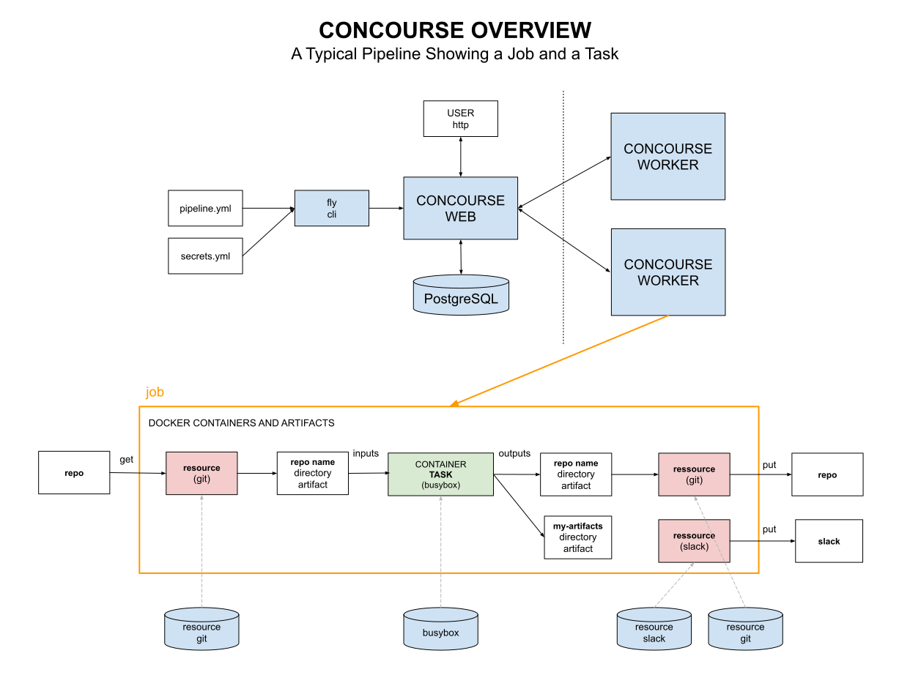

# CONCOURSE CHEAT SHEET

_Concourse is a pipelined CI/CD tool for software builds.
It's main goal is to run tasks._

TL;DR

```bash
# MY CONCOURSE SERVER
http://192.168.20.112:8080/

# cli version
fly -version

# Login to main team using main-ci-target
fly -t main-ci-target login -c http://192.168.20.112:8080 -u test -p test

# Set Pipeline
fly --target jeffs-ci-target set-pipeline --pipeline jeffs-concourse-example \
--config pipeline.yml --load-vars-from .concourse-secrets.yml
# Destroy Pipeline
fly --target jeffs-ci-target destroy-pipeline --pipeline jeffs-concourse-example

# Check Targets and Teams
fly targets
# Check Workers
fly -t main-ci-target workers
```

Table on Contents

* [OVERVIEW](https://github.com/JeffDeCola/my-cheat-sheets/blob/master/software/operations/continuous-integration-continuous-deployment/concourse-cheat-sheet/README.md#overview)
* [INSTALL](https://github.com/JeffDeCola/my-cheat-sheets/blob/master/software/operations/continuous-integration-continuous-deployment/concourse-cheat-sheet/README.md#install)
* [INSTALL FLY - A CLI TO CONNECT TO CONCOURSE](https://github.com/JeffDeCola/my-cheat-sheets/blob/master/software/operations/continuous-integration-continuous-deployment/concourse-cheat-sheet/README.md#install-fly---a-cli-to-connect-to-concourse)
* [CONNECT TO CONCOURSE USING FLY](https://github.com/JeffDeCola/my-cheat-sheets/blob/master/software/operations/continuous-integration-continuous-deployment/concourse-cheat-sheet/README.md#connect-to-concourse-using-fly)
* [CREATE A NEW TARGET AND NEW TEAM (OPTIONAL)](https://github.com/JeffDeCola/my-cheat-sheets/blob/master/software/operations/continuous-integration-continuous-deployment/concourse-cheat-sheet/README.md#create-a-new-target-and-new-team-optional)
* [CREATING YOUR FIRST PIPELINE](https://github.com/JeffDeCola/my-cheat-sheets/blob/master/software/operations/continuous-integration-continuous-deployment/concourse-cheat-sheet/README.md#creating-your-first-pipeline)
* [SET/DESTROY PIPELINE](https://github.com/JeffDeCola/my-cheat-sheets/blob/master/software/operations/continuous-integration-continuous-deployment/concourse-cheat-sheet/README.md#setdestroy-pipeline)
* [FILE PERMISSIONS](https://github.com/JeffDeCola/my-cheat-sheets/blob/master/software/operations/continuous-integration-continuous-deployment/concourse-cheat-sheet/README.md#file-permissions)
* [PASSING SECRETS TO USE IN YOUR SCRIPT (via env)](https://github.com/JeffDeCola/my-cheat-sheets/blob/master/software/operations/continuous-integration-continuous-deployment/concourse-cheat-sheet/README.md#passing-secrets-to-use-in-your-script-via-env)

Documentation and Reference

* [my-cicd-pipeline-examples](https://github.com/JeffDeCola/my-cicd-pipeline-examples)
* [concourse-resource-template](https://github.com/JeffDeCola/concourse-resource-template)
* [concourse-deploy-docker-resource](https://github.com/JeffDeCola/concourse-deploy-docker-resource)
* [github-status-resource-clone](https://github.com/JeffDeCola/github-status-resource-clone)
  (cloned from another user)

## OVERVIEW

This illustration shows the basic structure of concourse. Refer to
[my-cicd-pipeline-examples](https://github.com/JeffDeCola/my-cicd-pipeline-examples)
for pipeline examples.



## INSTALL

There are many ways to install concourse,

* [Install Docker Using docker-compose](https://github.com/JeffDeCola/my-cheat-sheets/tree/master/software/operations/continuous-integration-continuous-deployment/concourse-cheat-sheet/install-concourse-using-docker-compose.md)
**I use this**
* [Install Concourse On VirtualBox Using Vagrant](https://github.com/JeffDeCola/my-cheat-sheets/tree/master/software/operations/continuous-integration-continuous-deployment/concourse-cheat-sheet/install-concourse-on-virtualbox-using-vagrant.md)
**(archived)**
* [Install Concourse Binary](https://github.com/JeffDeCola/my-cheat-sheets/tree/master/software/operations/continuous-integration-continuous-deployment/concourse-cheat-sheet/install-concourse-binary.md)
**(archived)**
* [Install Concourse Using Ansible on Google Compute Engine](https://github.com/JeffDeCola/my-cheat-sheets/tree/master/software/operations/continuous-integration-continuous-deployment/concourse-cheat-sheet/install-concourse-using-ansible-google-compute-engine.md)
**(archived)**

## INSTALL FLY - A CLI TO CONNECT TO CONCOURSE

Connect to your concourse server. In my case it's
[192.168.20.112:8080](http://192.168.20.112:8080)
Unless you changed it in docker-compose file,
the default username/password is test/test.

Download fly to your machine and change the permissions,

```bash
chmod 755 fly
```

## CONNECT TO CONCOURSE USING FLY

Create a new target to attach to main team,

```bash
fly -t main-ci-target login -c http://192.168.20.112:8080 -u test -p test
```

Check targets and teams,

```bash
cat ~/.flyrc
fly targets
```

## CREATE A NEW TARGET AND NEW TEAM (OPTIONAL)

Create a new target,

```bash
fly -t jeffs-ci-target login -c http://192.168.20.112:8080 -u test -p test
```

Create a new team,

```bash
fly -t jeffs-ci-target set-team --team-name jeffs-ci-team --local-user test
```

Attach target to team,

```bash
fly -t jeffs-ci-target login -n jeffs-ci-team -c http://192.168.20.112:8080
```

Check targets and teams,

```bash
cat ~/.flyrc
fly targets
```

## CREATING YOUR FIRST PIPELINE

There are plenty of better explanations on the web then I could do here.

I have a few examples in my repo
[my-concourse-ci-tasks](https://github.com/JeffDeCola/my-concourse-ci-tasks).

## SET/DESTROY PIPELINE

Load your pipeline to concourse,

```bash
fly --target jeffs-ci-target \
    set-pipeline \
    --pipeline jeffs-concourse-example \
    --config pipeline.yml
```

To remove,

```bash
fly --target jeffs-ci-target \
    destroy-pipeline \
    --pipeline jeffs-concourse-example
```

## FILE PERMISSIONS

Git maintains a special "mode" for each file in its internal storage:

* 644 for regular files
* 755 for executable ones

To check the permissions,

```bash
git ls-files --stage
```

To change the permissions,

```bash
git update-index --chmod=+x path/to/file
```

## PASSING SECRETS TO USE IN YOUR SCRIPT (via env)

To pass secrets (files and variables) to your concourse script,
first use fly to upload the secret to concourse,

```bash
fly -t ci set-pipeline -p NAME \
    -c pipeline.yml --load-vars-from .credentials.yml \
    --var "private-key-file=$(cat private-key-file.txt | base64)" \
    --var "private-key=$(echo jeffdecola)"
```

Use base64 on files so you can unpack them properly on the other side.

Update the task in your pipeline with params,

```yml
- task: mybuild
  file: task.yml
  params:
    PRIVATE_KEY-FILE: {{private-key-file}}
    PRIVATE_KEY: {{private-key}}
```

Then in your `task.yml` file, also use params with the same name
(the value will be overwritten).

```yml
params:
  PRIVATE_KEY-FILE: "this will be overwritten"
  PRIVATE_KEY: "this will be overwritten"
```

This will create an env variable `PRIVATE_KEY-FILE` and `PRIVATE_KEY` you
may use in your concourse script.

```bash
echo $PRIVATE_KEY-FILE | base64 -d > private-key-file.txt
echo $PRIVATE_KEY
```
