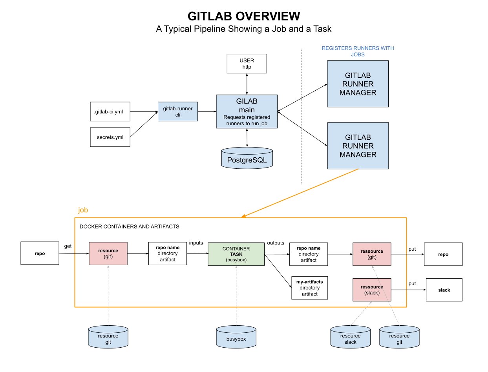

# GITLAB CHEAT SHEET

[](https://jeffdecola.com)
[](https://jeffdecola.mit-license.org)

_Gitlab is a pipelined CI/CD tool for software builds.
It's main goal is to run tasks._

```text
*** THIS CHEAT SHEET IS UNDER CONSTRUCTION - CHECK BACK SOON ***
```

tl;dr

```bash
tbd
```

Table on Contents

* [OVERVIEW](https://github.com/JeffDeCola/my-cheat-sheets/blob/master/software/operations/continuous-integration-continuous-deployment/gitlab-cheat-sheet/README.md#overview)
* [INSTALL](https://github.com/JeffDeCola/my-cheat-sheets/blob/master/software/operations/continuous-integration-continuous-deployment/gitlab-cheat-sheet/README.md#install)

Documentation and Reference

* [my-cicd-pipeline-examples](https://github.com/JeffDeCola/my-cicd-pipeline-examples)

## OVERVIEW

This illustration shows the basic structure of gitlab. Refer to
[my-cicd-pipeline-examples](https://github.com/JeffDeCola/my-cicd-pipeline-examples)
for pipeline examples.



## INSTALL

tbd
