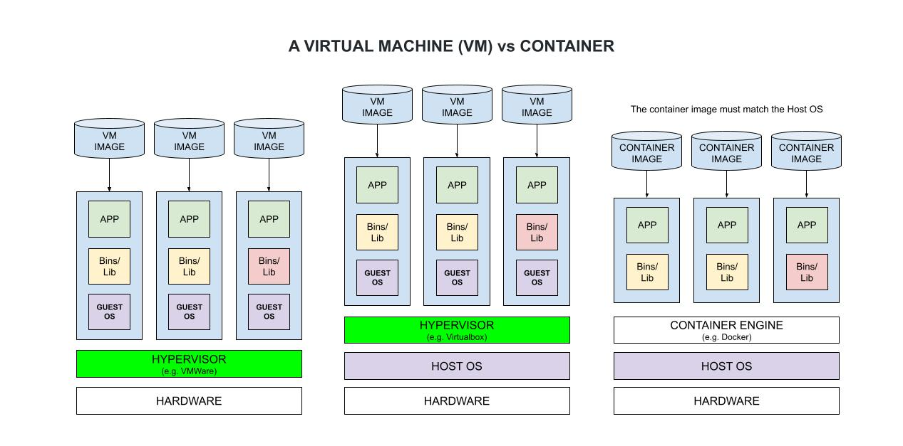
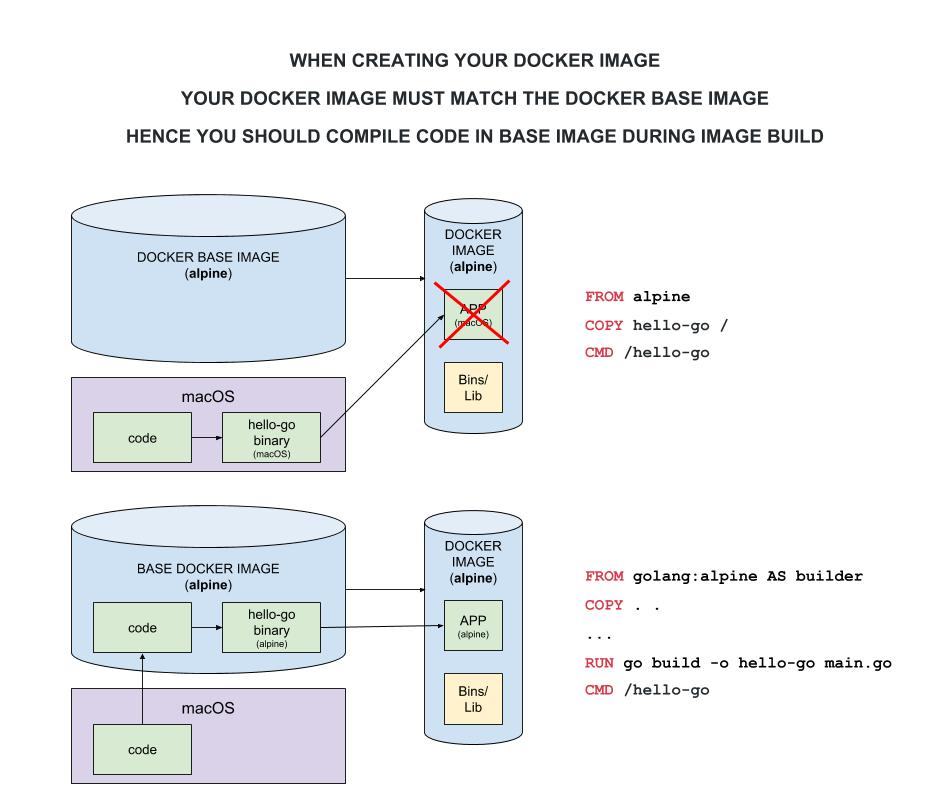
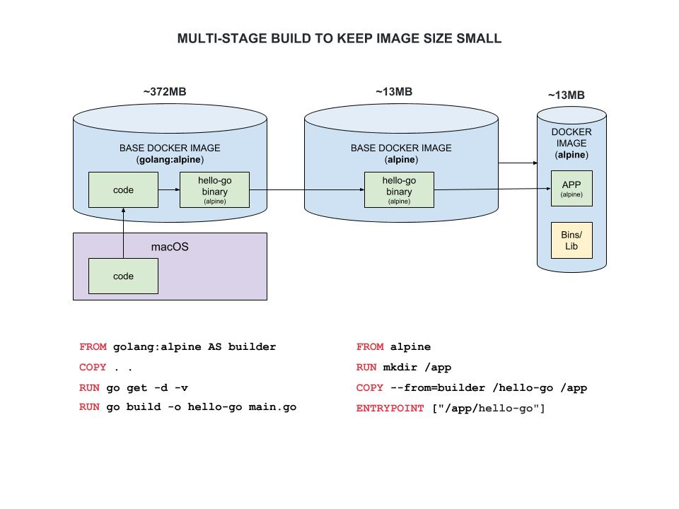
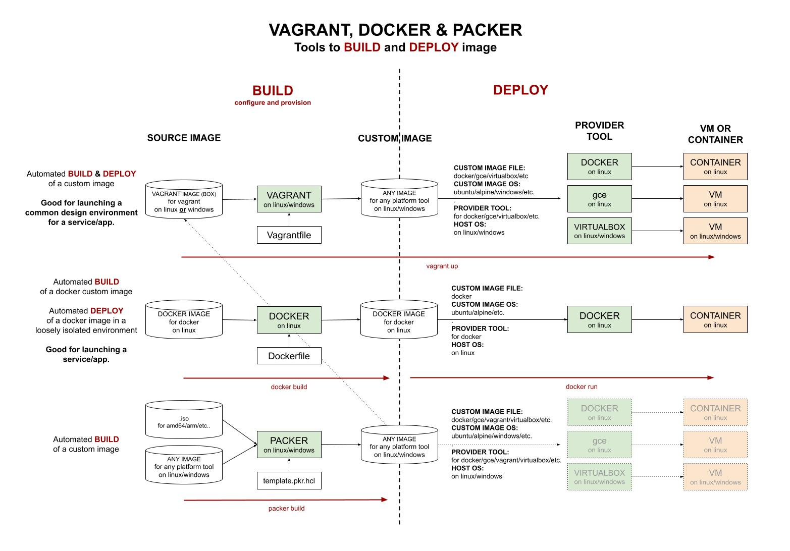

# DOCKER CHEAT SHEET

[](https://hub.docker.com/u/jeffdecola)

Docker is useful for the automated BUILD of a docker custom image.
Docker is also useful for the automated DEPLOY of a docker
custom image in an loosely isolated environment._

tl;dr

```bash
docker version

# IMAGES
docker run jeffdecola/hello-go-deploy-gce
docker run --name hello-go -dit jeffdecola/hello-go-deploy-gce
docker images
docker history jeffdecola/hello-go-deploy-gce
docker rmi <IMAGE-ID>
docker push jeffdecola/hello-go
docker pull jeffdecola/hello-go
docker build -t jeffdecola/hello-go .

# CONTAINERS
docker ps
docker start hello-go
docker stop hello-go
docker rm $(docker ps -a -q)

# CONNECT
docker exec -t -i hello-go /bin/bash

# STDIN
echo 'whatever' | socat EXEC:"docker attach hello-go",pty STDIN

# STDOUT
docker logs -f hello-go
```

Table of Contents

* [VIRTUAL MACHINE (VM) vs DOCKER CONTAINER](https://github.com/JeffDeCola/my-cheat-sheets/tree/master/software/operations/orchestration/builds-deployment-containers/docker-cheat-sheet#virtual-machine-vm-vs-docker-container)
* [INSTALL](https://github.com/JeffDeCola/my-cheat-sheets/tree/master/software/operations/orchestration/builds-deployment-containers/docker-cheat-sheet#install)
* [DOCKER DESKTOP ON WINDOWS WITH WSL2](https://github.com/JeffDeCola/my-cheat-sheets/tree/master/software/operations/orchestration/builds-deployment-containers/docker-cheat-sheet#docker-desktop-on-windows-with-wsl2)
* [DOCKER RUN (RUN A SINGLE CONTAINER)](https://github.com/JeffDeCola/my-cheat-sheets/tree/master/software/operations/orchestration/builds-deployment-containers/docker-cheat-sheet#docker-run-run-a-single-container)
* [DOCKER-COMPOSE (RUN MULTIPLE CONTAINERS)](https://github.com/JeffDeCola/my-cheat-sheets/tree/master/software/operations/orchestration/builds-deployment-containers/docker-cheat-sheet#docker-compose-run-multiple-containers)
* [IMAGES](https://github.com/JeffDeCola/my-cheat-sheets/tree/master/software/operations/orchestration/builds-deployment-containers/docker-cheat-sheet#images)
  * [PULL DOCKER IMAGES](https://github.com/JeffDeCola/my-cheat-sheets/tree/master/software/operations/orchestration/builds-deployment-containers/docker-cheat-sheet#pull-docker-images)
  * [CHECK THE HISTORY OF AN IMAGE](https://github.com/JeffDeCola/my-cheat-sheets/tree/master/software/operations/orchestration/builds-deployment-containers/docker-cheat-sheet#check-the-history-of-an-image)
  * [CREATE IMAGE USING DOCKERFILE](https://github.com/JeffDeCola/my-cheat-sheets/tree/master/software/operations/orchestration/builds-deployment-containers/docker-cheat-sheet#create-image-using-dockerfile)
  * [COMPILE YOUR CODE INSIDE BASE IMAGE](https://github.com/JeffDeCola/my-cheat-sheets/tree/master/software/operations/orchestration/builds-deployment-containers/docker-cheat-sheet#compile-your-code-inside-base-image)
  * [PUT YOUR APP/SERVICE INTO SMALLER IMAGE (MULTI-STAGE BUILD)](https://github.com/JeffDeCola/my-cheat-sheets/tree/master/software/operations/orchestration/builds-deployment-containers/docker-cheat-sheet#put-your-appservice-into-smaller-image-multi-stage-build)
  * [PUSH IMAGE TO dockerhub](https://github.com/JeffDeCola/my-cheat-sheets/tree/master/software/operations/orchestration/builds-deployment-containers/docker-cheat-sheet#push-image-to-dockerhub)
* [CONTAINERS](https://github.com/JeffDeCola/my-cheat-sheets/tree/master/software/operations/orchestration/builds-deployment-containers/docker-cheat-sheet#containers)
  * [START/STOP A CONTAINER](https://github.com/JeffDeCola/my-cheat-sheets/tree/master/software/operations/orchestration/builds-deployment-containers/docker-cheat-sheet#startstop-a-container)
  * [DELETE A CONTAINER](https://github.com/JeffDeCola/my-cheat-sheets/tree/master/software/operations/orchestration/builds-deployment-containers/docker-cheat-sheet#delete-a-container)
  * [RUN INTERACTIVE CONTAINER](https://github.com/JeffDeCola/my-cheat-sheets/tree/master/software/operations/orchestration/builds-deployment-containers/docker-cheat-sheet#run-interactive-container)
  * [CONNECT](https://github.com/JeffDeCola/my-cheat-sheets/tree/master/software/operations/orchestration/builds-deployment-containers/docker-cheat-sheet#connect)
  * [STDIN](https://github.com/JeffDeCola/my-cheat-sheets/tree/master/software/operations/orchestration/builds-deployment-containers/docker-cheat-sheet#stdin)
  * [STDOUT](https://github.com/JeffDeCola/my-cheat-sheets/tree/master/software/operations/orchestration/builds-deployment-containers/docker-cheat-sheet#stdout)
* [VAGRANT, DOCKER AND PACKER](https://github.com/JeffDeCola/my-cheat-sheets/tree/master/software/operations/orchestration/builds-deployment-containers/docker-cheat-sheet#vagrant-docker-and-packer)

Documentation and Reference

* [my-docker-image-builds](https://github.com/JeffDeCola/my-docker-image-builds)
* My images at [dockerhub](https://hub.docker.com/u/jeffdecola/)

## VIRTUAL MACHINE (VM) vs DOCKER CONTAINER

The following diagram shows the difference between a Virtual Machine
and a Docker Container.



Virtual Machine,

* Must use a Hypervisor emulated Virtual Hardware
* Needs a guest OS
* Takes a lot of system resources
* Takes up a lot of memory

Container,

* Uses a shared host OS
* You must use that OS
* Less resources and lightweight

## INSTALL

Goto [docs.docker.com/install](https://docs.docker.com/install)
to install. Must be 64-bit machine.

When you're done, check version,

```bash
docker version
```

To mange docker as non-root, add yourself to the docker group,

```bash
sudo usermod -aG docker $USER
```

## DOCKER DESKTOP ON WINDOWS WITH WSL2

How to Move your data hogging docker data to external drive.

STEP 1 - Shutdown docker desktop via menu.

STEP 2 - Shut down wsl via cmd.

```cmd
wsl --shutdown
```

STEP 3 - DELETE docker director in `C:\Users\jeffry\AppData\Local\Docker`
and `C:\ProgramData\Docker`.

STEP 4 - Link AppData to external location via cmd.

```cmd
mklink /j "C:\Users\jeffry\AppData\Local\Docker" "F:\Docker\AppData"
```

STEP 5 - Link ProgramData to external location via cmd.

```cnd
mklink /j "C:\ProgramData\Docker" "F:\Docker\ProgramData"
```

## DOCKER RUN (RUN A SINGLE CONTAINER)

To run a simple docker container just use `docker run`,

```bash
docker run jeffdecola/hello-go-deploy-gce
docker run --name hello-go -dit jeffdecola/hello-go-deploy-gce
```

* `-d` Run container in background.
* `-t` or `-tty` terminal.
* `-i` interactive container, Keep STDIN open even if
  not attached.

## DOCKER-COMPOSE (RUN MULTIPLE CONTAINERS)

Compose is a tool for defining and running
multi-container Docker applications.

With compose, you use a .yml file to configure your application’s
services. Then, with a single command, you create and
start all the services from your configuration.

Here is an example of using docker-compose to
[start up concourse services using two docker containers](https://github.com/JeffDeCola/my-cheat-sheets/tree/master/software/operations/continuous-integration-continuous-deployment/concourse-cheat-sheet/install-concourse-using-docker-compose/README.md).

## IMAGES

List your docker images,

```bash
docker images
```

Delete an image,

```bash
docker rmi <IMAGE-ID>
```

Delete all images (-f is force),

```bash
docker rmi $(docker images -q)
docker rmi -f $(docker images -q)
```

### PULL DOCKER IMAGES

Get an image from [hub.docker.com](https://hub.docker.com/explore/),

```bash
docker pull concourse/concourse
```

Check you got it,

```bash
docker images
```

### CHECK THE HISTORY OF AN IMAGE

```bash
docker history jeffdecola/hello-go-deploy-gce
```

### CREATE IMAGE USING DOCKERFILE

Create a Dockerfile,

```bash
# Test
FROM ubuntu:14.04
MAINTAINER Jeff DeCola
CMD echo "Hi Jeff"
```

Another example,

```bash
FROM docker/whalesay:latest
RUN apt-get -y update && apt-get install -y fortunes
CMD /usr/games/fortune -a | cowsay
```

And another one,

```bash
# Test
FROM ubuntu:14.04
LABEL Jeff DeCola
COPY whatever /
CMD echo "Hi Jeff"
```

Build the image,

```bash
docker build -t jeffdecola/NAME .
```

`-t` is tag name.

Check your build,

```bash
docker images
```

### COMPILE YOUR CODE INSIDE BASE IMAGE

When creating a docker image, your image must match the base docker image.

Hence, you should compile your code in the base image during build.

Here is an illustration why,



### PUT YOUR APP/SERVICE INTO SMALLER IMAGE (MULTI-STAGE BUILD)

Now that you compiled your code and created an image its just too big.
You can use multi-stage to place your app/service in a smaller image ~`13MB`,



### PUSH IMAGE TO dockerhub

To push an image to dockerhub,

```bash
docker push jeffdecola/hello-go
```

## CONTAINERS

A container is a running image.

List of Running Containers,

```bash
docker ps
```

### START/STOP A CONTAINER

Run an image from dockerhub,

```bash
docker run jeffdecola/hello-go
docker run --name hello-go jeffdecola/hello-go
docker run docker/whalesay cowsay boo
docker run ubuntu /bin/echo 'Hello World'
```

I like to use,

```bash
docker run --name hello-go -dit jeffdecola/hello-go
```

The docker command looks for it on your local system.
If the image isn’t there, docker gets it.

Stop a running container,

```bash
docker stop <IMAGE-ID>
```

Find the switches you can use with a container,

```bash
docker run IMAGENAME --help
```

List old containers you have lying around (cached),

```bash
docker ps -a
```

### DELETE A CONTAINER

Delete a container,

```bash
docker rm <IMAGE-ID>
```

Delete all containers,

```bash
docker rm $(docker ps -a -q)
```

### RUN INTERACTIVE CONTAINER

Run an interactive container, This is cool, it gives you a tty terminal,

* -t tty
* -i interactive

```bash
docker run -t -i ubuntu /bin/bash
docker run -t -i jeffdecola/hello-go
```

Run a container as a daemon,

```bash
docker run -d ubuntu /bin/sh -c "while true; do echo hello world; sleep 1; done"
```

Now see what the docker container daemon is doing,

```bash
docker logs NAME
```

### CONNECT

To get a shell in a running container,

```bash
docker exec -t -i hello-go /bin/bash
```

### STDIN

```bash
echo 'whatever' | socat EXEC:"docker attach hello-go",pty STDIN
```

### STDOUT

```bash
docker logs -f hello-go
```

`-f` switch is check forever.

## VAGRANT, DOCKER AND PACKER

An illustration of vagrant, docker and packer tools,


