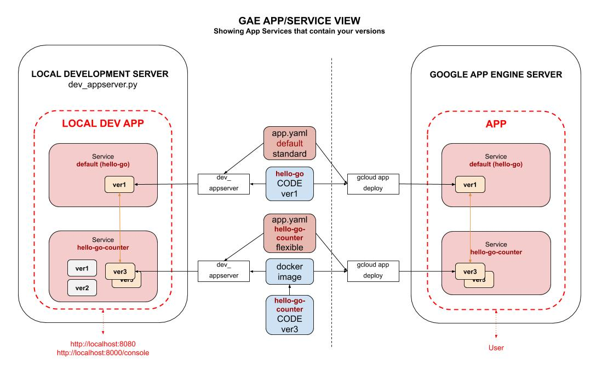
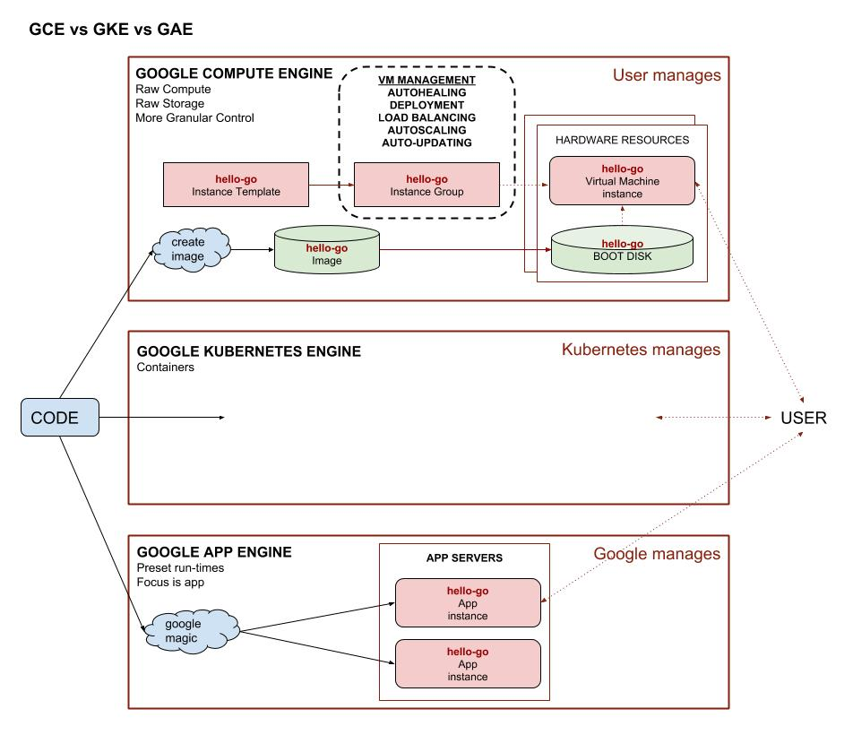

# GOOGLE APP ENGINE (GAE) CHEAT SHEET

`google app engine (gae)` _which is part of
[gcp](https://github.com/JeffDeCola/my-cheat-sheets/tree/master/software/infrastructure-as-a-service/cloud-services-compute/google-cloud-platform-cheat-sheet)
provides a serverless application platform that you can use to run an App._

Part of three compute engines at `gcp`,

* App engine (gae)
  PaaS
* Container/Kubernetes engine
  [(gke)](https://github.com/JeffDeCola/my-cheat-sheets/tree/master/software/infrastructure-as-a-service/cloud-services-compute/google-cloud-platform-cheat-sheet/google-kubernetes-engine.md)
  IaaS/PaaS or CaaS
* Compute engine
  [(gce)](https://github.com/JeffDeCola/my-cheat-sheets/tree/master/software/platform-as-a-service/cloud-services-app/google-cloud-platform-cheat-sheet/google-compute-engine.md)
  IaaS

Documentation and reference,

* [Google App Engine Documentation](https://cloud.google.com/appengine/docs)
* [Quickstart standard environment using go](https://cloud.google.com/appengine/docs/standard/go/)
* [Quickstart flexible environment using go](https://cloud.google.com/appengine/docs/flexible/go/)
* [Google App Engine SDK Reference (gcloud compute)](https://cloud.google.com/sdk/gcloud/reference/app/)
* [Google app.yaml file reference](https://cloud.google.com/appengine/docs/standard/go111/config/appref)

My Repo example using `gae` is [hello-go-deploy-gae](https://github.com/JeffDeCola/hello-go-deploy-gae).

View my entire list of cheat sheets on
[my GitHub Webpage](https://jeffdecola.github.io/my-cheat-sheets/).

## OVERVIEW

What if you just don't really care about
the guts or configurations (infrastructure) and just want to
deploy and App.  Well `gae`
is for you.  You bring the code, they handle the rest.

`gae` is really used for web applications, and can be used with
google firebase for mobile apps.



On a side note, can `gae` run a service?  I would say yes.  But that's
not really the point of `gae`.

## FREE RESOURCE (standard environment only)

As of my last update, the free resources are,

* 28 frontend instance hours per day
* 9 backend instance hours per day
* 5 GB Cloud Storage
* 1 GB of egress per day
* Shared memcache
* 1000 search operations per day, 10 MB search indexing
* 100 emails per day

The free tier is available only for the `Standard Environment`.

Full list of [free gcp services](https://cloud.google.com/free/docs/gcp-free-tier).

## GCE, GKE & GAE (THE ENGINES ON GCP)

What are the main differences between `google app engine`, 
`google kubernetes engine` and `google compute engine`?

* [google app engine (gae)](https://github.com/JeffDeCola/my-cheat-sheets/tree/master/software/platform-as-a-service/cloud-services-compute/google-cloud-platform-cheat-sheet/google-app-engine.md)
  PaaS
  * A higher level of abstraction. Serverless. Focus is on your code.
  * Auto scales for you. Will create more instances as needed.
  * Google worries about infrastructure, you worry about code.
    Simply deploy your code and platform does the rest.
  * You don't manage or update the OS.
* [google kubernetes engine (gke)](https://github.com/JeffDeCola/my-cheat-sheets/tree/master/software/infrastructure-as-a-service/cloud-services-compute/google-cloud-platform-cheat-sheet/google-kubernetes-engine.md)
  IaaS/PaaS or CaaS
  * A step up from `gce` that uses Containers to manage your App.
  * Immutable OS (Unable to be changed - Can't modify the OS).
  * Autoscaling.
  * GCE Resources integrated. Kubernetes runs on `gce`.
* [google compute engine (gce)](https://github.com/JeffDeCola/my-cheat-sheets/tree/master/software/infrastructure-as-a-service/cloud-services-compute/google-cloud-platform-cheat-sheet/google-compute-engine.md)
  IaaS.
  * You have full control/responsibility for server.
  * Create your own VM instance by allocating hardware specific resources
    (e.g. RAM, CPU, Storage).
  * Direct access to OS.
  * Manage OS and updates as needed.

So what is this all good for,

* `gae`
  * Web services with large scaling.
  * Quick scaling.
* `gke`
  * Micro services.
  * Container services.
  * Plan to cross cloud.
* `gce`
  * Small services.
  * Larger scale high performance service.

Here is a high-level illustration,



## TWO ENVIRONMENTS

* STANDARD ENVIRONMENT
  * Based on container instances running on Google's infrastructure.
  * Containers are preconfigured with one of several available runtimes
    (i.e. go, python, etc...).
* FLEXIBLE ENVIRONMENT
  * The App Engine flexible environment automatically scales your app up and
    down while balancing the load.
  * Allows you to customize the runtime (i.e. go, python, etc...) and even
    the operating system of your virtual machine using Dockerfiles

## INSTALL

Must install the app-engine for gcloud,

First see if you got it,

```bash
gcloud components list
```

If you don't install it,

```bash
gcloud components update
gcloud components install app-engine-go
```

## LOCAL APP SERVER & CONSOLE

You kick off your app using the local app server `dev_appserver.py`.

And you monitor your local app in the interactive console,

[http://localhost:8000/console](http://localhost:8000/console)

Lets check this out by way of an example,

## EXAMPLE 1 - A SIMPLE EXAMPLE USING GO

Here is a very simple example using two file to test everything
is working.

You can pull the example I placed in my repo
[here](https://github.com/JeffDeCola/hello-go-deploy-gae/tree/master/example-01-app).

### STEP 1 - CREATE TWO FILES IN A DIRECTORY

Make a directory and create the following two files,

main.go,

```go
package main

import (
    "fmt"
    "net/http"

    "google.golang.org/appengine"
)

func main() {

    http.HandleFunc("/", handle)
    appengine.Main()

}

func handle(w http.ResponseWriter, r *http.Request) {
    fmt.Fprintln(w, "Hello, world!")
}
```

app.yaml,

```yaml
runtime: go111

service: example-01-app

handlers:
- url: /.*
  script: auto
```

### STEP 2 - TEST RUN ON YOUR LOCAL DEVELOPMENT SERVER

Test on the local development server using google's Local
App Server `dev_appserver.py`,

```bash
dev_appserver.py app.yaml
```

Check the results,

[http://localhost:8080](http://localhost:8080)

Check the interactive local console,

[http://localhost:8000/console](http://localhost:8000/console)


### STEP 3 - EDIT CODE ON THE FLY AND SEE RESULTS

Edit "hello world" to something else.

Refresh,

[http://localhost:8080](http://localhost:8080)

### STEP 4 - DEPLOY TO GAE

```bash
gcloud app deploy app.yaml
```

### STEP 5 - VIEW AT GAE

Head to the console or,

```bash
gcloud app browse
```

## EXAMPLE 2 - LETS ADD A LITTLE STRUCTURE

Lets use google cloud to add some static web pages.

You can look at or pull the example I placed in my repo
[here](https://github.com/JeffDeCola/hello-go-deploy-gae/tree/master/example-02-app).

## FILE/DIRECTOR STRUCTURE

For example 2, lets get a little more structured with some static web pages.

* example-02-app/
  * app.yaml
  * main.go (Your App code)
  * index.html (Static HTML file)
  * opps.html (Wrong URL)
  * static/ (Directory to store your static files)
    * style.css
    * go-logo.png (Picture of gopher)
  * bucket-gcs/ (Directory to store your static files on google cloud storage)
    * gae-logo.jpg

You can look at or pull the example I placed in my repo
[here](https://github.com/JeffDeCola/hello-go-deploy-gae/tree/master/example-02-app).

## EXAMPLE 3 - LETS ADD A SERVICE

Lets do something.
