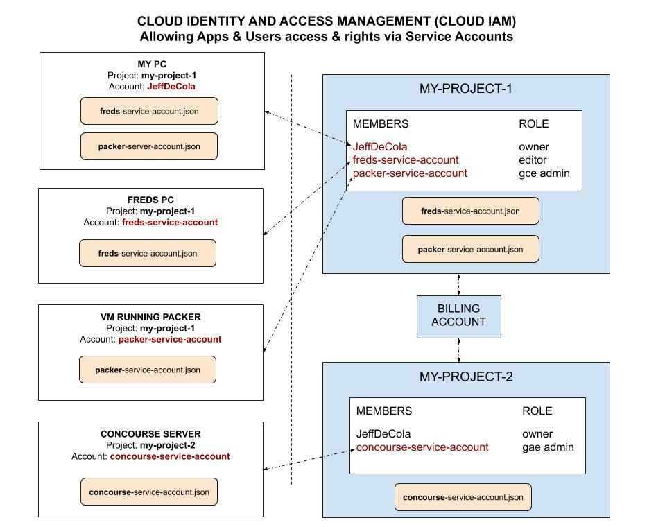

# GOOGLE CLOUD PLATFORM (GCP) CHEAT SHEET

`google cloud platform (gcp)` _is a massive suite of cloud computing services like
[amazon web services (aws)](https://github.com/JeffDeCola/my-cheat-sheets/tree/master/software/service-architectures/infrastructure-as-a-service/cloud-services/amazon-web-services-cheat-sheet)
or
[microsoft azure](https://github.com/JeffDeCola/my-cheat-sheets/tree/master/software/service-architectures/infrastructure-as-a-service/cloud-services/microsoft-azure-cheat-sheet)._

Documentation and reference,

* [Your GCP Dashboard](https://console.cloud.google.com/home/dashboard)
* [Google Cloud Platform Documentation](https://cloud.google.com/docs)
* [Google Cloud Platform SDK Documentation (gcloud, gsutil, bq)](https://cloud.google.com/sdk/docs/)
* [Google Cloud Platform SDK Reference (gcloud)](https://cloud.google.com/sdk/gcloud/reference/)
* [go on google cloud platform](https://cloud.google.com/go/docs/)

View my entire list of cheat sheets on
[my GitHub Webpage](https://jeffdecola.github.io/my-cheat-sheets/).

## MY GCP CHEAT SHEETS

Here are my gcp cheat sheets so far,

* [google app engine (gae)](https://github.com/JeffDeCola/my-cheat-sheets/tree/master/software/service-architectures/platform-as-a-service/google-app-engine-cheat-sheet),
  [hello-go-deploy-gae](https://github.com/JeffDeCola/hello-go-deploy-gae)
* [google kubernetes engine (gke)](https://github.com/JeffDeCola/my-cheat-sheets/tree/master/software/service-architectures/containers-as-a-service/google-kubernetes-engine-cheat-sheet),
  [hello-go-deploy-gke](https://github.com/JeffDeCola/hello-go-deploy-gke)
* [google compute engine (gce)](https://github.com/JeffDeCola/my-cheat-sheets/tree/master/software/service-architectures/infrastructure-as-a-service/compute/google-compute-engine-cheat-sheet),
  [hello-go-deploy-gce](https://github.com/JeffDeCola/hello-go-deploy-gce)
* [google cloud pub/sub](https://github.com/JeffDeCola/my-cheat-sheets/tree/master/software/service-architectures/infrastructure-as-a-service/cloud-services/google-cloud-platform-cheat-sheet/google-cloud-pub-sub.md)
* [google cloud storage](https://github.com/JeffDeCola/my-cheat-sheets/tree/master/software/service-architectures/infrastructure-as-a-service/cloud-services/google-cloud-platform-cheat-sheet/google-cloud-storage.md)
* [google source repositories (git)](https://github.com/JeffDeCola/my-cheat-sheets/tree/master/software/service-architectures/infrastructure-as-a-service/cloud-services/google-cloud-platform-cheat-sheet/google-source-repositories-git.md)
* [google stackdriver monitoring](https://github.com/JeffDeCola/my-cheat-sheets/tree/master/software/service-architectures/infrastructure-as-a-service/cloud-services/google-cloud-platform-cheat-sheet/google-stackdriver-monitoring.md)

## GCP FREE RESOURCES

Three are a lot of
[free resources](https://cloud.google.com/free/docs/gcp-free-tier)
across gcp.

## GOOGLE CLOUD PLATFORM (GCP) OVERVIEW

Google Cloud Platform is absolutely massive with a host of
hundreds of powerful products from storage and compute to
data analytics.

An extensive list is [here](https://cloud.google.com/docs/).

* AI AND MACHINE LEARNING
  * AI hub
  * cloud machine learning engine
  * cloud TPU
  * cloud deep learning vm image
  * bigquery ML
  * cloud autoML
  * cloud vision
  * cloud video intelligence
  * cloud natural language
  * cloud translation
  * cloud speech-to-text
  * cloud text-to-speech
  * dialogflow enterprise edition
  * cloud inference API
* API MANAGEMENT
  * API analytics
  * API monetization
  * apigee API platform
  * apigee sense
  * cloud endpoints
  * developer portal
  * gcp marketplace
  * private catalog
* COMPUTE
  * [google cloud functions (gcf)](https://github.com/JeffDeCola/my-cheat-sheets/tree/master/software/service-architectures/function-as-a-service/google-cloud-functions-cheat-sheet)
    cheat sheet (FaaS)
  * [google app engine (gae)](https://github.com/JeffDeCola/my-cheat-sheets/tree/master/software/service-architectures/platform-as-a-service/google-app-engine-cheat-sheet)
    cheat sheet (PaaS)
  * [google kubernetes engine (gke)](https://github.com/JeffDeCola/my-cheat-sheets/tree/master/software/service-architectures/containers-as-a-service/google-kubernetes-engine-cheat-sheet)
    cheat sheet (CaaS)
  * [google compute engine (gce)](https://github.com/JeffDeCola/my-cheat-sheets/tree/master/software/service-architectures/infrastructure-as-a-service/compute/google-compute-engine-cheat-sheet)
    cheat sheet (IaaS)
  * shielded VMs
* DATA AND ANALYTICS
  * cloud composer
  * cloud dataflow
  * cloud datalab
  * cloud dataprep
  * cloud dataproc
  * [google cloud pub/sub](https://github.com/JeffDeCola/my-cheat-sheets/tree/master/software/service-architectures/infrastructure-as-a-service/cloud-services/google-cloud-platform-cheat-sheet/google-cloud-pub-sub.md)
    cheat sheet
  * google bigquery
  * google data studio
  * google genomics
* DATABASES
  * cloud bigtable
  * cloud datastore
  * cloud firestore
  * cloud memorystore
  * cloud spanner
  * cloud SQL (MySQL)
  * cloud SQL (Postgres)
* DEVELOPER TOOLS
  * [cloud SDK](https://github.com/JeffDeCola/my-cheat-sheets/tree/master/software/service-architectures/infrastructure-as-a-service/cloud-services/google-cloud-platform-cheat-sheet#google-cloud-software-development-kit-sdk)
  * cloud build
  * [google source repositories (git)](https://github.com/JeffDeCola/my-cheat-sheets/tree/master/software/service-architectures/infrastructure-as-a-service/cloud-services/google-cloud-platform-cheat-sheet/google-source-repositories-git.md)
    cheat sheet
  * cloud tools for IntelliJ
  * cloud tools for powershell
  * cloud tools for visual studio
  * cloud tool for eclipse
  * container registry
  * gradle APP engine plugin
  * maven APP engine plugin
* INTERNET OF THINGS (IoT)
  * cloud IoT core
* MANAGEMENT TOOLS
  * cloud APIs
  * cloud billing
  * cloud billing API
  * cloud console
  * cloud deployment manager
  * cloud shell
  * stackdriver debugger
  * stackdriver error reporting
  * stackdriver logging
  * [google stackdriver monitoring](https://github.com/JeffDeCola/my-cheat-sheets/tree/master/software/service-architectures/infrastructure-as-a-service/cloud-services/google-cloud-platform-cheat-sheet/google-stackdriver-monitoring.md)
    cheat sheet
  * stackdriver profiler
  * stackdriver trace
* MEDIA SOLUTIONS
  * anvato
  * zync render
* MIGRATION TO GCP
  * google transfer appliance
  * storage transfer appliance
  * bigquery data transfer service
  * velostrata
* NETWORKING
  * carrier peering
  * direct peering
  * dedicated interconnect
  * partner interconnect
  * cloud armor
  * cloud CDN
  * cloud DNS
  * cloud load balancing
  * IPsec VPN
  * network service tires
  * virtual private cloud
* SECURITY AND IDENTITY
  * access context manager
  * access transparency
  * binary authorization
  * cloud data loss prevention API
  * cloud IAM
  * cloud identity-aware proxy
  * cloud key management service
  * resource manager
  * cloud security scanner
  * security key enforcement
  * vpc service controls
* STORAGE
  * [google cloud storage](https://github.com/JeffDeCola/my-cheat-sheets/tree/master/software/service-architectures/infrastructure-as-a-service/cloud-services/google-cloud-platform-cheat-sheet/google-cloud-storage.md)
    cheat sheet
  * cloud storage nearline
  * cloud storage coldline
  * [persistent disk (VM boot disk)](https://github.com/JeffDeCola/my-cheat-sheets/tree/master/software/service-architectures/infrastructure-as-a-service/compute/google-compute-engine-cheat-sheet)
    cheat sheet
  * cloud firestore

## GCF, GAE, GKE & GCE (THE ENGINES ON GCP)

What are the main differences between `google cloud functions`,
`google app engine`, `google kubernetes engine` and
`google compute engine`?

* FaaS -
  [Google Cloud Functions (gcf)](https://github.com/JeffDeCola/my-cheat-sheets/tree/master/software/service-architectures/function-as-a-service/google-cloud-functions-cheat-sheet)
  * Severless
  * Events.
* PaaS -
  [Google App Engine (gae)](https://github.com/JeffDeCola/my-cheat-sheets/tree/master/software/service-architectures/platform-as-a-service/google-app-engine-cheat-sheet)
  * A higher level of abstraction. Serverless. Focus is on your code.
  * Auto scales for you. Will create more instances as needed.
  * Google worries about infrastructure, you worry about code.
    Simply deploy your code and platform does the rest.
  * You don't manage or update the OS.
* CaaS -
  [Google Kubernetes Engine (gke)](https://github.com/JeffDeCola/my-cheat-sheets/tree/master/software/service-architectures/containers-as-a-service/google-kubernetes-engine-cheat-sheet)
  * A step up from `gce` that uses Containers to manage your App.
  * Immutable OS (Unable to be changed - Can't modify the OS).
  * Autoscaling.
  * GCE Resources integrated. Kubernetes runs on `gce`.
* IaaS -
  [Google Compute Engine (gce)](https://github.com/JeffDeCola/my-cheat-sheets/tree/master/software/service-architectures/infrastructure-as-a-service/compute/google-compute-engine-cheat-sheet)
  * You have full control/responsibility for server.
  * Create your own VM instance by allocating hardware specific resources
    (e.g. RAM, CPU, Storage).
  * Direct access to OS.
  * Manage OS and updates as needed.

So what is this all good for?

* `gcf`
  * Web.
* `gae`
  * Web services with large scaling.
  * Quick scaling.
* `gke`
  * Micro services.
  * Container services.
  * Plan to cross cloud.
* `gce`
  * Small services.
  * Larger scale high performance service.

Here is a high-level illustration,


## GET AN ACCOUNT AT GOOGLE CLOUD PLATFORM

First setup a
[google cloud platform](https://cloud.google.com/)
account.

Create a Project which will have a name and ID.
Then submit your billing information.

* [Redeem a Promotion](https://console.cloud.google.com/billing/redeem)
* [Your gcp Dashboard](https://console.cloud.google.com/home/dashboard)

## INTERACTING WITH GCP

There are a few ways to interact with `gcp`,

* Using the gui/console.
* Using the SDK cli (e.g. `gcloud`). See below.
* Using Google Cloud Client Libraries / API
  (e.g. [go](https://cloud.google.com/compute/docs/api/libraries#google_apis_go_client_library)).

## GOOGLE CLOUD SOFTWARE DEVELOPMENT KIT (SDK)

[Cloud SDK](https://cloud.google.com/sdk/docs/)
is a command-line interface for Google Cloud
Platform products and services.

These include,

* `gcloud`
  [doc](https://cloud.google.com/sdk/gcloud/),
  [reference](https://cloud.google.com/sdk/gcloud/reference/)
  provides the primary command-line tool for Google Cloud Platform.
* `gsutil`
  [doc](https://cloud.google.com/storage/docs/gsutil),
  is the command-line tool for
  [google cloud storage](https://github.com/JeffDeCola/my-cheat-sheets/tree/master/software/service-architectures/infrastructure-as-a-service/cloud-services/google-cloud-platform-cheat-sheet/google-cloud-storage.md).
* `bq`
  [doc](https://cloud.google.com/bigquery/docs/bq-command-line-tool),
  is the command-line tool for BigQuery.

## INSTALL AND CONFIGURE THE gcloud SOFTWARE DEVELOPMENT KIT (SDK)

There is great documentation online to install the SDK on your
particular platform [here](https://cloud.google.com/sdk/).

After installation configure,

```bash
gcloud init
```

You will be asked to attached a GCP project and a default compute region.
When complete, check your active configuration,

```bash
gcloud config list
gcloud auth list
gcloud info
```

See what components you have installed,

```bash
gcloud components list
```

You can add components as needed. For example,
to add `gae` go extensions,

```bash
gcloud components update
gcloud components install app-engine-go
```

Your configuration file is located `~/.boto`.

To change your default region/zone,

```bash
gcloud config set compute/region NAME
gcloud config set compute/zone NAME
```

For more information on the configuration file `.boto` go
[here](https://cloud.google.com/storage/docs/gsutil/commands/config).

## CLOUD IAM - CLOUD IDENTITY AND ACCESS MANAGEMENT - SERVICE ACCOUNTS

Allowing Apps & users access & rights via service accounts.

As an illustration,



You create service account and define the roles those users or Apps can do.

The big roles are the project roles,

* Owner
* Editor
* Viewer
* Browser

But you can fine tune roles to only a access certain services like
`gce`, `gae`, etc....

To see what service accounts you have access too on your local machine,

```bash
gcloud auth list
```

To add an account on your local machine,

```bash
gcloud auth activate-service-account --key-file=credential_key.json
```

You can switch accounts on your local machine,

```bash
gcloud config set account <ACCOUNT>
```

Or switch projects on your local machine,

```bash
gcloud config set project <my_project>
```

## CREATE A SERVICE ACCOUNT KEY

These are the steps,

* In Google Developers Console select a project.
* Under the "API & Services" section, click "Credentials".
* Click the "Create credentials" button, select "Service account key".
* Choose JSON as the Key type and gce as service account and click "Create".
* A JSON file will be downloaded automatically. This is your account file.

I would put the credentials file here,

```bash
$HOME/.config/gcloud/<name>.json
```

Set an environment variable in `~/.bashrc` to point to your service account file,

```bash
export GCP_SERVICE_ACCOUNT_KEY_PATH='/home/jeff/.config/gcloud/<name>.json'
```

Then you can use this env variables in your deployments and
it is kept secret on your local machine.

## SOME BASIC GCP COMMANDS

GCP Help,

```bash
gcloud help
```

Version,

```bash
gcloud -v
```
