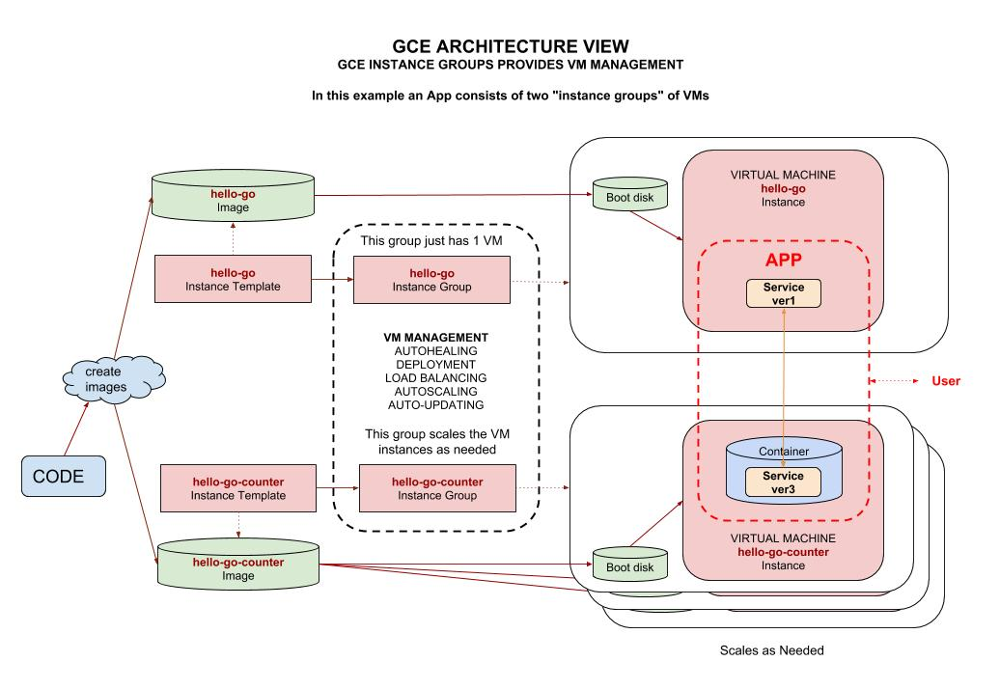
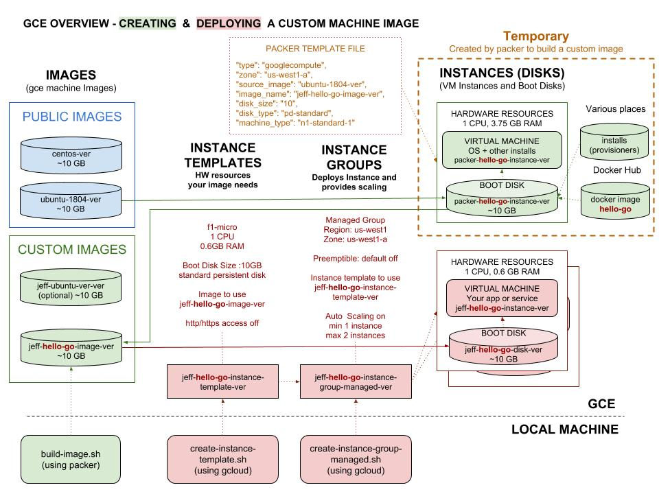
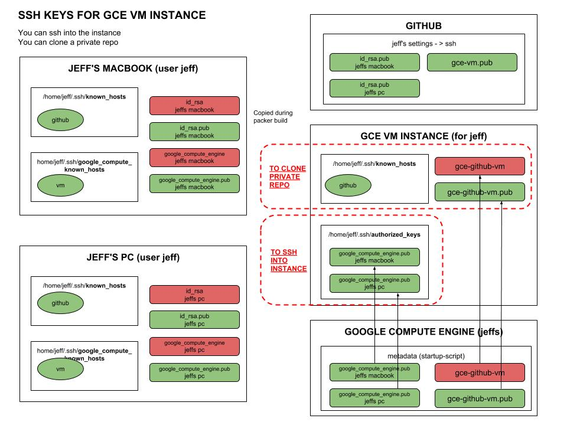

# GOOGLE COMPUTE ENGINE (GCE) CHEAT SHEET

`google compute engine (gce)` _which is part of
[gcp](https://github.com/JeffDeCola/my-cheat-sheets/tree/master/software/service-providers/google-cloud-platform-cheat-sheet)
provides high performance scalable Virtual Machine (VM) instances
that you can use to run an App/service._

Part of four main compute engines at `gcp`,

* FaaS - Google Cloud Functions
  [(gcf)](https://github.com/JeffDeCola/my-cheat-sheets/tree/master/software/service-architectures/function-as-a-service/google-cloud-functions-cheat-sheet)
* PaaS - Google App Engine
  [(gae)](https://github.com/JeffDeCola/my-cheat-sheets/tree/master/software/service-architectures/platform-as-a-service/google-app-engine-cheat-sheet)
* CaaS - Google Kubernetes Engine
  [(gke)](https://github.com/JeffDeCola/my-cheat-sheets/tree/master/software/service-architectures/containers-as-a-service/google-kubernetes-engine-cheat-sheet)
* IaaS - Google Compute Engine
  [(gce)](https://github.com/JeffDeCola/my-cheat-sheets/tree/master/software/service-architectures/infrastructure-as-a-service/google-compute-engine-cheat-sheet)

Documentation and reference,

* Your
  [Images](https://console.cloud.google.com/compute/images),
  [Instances Templates](https://console.cloud.google.com/compute/instanceTemplates),
  [Instances Groups](https://console.cloud.google.com/compute/instanceGroups) and
  [Instances](https://console.cloud.google.com/compute/instances)
  ([VM boot disks](https://console.cloud.google.com/compute/disks))
  via the console.
* [Google Compute Engine Documentation](https://cloud.google.com/compute/docs)
* [Quickstart using console](https://cloud.google.com/compute/docs/quickstart-linux)
* [Google Compute Engine SDK Reference (gcloud compute)](https://cloud.google.com/sdk/gcloud/reference/compute/)
* [go api / compute engine client libraries](https://cloud.google.com/compute/docs/api/libraries#google_apis_go_client_library))
* A list of
  [basic gce commands](https://github.com/JeffDeCola/my-cheat-sheets/blob/master/software/service-architectures/infrastructure-as-a-service/google-compute-engine-cheat-sheet#gce-basic-gcloud-commands)
  I like.

* [OVERVIEW](https://github.com/JeffDeCola/my-cheat-sheets/tree/master/software/service-architectures/infrastructure-as-a-service/google-compute-engine-cheat-sheet#overview)
* [FREE RESOURCE (f1-micro)](https://github.com/JeffDeCola/my-cheat-sheets/tree/master/software/service-architectures/infrastructure-as-a-service/google-compute-engine-cheat-sheet#free-resource-f1-micro)
* [GCE REGIONS AND ZONES](https://github.com/JeffDeCola/my-cheat-sheets/tree/master/software/service-architectures/infrastructure-as-a-service/google-compute-engine-cheat-sheet#gce-regions-and-zones)
* [GCE MACHINE TYPES, PRICING & REGIONS](https://github.com/JeffDeCola/my-cheat-sheets/tree/master/software/service-architectures/infrastructure-as-a-service/google-compute-engine-cheat-sheet#gce-machine-types-pricing--regions)
* [https://github.com/JeffDeCola/my-cheat-sheets/tree/master/software/service-architectures/infrastructure-as-a-service/google-compute-engine-cheat-sheet#interacting-with-gce](https://github.com/JeffDeCola/my-cheat-sheets/tree/master/software/service-architectures/infrastructure-as-a-service/google-compute-engine-cheat-sheet#interacting-with-gce)
* [INTERACTING WITH GCE](https://github.com/JeffDeCola/my-cheat-sheets/tree/master/software/service-architectures/infrastructure-as-a-service/google-compute-engine-cheat-sheet#interacting-with-gce)
* [GOOGLE COMPUTE ENGINE (GCE) MAIN SECTIONS](https://github.com/JeffDeCola/my-cheat-sheets/tree/master/software/service-architectures/infrastructure-as-a-service/google-compute-engine-cheat-sheet#google-compute-engine-gce-main-sections)
  * [IMAGES](https://github.com/JeffDeCola/my-cheat-sheets/tree/master/software/service-architectures/infrastructure-as-a-service/google-compute-engine-cheat-sheet#images)
  * [INSTANCE TEMPLATES](https://github.com/JeffDeCola/my-cheat-sheets/tree/master/software/service-architectures/infrastructure-as-a-service/google-compute-engine-cheat-sheet#instance-templates)
  * [INSTANCE GROUPS](https://github.com/JeffDeCola/my-cheat-sheets/tree/master/software/service-architectures/infrastructure-as-a-service/google-compute-engine-cheat-sheet#instance-groups)
  * [INSTANCES](https://github.com/JeffDeCola/my-cheat-sheets/tree/master/software/service-architectures/infrastructure-as-a-service/google-compute-engine-cheat-sheet#instances)  
* [GCE BASIC GCLOUD COMMANDS](https://github.com/JeffDeCola/my-cheat-sheets/tree/master/software/service-architectures/infrastructure-as-a-service/google-compute-engine-cheat-sheet#gce-basic-gcloud-commands)
* [GCE HEALTH CHECK GCLOUD COMMANDS](https://github.com/JeffDeCola/my-cheat-sheets/tree/master/software/service-architectures/infrastructure-as-a-service/google-compute-engine-cheat-sheet#gce-health-check-gcloud-commands)

My repo example using `gce` is
[hello-go-deploy-gce](https://github.com/JeffDeCola/hello-go-deploy-gce).

View my entire list of cheat sheets on
[my GitHub Webpage](https://jeffdecola.github.io/my-cheat-sheets/).

## OVERVIEW

In a nutshell, `gce` allows you to deploy a VM instance from an `image`.
And your VM instance can contain Apps, services, containers, etc...

`gce` offers scale, performance and value that allows
you to easily launch large compute clusters on Google's infrastructure.
There are no upfront investments.  Pay what you use.

## WHAT YOU NEED IN ORDER TO USE GCE

In order to use `gce` you will need,

* ACCOUNT - GCP Account (with billing).
* CREDENTIALS - Service Account ($HOME/.config/gcloud/<name>.json).
* API - `gcloud` cli or client libraries.
* YOUR WORLD AT GOOGLE - Project at google.
* CONNECT TO VM - ssh keys ($HOME/.ssh/gcp-ssh-key.pub and gcp-ssh-key (pair)).

Refer to
[google cloud platform (gcp)](https://github.com/JeffDeCola/my-cheat-sheets/tree/master/software/service-providers/google-cloud-platform-cheat-sheet)
to get all this set up.

## FREE RESOURCE (f1-micro)

As of my last update, there is a free
`f1-micro` resource is as follows,

* 1 non-preemptible `f1-micro` VM instance per month in one of the following US regions:
  * Oregon: us-west1
  * Iowa: us-central1
  * South Carolina: us-east1
* 30 GB of HDD `Standard persistent disk storage` per month.
* 5 GB of `snapshot storage per month`. Limited to the following regions:
  * Oregon: us-west1
  * Iowa: us-central1
  * South Carolina: us-east1
  * Taiwan: asia-east1
  * Belgium: europe-west1
* Network Traffic Limits:
  * You must use Premium Tier. You cannot use Standard Tier.
  * Traffic must be sent from a GCP region in North America.
  * You can send up to `1GB of egress traffic`, in aggregate,
    to regions except for those in Oceania and China.

Preemptible VM instances (VMs that can be shut down by google at any moment)
are not included in the Free Tier.

Full list of [free gcp services](https://cloud.google.com/free/docs/gcp-free-tier).

## GCE REGIONS AND ZONES

Compute is located in regions across the globe.

* ASIA
  * asia-east1 (Taiwan)
  * asia-east2 (Hong Kong)
  * asia-northeast1 (Tokyo)
  * asia-south1 (Mumbai)
  * asia-southeast1 (Singapore)
* AUSTRALIA
  * australia-southeast1 (Sydney)
* EUROPE
  * europe-north1 (Finland)
  * europe-west1 (Belgium)
  * europe-west2 (London)
  * europe-west3 (Frankfurt)
  * europe-west4 (Netherlands)
  * europe-west6 (Zurich)
* NORTH AMERICA
  * northamerica-northeast1 (Montreal)
* SOUTH AMERICA
  * southamerica-east1 (Sao Paulo)
* UNITED STATES
  * us-central1 (Iowa)
  * us-east1 (South Carolina)
  * us-east4 (Northern Virginia)
  * us-west1 (Oregon)
  * us-west2 (Los Angeles)

Each region may have a few zones.

## GCE MACHINE TYPES, PRICING & REGIONS

To get an idea on pricing, here are some predefined standard machine
types. These prices also vary by region.

| MACHINE TYPE    | V. CPUs |   MEMORY |  PRICE/MONTH |  PREEMPTIBLE |
|:----------------|--------:|---------:|-------------:|-------------:|
| f1-micro        |       1 |    0.6GB |          ~$4 |          ~$3 |
| g1-small        |       1 |    1.7GB |         ~$14 |          ~$6 |
|                 |         |          |              |              |
| n1-standard-1   |       1 |   3.75GB |         ~$25 |          ~$8 |
| n1-standard-2   |       2 |    7.5GB |         ~$58 |         ~$17 |
| n1-standard-8   |       8 |     30GB |        ~$233 |         ~$70 |
| n1-standard-64  |      64 |    240GB |      ~$1,867 |        ~$561 |
|                 |         |          |              |              |
| n1-highmem-2    |       2 |     13GB |         ~$72 |         ~$21 |
| n1-highmem-4    |       4 |     26GB |        ~$145 |         ~$43 |
| n1-highmem-8    |       8 |     52GB |        ~$290 |         ~$87 |
| n1-highmem-64   |      64 |    416GB |      ~$2,323 |        ~$699 |
|                 |         |          |              |              |
| n1-highcpu-2    |       2 |    1.8GB |         ~$43 |         ~$13 |
| n1-highcpu-4    |       4 |    3.6GB |         ~$86 |         ~$26 |
| n1-highcpu-8    |       8 |    7.2GB |        ~$173 |         ~$52 |
| n1-highcpu-64   |      64 |     57GB |      ~$1,391 |        ~$418 |
|                 |         |          |              |              |
| n1-ultramem-40  |      40 |    961GB |      ~ 3,221 |       ~$ 971 |
| n1-ultramem-80  |      80 |   1922GB |      ~ 6,442 |     ~$ 1,943 |
| n1-ultramem-160 |     160 |   3844GB |      ~12,885 |     ~$ 3,886 |
|                 |         |          |              |              |
| n1-megamem-96   |      96 |   1433GB |      ~$5,454 |      ~$1,649 |

`f1-micro` and `g1-small` machine types offer bursting capabilities that
allow VM instances to use additional physical CPU for short periods of time.

There are many other models depending on what you need. Check out the
latest machines and [pricing](https://cloud.google.com/compute/pricing).

Google [pricing calculator](https://cloud.google.com/products/calculator/).

## INTERACTING WITH GCE

There are a few ways to interact with `gce`,

* Using the gui/console.
* Using the SDK cli (e.g. `gcloud`). See below.
* Using Google Cloud Client Libraries / API
  (e.g. [go](https://cloud.google.com/compute/docs/api/libraries#google_apis_go_client_library)).
  My [go example](https://github.com/JeffDeCola/my-go-examples/tree/master/cloud-services/google-gcp).

This cheat sheet will be focused on the `gcloud`.

## GOOGLE COMPUTE ENGINE (GCE) MAIN SECTIONS

There are four main section of gce:

* `IMAGES` - Boot disk image / machine image (contains your App/service).
* `INSTANCE TEMPLATES` - The HW resources you need to deploy an `image`.
* `INSTANCE GROUPS` - Deploys and scales VM instances.
* `INSTANCES` (AND BOOT DISKS) - A deployed `image` (your VM instance).

The goal is to deploy an `image` that creates a VM instance(s)
(That contains your App/service).

The following illustration shows a high level view on how an
App/service may be running on `gce`.  AS you can see in this example,
the VM instances contain services.  It also shows
`instance groups` control the show (They deploy and scale VM instances).



The following illustration is a more detailed view of gce,

* The creation of a custom image `jeff-hello-go-image-ver`
  that contains you App/service.
* The deployment of an image `jeff-hello-go-instance-ver`
  that runs your App/service.

We will go over each section below.



### IMAGES

As shown in the above illustration, images are used for deploying
your VM instance.

A machine `image` is a single static unit that contains
a pre-configured operating system and installed software which
is used to quickly create new running machines.

There are two types of `gce` `images`,

* `Public images` are provided and maintained by Google,
  open-source communities, and third-party vendors.
* `Custom images` are available only to your project.
  You can create a custom image from `boot disks` or other `images`.

Refer to these cheat sheets for creating a custom image
(I recommended using
[packer](https://github.com/JeffDeCola/my-cheat-sheets/tree/master/software/operations-tools/orchestration/builds-deployment-containers/packer-cheat-sheet)),

* [Create a custom image using packer](https://github.com/JeffDeCola/my-cheat-sheets/tree/master/software/service-architectures/infrastructure-as-a-service/google-compute-engine-cheat-sheet/google-compute-engine-create-image-packer.md).
  Do this one.  Your best option.
* [Create a custom image using gcloud](https://github.com/JeffDeCola/my-cheat-sheets/tree/master/software/service-architectures/infrastructure-as-a-service/google-compute-engine-cheat-sheet/google-compute-engine-create-image-gcloud.md).
* Create a custom image using console - Just click a few buttons.

List your images,

```bash
gcloud compute images list
```

Delete an image,

```bash
gcloud compute images delete <IMAGENAME>
```

### INSTANCE TEMPLATES

Instance template perform the following functions,

* The HW resources your instance needs to run the image.

You specify,

* The image
* CPUs and RAM sizes
* Boot Disk Size (standard persistent disk)
* http/https on or off

In the above illustration the `hello-go`
needs 1CPU and 0.6GB RAM on a 10GB boot disk.
This is because the image needs at least 10GB.

A `standard persistent` disk is a fancy way
to say VM boot disk; the disk used
to start your instance.

Hence, the command may look like,

```bash
gcloud compute \
    --project "$GOOGLE_JEFFS_PROJECT_ID" \
     instance-templates create "$PREFIX-$SERVICE-instance-template-$POSTFIX" \
    --machine-type "f1-micro" \
    --network "default" \
    --maintenance-policy "TERMINATE" \
    --tags "jeff-test" \
    --image "$IMAGENAME" \
    --boot-disk-size "10" \
    --boot-disk-type "pd-standard" \
    --boot-disk-device-name "$PREFIX-$SERVICE-disk-$POSTFIX" \
    --description "hello-go from Jeffs Repo hello-go-deploy-gce" \
    --region "us-west1"
    # --service-account=SERVICE_ACCOUNT
    # --preemptible \
```

List your instance templates,

```bash
gcloud compute instance-templates list
```

Create your instance template help,

```bash
gcloud help compute instance-templates create
```

[Online docs](https://cloud.google.com/sdk/gcloud/reference/compute/instance-templates/create)
to create instance template.

As a side note, I would of called this `instance resources`
rather than `instance templates`. Just my 2 cents.

### INSTANCE GROUPS

Instance groups manages your VMs.
It can provides the following management functions,

* AUTOHEALING - App / Service Heath checks
* DEPLOYMENT - Launches your VM `instance`
* LOAD BALANCING - Distributes traffic
* AUTOSCALING - Scales your VM instances as needed
* AUTO-UPDATING - Updates your services

You specify,

* The `image template`
* Region and zone
* Managed or unmanaged group
* Scaling or no scaling
* Preemptible or non-preemptible VM `instance`

`Managed instance groups` are intended to support stateless
applications that aren't dependent on the specific state
of the underlying VM instances to run.
This allows for features like autoscaling.

An `unmanaged instance group` are collections of VM instances
that are not necessarily identical and do not share a
common instance template.

Scaling can be set to scale your VM instances as you hit
certain thresholds.

A `preemptible instance` means that google could shut down the VM instance
as its shifting its HW resources around.  It could fail at any moment.
These are a lot cheaper to use.

Hence a command may look like,

```bash
gcloud compute \
    --project "$GOOGLE_JEFFS_PROJECT_ID" \
    instance-groups managed create "$PREFIX-$SERVICE-instance-group-$POSTFIX" \
    --size "1" \
    --template "$TEMPLATENAME" \
    --base-instance-name "$PREFIX-$SERVICE-instance-$POSTFIX" \
    --zone "us-west1-a" \
    --description "hello-go from Jeffs Repo hello-go-deploy-gce"
```

List your instance groups,

```bash
gcloud compute instance-groups list
gcloud compute instance-groups managed list
gcloud compute instance-groups unmanaged list
```

Create your instance group help,

```bash
gcloud help compute instance-groups managed create
gcloud help compute instance-groups unmanaged create
```

Online docs to create [managed](https://cloud.google.com/sdk/gcloud/reference/compute/instance-groups/managed/create)
or [unmanaged](https://cloud.google.com/sdk/gcloud/reference/compute/instance-groups/unmanaged/create).

As a side note, I would of called this `instance control`
rather than `instance groups`. Just my 2 cents.

### INSTANCES

For clarity, an `instance` is a VM on GCP.
I like to use the term VM instance.

So now, your `image` has been loaded
onto a boot disk (standard persistent disk) and
is running as a VM instance.

A VM instance can contain,

* Services
* Containers
* An App

List your VM instances,

```bash
gcloud compute instances list
```

Create your VM instance help,

```bash
gcloud help compute instances create
```

### INSTANCES - METADATA SERVER QUERY

Every VM instance stores its metadata on the metadata server.
You can query this metadata server pro grammatically for information such as,

* The VM instance's host name
* VM instance ID
* Startup scripts
* Custom metadata

ssh onto your instance and perform the following,

Relative to `http://metadata.google.internal/computeMetadata/v1/project/`

```bash
curl -s http://metadata.google.internal/computeMetadata/v1/\
project/<PROJECT-ID> \
-H "Metadata-Flavor: Google"
```

Relative to `http://metadata.google.internal/computeMetadata/v1/instance/`

```bash
curl -s http://metadata.google.internal/computeMetadata/v1\
/instance \
    -H "Metadata-Flavor: Google"
curl -s http://metadata.google.internal/computeMetadata/v1\
/instance/hostname \
    -H "Metadata-Flavor: Google"
curl -s http://metadata.google.internal/computeMetadata/v1\
/instance/machine-type \
    -H "Metadata-Flavor: Google"
curl -s http://metadata.google.internal/computeMetadata/v1\
/instance/scheduling/preemptible \
    -H "Metadata-Flavor: Google"
```

Wait for a change,

```bash
curl http://metadata.google.internal/computeMetadata/v1\
/instance/maintenance-event?wait_for_change=true \
    -H 'Metadata-Flavor: Google'
```

### INSTANCES - GCE METADATA - STARTUP SCRIPTS

You can perform a startup script on instances you create.
Google calls this metadata.

One thing you can do is organize your ssh keys.
You can do this from the metadata section in the online console.

The end results allows you to,

* ssh into an `instance` from your machine.
* `git clone` private repos from github into your
  VM `instance`.

Here is an illustration of ssh keys are on your VM instance,



## GCE BASIC GCLOUD COMMANDS

GCE Help,

```bash
gcloud help compute
```

List of Machines Types per zone,

```bash
gcloud compute machine-types list
gcloud compute machine-types list | grep us-west1
```

List zones,

```bash
gcloud compute zones list
```

Listing static external IP addresses,

```bash
gcloud compute addresses list
```

Lists,

```bash
gcloud compute images list
gcloud compute instance-templates list
gcloud compute instance-groups list
gcloud compute instance-groups managed list
gcloud compute instance-groups unmanaged list
gcloud compute instances list
```

Help on creating,

```bash
gcloud help compute images create
gcloud help compute instance-templates create
gcloud help compute instance-groups managed create
gcloud help compute instance-groups unmanaged create
gcloud help compute instances create
```

ssh onto a VM instance `hello-go` in zone `us-west1-a`,

```bash
gcloud compute --project "<project-name>" ssh --zone "us-west1-a" "hello-go"
```

## GCE HEALTH CHECK GCLOUD COMMANDS

List your health checks at GCE,

```bash
gcloud compute health-checks list
gcloud compute http-health-checks list
```

Describe the health check settings,

```bash
gcloud compute health-checks describe general-http-healthcheck-8080
gcloud compute http-health-checks describe p-jeff-test
```

Add your instance group to an existing GCE Health Check,

You can go into the browser and do it, or via CLI using,

```bash
gcloud beta compute instance-groups managed set-autohealing [IMAGE_NAME] \
    --http-health-check [HEALTHCHECK_NAME] \
    --initial-delay 120 \
   --zone [ZONE]
```
