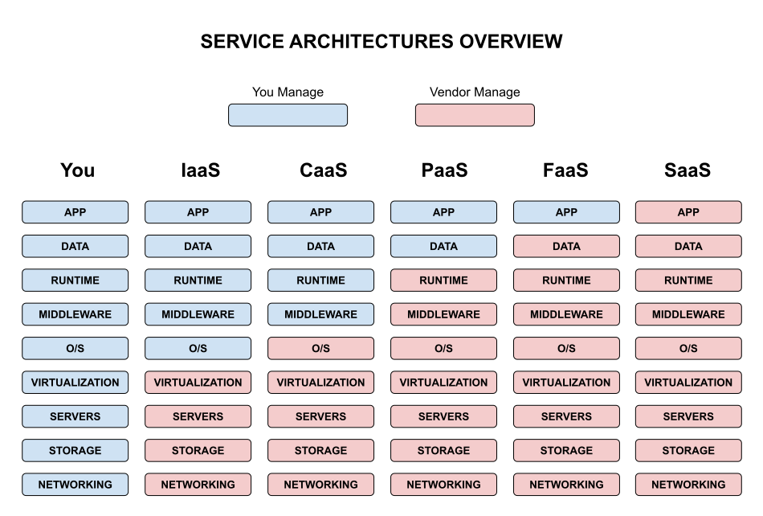

# OVERVIEW OF SERVICE ARCHITECTURES CHEAT SHEET

_Vendors take care of infrastructure for you._

## OVERVIEW

The five main types are

* SaaS - SOFTWARE AS A SERVICE
* FaaS - FUNCTION AS A SERVICE
* PaaS - PLATFORM AS A SERVICE
* CaaS - CONTAINERS AS A SERVICE
* IaaS - INFRASTRUCTURE AS A SERVICE

As a high level view

