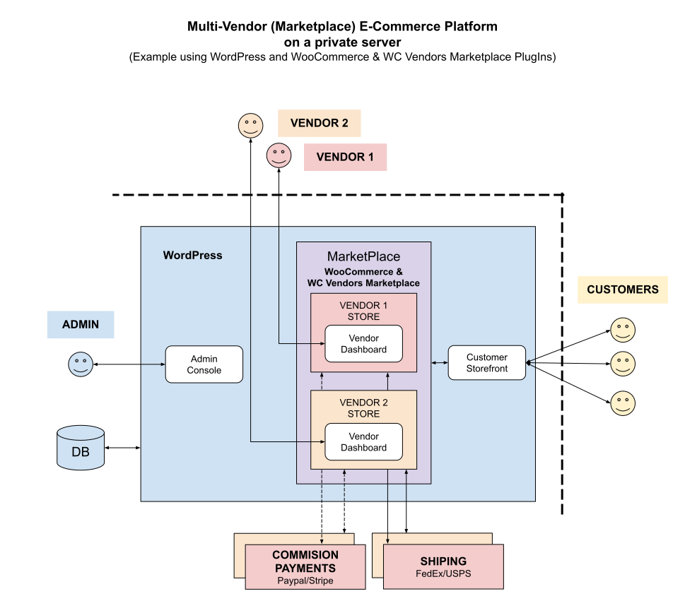

# MULTI-VENDOR MARKETPLACE CHEAT SHEET

_A Multi-Vendor (Marketplace) E-Commerce platform.
More simply, **an online marketplace**._

Other Configurations

* [multi-vendor marketplace](https://github.com/JeffDeCola/my-cheat-sheets/tree/master/software/service-architectures/software-as-a-service/content-management/multi-vendor-marketplace-cheat-sheet)
  **(You are Here)**
* [multi-vendor multi-store](https://github.com/JeffDeCola/my-cheat-sheets/tree/master/software/service-architectures/software-as-a-service/content-management/multi-vendor-multi-store-cheat-sheet)
* [single-vendor single-store](https://github.com/JeffDeCola/my-cheat-sheets/tree/master/software/service-architectures/software-as-a-service/content-management/single-vendor-single-store-cheat-sheet)

Table of Contents

* [OVERVIEW](https://github.com/JeffDeCola/my-cheat-sheets/tree/master/software/service-architectures/software-as-a-service/content-management/multi-vendor-marketplace-cheat-sheet#overview)
* [USERS (ADMIN, VENDORS & CUSTOMERS)](https://github.com/JeffDeCola/my-cheat-sheets/tree/master/software/service-architectures/software-as-a-service/content-management/multi-vendor-marketplace-cheat-sheet#users-admin-vendors--customers)
* [STEPS TO CREATE AN ONLINE MARKETPLACE USING WORDPRESS](https://github.com/JeffDeCola/my-cheat-sheets/tree/master/software/service-architectures/software-as-a-service/content-management/multi-vendor-marketplace-cheat-sheet#steps-to-create-an-online-marketplace-using-wordpress)

Documentation and Reference

* my offsite
  [demo of an E-Commerce marketplace](https://multi-vendor-marketplace.jeffdecola.com)
* [wordpress](https://github.com/JeffDeCola/my-cheat-sheets/tree/master/software/service-architectures/software-as-a-service/content-management/wordpress-cheat-sheet)
  content management system
* [WooCommerce](https://woocommerce.com/)
  e-commerce plugin
* [wc vendors](https://www.wcvendors.com/)
  multi-vendor marketplace plugin

## OVERVIEW

The following illustration is a high-level view of an
Multi-Vendor (Multi-Store) E-Commerce platform (SaaS)
on a private server using,

* WordPress (Content Management System)
* WooCommerce PlugIn (E-Commerce Platform)
* WC Vendors PlugIn (Multi-Vendor Marketplace)

Or more simply, this illustration shows an **online marketplace**
hosted on your private server,

## USERS (ADMIN, VENDORS & CUSTOMERS)

There are 3 main users of an E-Commerce platform;
Admin, Vendors and Customers. Each have there own
interface and capabilities.

## STEPS TO CREATE AN ONLINE MARKETPLACE USING WORDPRESS

These are the high-level steps I did to create my
[online marketplace demo](https://multi-vendor-marketplace.jeffdecola.com).

* WC Vendors Marketplace Plugin

* INSTALL WOOCOMMERCE PLUGIN
  * Install the WC Vendors Marketplace Plugin
  * The setup wizard will help you with basic plugin setup
    * You can set the basic commission rate here
  * This will add 4 new Pages: **Vendor Dashboard, Orders, Shop Settings & Vendors**
  * This will add 2 new Users: **Vendor & Pending Vendor**

* WC Vendors Users
  * Vendor
  * Pending Vendor

* WC Vendors Pages
  * Vendor Dashboard
  * Orders
  * Shop Settings
  * Vendors
