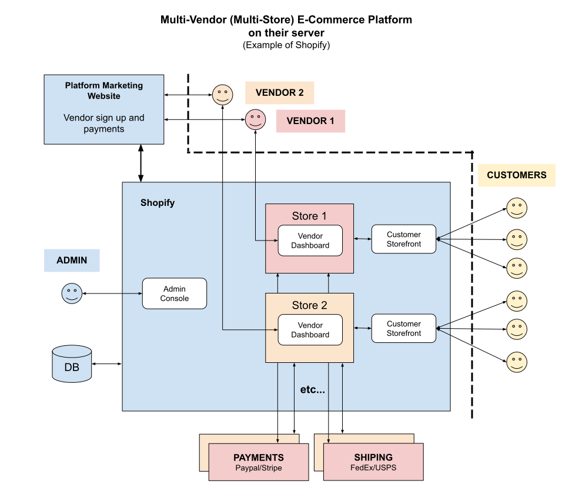

# MULTI-VENDOR MULTI-STORE CHEAT SHEET

_A Multi-Vendor (Multi-Store) E-Commerce Platform.
More simply, an **online store**._

Other Configurations

* [multi-vendor marketplace](https://github.com/JeffDeCola/my-cheat-sheets/tree/master/software/service-architectures/software-as-a-service/content-management/multi-vendor-marketplace-cheat-sheet)
* [multi-vendor multi-store](https://github.com/JeffDeCola/my-cheat-sheets/tree/master/software/service-architectures/software-as-a-service/content-management/multi-vendor-multi-store-cheat-sheet)
  **(You are Here)**
* [single-vendor single-store](https://github.com/JeffDeCola/my-cheat-sheets/tree/master/software/service-architectures/software-as-a-service/content-management/single-vendor-single-store-cheat-sheet)

Table of Contents

* [OVERVIEW](https://github.com/JeffDeCola/my-cheat-sheets/tree/master/software/service-architectures/software-as-a-service/content-management/multi-vendor-multi-store-cheat-sheet#overview)

Documentation and Reference

* [wordpress](https://github.com/JeffDeCola/my-cheat-sheets/tree/master/software/service-architectures/software-as-a-service/content-management/wordpress-cheat-sheet)

## OVERVIEW

The following illustration is a high-level view of an
Multi-Vendor (Multi-Store) E-Commerce platform (SaaS)
on a hosted server using,

* Shopify

Or more simply, this illustration shows an **online store** hosted on Shopify's server,

