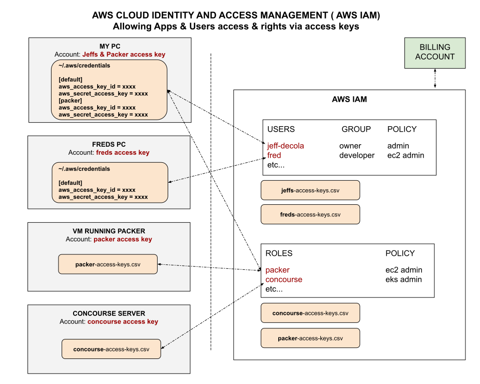

# AMAZON WEB SERVICES (AWS) CHEAT SHEET

[](https://jeffdecola.com)
[](https://jeffdecola.mit-license.org)

_Amazon web services (aws) is a massive suite of cloud computing services like
[microsoft azure](https://github.com/JeffDeCola/my-cheat-sheets/tree/master/software/service-providers/microsoft-azure-cheat-sheet)
or
[google cloud platform (gcp)](https://github.com/JeffDeCola/my-cheat-sheets/tree/master/software/service-providers/google-cloud-platform-cheat-sheet)._

Table of Contents

* [AWS FREE RESOURCES](https://github.com/JeffDeCola/my-cheat-sheets/tree/master/software/service-providers/amazon-web-services-cheat-sheet#aws-free-resources)
* [AMAZON WEB SERVICES (AWS) OVERVIEW](https://github.com/JeffDeCola/my-cheat-sheets/tree/master/software/service-providers/amazon-web-services-cheat-sheet#amazon-web-services-aws-overview)
* [GET AN ACCOUNT AT AWS](https://github.com/JeffDeCola/my-cheat-sheets/tree/master/software/service-providers/amazon-web-services-cheat-sheet#get-an-account-at-aws)
* [IDENTITY & ACCESS MANAGEMENT (IAM) - ACCESS KEYS](https://github.com/JeffDeCola/my-cheat-sheets/tree/master/software/service-providers/amazon-web-services-cheat-sheet#identity--access-management-iam---access-keys)
* [VIRTUAL PRIVATE CLOUD](https://github.com/JeffDeCola/my-cheat-sheets/tree/master/software/service-providers/amazon-web-services-cheat-sheet#virtual-private-cloud)
* [INTERACTING WITH AWS](https://github.com/JeffDeCola/my-cheat-sheets/tree/master/software/service-providers/amazon-web-services-cheat-sheet#interacting-with-aws)
* [AWS CLI](https://github.com/JeffDeCola/my-cheat-sheets/tree/master/software/service-providers/amazon-web-services-cheat-sheet#aws-cli)
  * [AWS CLI - INSTALL](https://github.com/JeffDeCola/my-cheat-sheets/tree/master/software/service-providers/amazon-web-services-cheat-sheet#aws-cli---install)
  * [AWS CLI - CONFIGURE](https://github.com/JeffDeCola/my-cheat-sheets/tree/master/software/service-providers/amazon-web-services-cheat-sheet#aws-cli---configure)
* [SOME BASIC AWS COMMANDS](https://github.com/JeffDeCola/my-cheat-sheets/tree/master/software/service-providers/amazon-web-services-cheat-sheet#some-basic-aws-commands)

Documentation and Reference

* [aws documentation](https://aws.amazon.com)

## AWS FREE RESOURCES

There are a lot of
[free resources](https://aws.amazon.com/free/)
across aws.

## AMAZON WEB SERVICES (AWS) OVERVIEW

AWS is absolutely massive with a host of
hundreds of powerful products from storage and compute to
data analytics.

An extensive list is
[here](https://aws.amazon.com/products/).

* ANALYTICS
  * athena
  * cloudsearch
  * elasticsearch service
  * emr
  * glue
  * kinesis
  * lake formation
  * managed streaming for kafka
  * quicksight data pipeline
  * redshift
* APPLICATION INTEGRATION
  * appsync
  * mq
  * simple queue service
  * simple notification service
  * step functions
* AR & VR
  * sumerian
* AWS COST MANAGEMENT
  * budgets
  * cost explorer
  * cost and usage reports
  * reserved instance reporting
* BLOCKCHAIN
  * managed blockchain
  * quantum ledger database (qldb)
* BUSINESS APPLICATIONS
  * alexa for business
  * chime
  * workmail
* COMPUTE
  * [aws lambda](https://github.com/JeffDeCola/my-cheat-sheets/tree/master/software/service-architectures/function-as-a-service/aws-lambda-cheat-sheet)
    cheat sheet (FaaS)
  * [aws elastic beanstalk](https://github.com/JeffDeCola/my-cheat-sheets/tree/master/software/service-architectures/platform-as-a-service/aws-elastic-beanstalk-cheat-sheet)
    cheat sheet (PaaS)
  * [amazon elastic container service (ecs)](https://github.com/JeffDeCola/my-cheat-sheets/tree/master/software/service-architectures/containers-as-a-service/amazon-elastic-container-service-cheat-sheet)
    cheat sheet (CaaS)
  * [amazon elastic container service for kubernetes (eks)](https://github.com/JeffDeCola/my-cheat-sheets/tree/master/software/service-architectures/containers-as-a-service/amazon-elastic-container-service-for-kubernetes-cheat-sheet)
    cheat sheet (CaaS)
  * [amazon elastic compute cloud (ec2)](https://github.com/JeffDeCola/my-cheat-sheets/tree/master/software/service-architectures/infrastructure-as-a-service/amazon-elastic-compute-cloud-cheat-sheet)
    cheat sheet (IaaS)
  * batch
  * ecr
  * elastic container registry
  * fargate
  * Lightsail
  * outposts
  * serverless application repository
  * vmware cloud on aws
* CUSTOMER ENGAGEMENT
  * connect
  * pinpoint
  * simple email service (ses)
* DATABASES
  * aurora
  * database migration service
  * documentDB
  * dynamoDB
  * elasticcache
  * neptune
  * redshift
  * rds
  * red on vmware
  * timestream
  * quantum ledger database (qldb)
* DEVELOPER TOOLS
  * cloud9
  * codebuild
  * codecommit
  * codedeploy
  * codepipeline
  * codestar
  * aws command line interface (cli)
  * corretto
  * tools & SDK
  * x-ray
* END USER COMPUTING
  * appstream 2.0
  * workdocs
  * worklink
  * workspaces
* GAME DEVELOPMENT
  * gamelift
  * lumberyard
* INTERNET OF THINGS (IoT)
  * freeRTOS
  * greengrassIotCore
  * IoT 1-click
  * IoT Analytics
  * IoT button
  * IoT core
  * IoT device defender
  * IoT device management
  * IoT events
  * IoT sitewise
  * IoT things graph
  * partner device catalog
* MACHINE LEARNING
  * apache MXNet on aws
  * comprehend
  * deep learning containers
  * deeplens
  * deeplearning amis
  * deepracer
  * elastic inference
  * forecast
  * inferentia
  * lex
  * personalize
  * polly
  * rekognition translate
  * sagemaker
  * sagemaker ground truth
  * tensorflow on aws
  * textract
  * transcribe
* MANAGEMENT & GOVERNANCE
  * auto scaling
  * cloudformation
  * cloudtrail
  * cloudwatch
  * command line interface
  * config
  * console mobile application
  * control tower
  * license manager
  * managed services
  * management console
  * organizations
  * opsworks
  * personal health dashboard
  * service catalog
  * system manager
  * trusted advisor
  * well-architected tool
* MEDIA SERVICES
  * elastic transcoder
  * elemental mediaconnect
  * elemental mediaconvert
  * elemental medialive
  * elemental mediapackage
  * elemental mediastore
  * elemental mediatailor
  * kinesis video streams
* MIGRATION TO AWS
  * application discovery service
  * database migration service
  * migration hub
  * server migration service
  * snowball family datasync
  * transfer for SFTP
* MOBILE
  * amplify
  * api gateway
  * appsync
  * device farm
  * pinpoint
* NETWORKING AND CONTENT DELIVERY
  * api gateway
  * app mesh
  * cloud map
  * cloudfront
  * direct connect
  * elastic load balancer
  * global accelerator
  * privatelink
  * route 53
  * transit gateway
  * vpc
* ROBOTICS
  * robomaker
* SATELLITE
  * ground station
* SECURITY, IDENTITY & COMPLIANCE
  * artifact
  * certificate manager
  * cloud directory
  * cloudHSM
  * cognito
  * directory service
  * firewall manager
  * guardduty
  * identity & access management (iam)
  * inspector
  * key management service
  * macie
  * resource access manager
  * secrets manager
  * security hub (preview)
  * shield
  * single sign-on
  * waf
* STORAGE
  * backup
  * elastic block store (ebs)
  * elastic file system (efs)
  * fsx for lustre
  * fsx for windows file server
  * simple storage service (s3)
  * s3 glacier
  * snow family
  * storage gateway

## GET AN ACCOUNT AT AWS

First setup a
[aws](https://aws.amazon.com/)
account.

## IDENTITY & ACCESS MANAGEMENT (IAM) - ACCESS KEYS

AWS makes access easy via access keys.

There are two basic types,

* Users
* Roles (for apps)

Where Users have groups & policies and Roles (apps) have just policies.

As an illustration,



Refer to the console
[here](https://console.aws.amazon.com/iam/home#/home)

Its pretty straightforward to create an access key for a app or a user.

Use `awc` cli to create your local ~/.aws credential files (see below).

## VIRTUAL PRIVATE CLOUD

Amazon Virtual Private Cloud (Amazon VPC) enables you to launch
Amazon Web Services (AWS) resources into a virtual network that
you've defined. This virtual network closely resembles a traditional
network that you'd operate in your own data center, with the benefits
of using the scalable infrastructure of AWS.

I'm assuming this is like projects in `gcp`.

You will need one, so go
[here](https://us-west-1.console.aws.amazon.com/vpc/home?region=us-west-1)
to make one.

## INTERACTING WITH AWS

There are a few ways to interact with `aws`,

* Using the gui/console.
* Using the aws cli (e.g. `aws`). See below.
* Using aws SDK Client Libraries / API
  (e.g. [go](https://docs.aws.amazon.com/sdk-for-go/api/)).
  My [go example](https://github.com/JeffDeCola/my-go-examples#cloud-service-providers).

This cheat sheet will focus on `aws`.

## AWS CLI

[aws cli](https://aws.amazon.com/cli/)
is a command-line interface for aws
products and services.

### AWS CLI - INSTALL

Install using pip,

```python
pip3 install awscli --upgrade --user
```

On my macbook it placed the binary in,

```txt
~/Library/Python/3.7/bin
```

On ubuntu it places in,

```txt
~/.local/bin
```

Update your path in ~/.bashrc

```bash
export PATH=~/Library/Python/3.7/bin:$PATH
export PATH=~/.local/bin:$PATH
```

See the version,

```bash
aws --version
```

### AWS CLI - CONFIGURE

```bash
aws configure
```

It will ask you to enter,

```bash
AWS Access Key ID [None]: XXXXXXXXXXXXXXXXXXXXXX
AWS Secret Access Key [None]: XXXXXXXXXXXXXXXXXXXXXXXXXXXXXXXX
Default region name [None]: us-west-1
Default output format [None]: json
```

It will place a configuration & configuration in,

```txt
~/.aws/config
~/.aws/credentials
```

## SOME BASIC AWS COMMANDS

GCP Help,

```bash
aws help
```

Version,

```bash
aws --v
```
